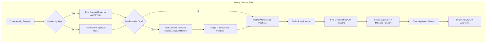
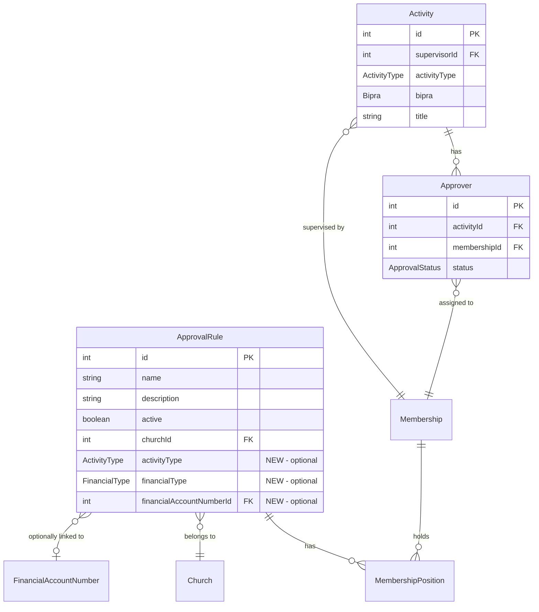

# Design Document: Activity Approver Linking

## Overview

This feature implements automatic linking of activity approvers based on approval rules when creating activities. The system will automatically assign approvers to newly created activities by matching the activity type and financial data (if applicable) with configured approval rules within the same church.

The implementation involves:
1. Extending the ApprovalRule model with activity type and financial filtering capabilities
2. Implementing an approver resolution algorithm in the activity creation flow
3. Updating the admin panel to support the new approval rule configuration
4. Updating the database seeder to demonstrate the complete workflow

## Architecture





## Components and Interfaces

### 1. Backend - Prisma Schema Changes

**File:** `apps/palakat_backend/prisma/schema.prisma`

```prisma
model ApprovalRule {
  id                       Int                     @id @default(autoincrement())
  name                     String
  description              String?
  active                   Boolean                 @default(true)
  activityType             ActivityType?           // NEW: Optional activity type filter
  financialType            FinancialType?          // NEW: Optional financial type filter
  financialAccountNumberId Int?                    // NEW: Optional financial account link
  createdAt                DateTime                @default(now())
  updatedAt                DateTime                @updatedAt
  churchId                 Int
  church                   Church                  @relation(fields: [churchId], references: [id], onDelete: Cascade)
  financialAccountNumber   FinancialAccountNumber? @relation(fields: [financialAccountNumberId], references: [id], onDelete: SetNull)
  positions                MembershipPosition[]

  @@index([churchId])
  @@index([active])
  @@index([activityType])
  @@index([financialType])
}
```

### 2. Backend - Approver Resolution Service

**File:** `apps/palakat_backend/src/activity/approver-resolver.service.ts`

```typescript
interface ApproverResolutionInput {
  churchId: number;
  activityType: ActivityType;
  supervisorId: number;
  financialAccountNumberId?: number;
  financialType?: FinancialType;
}

interface ApproverResolutionResult {
  membershipIds: number[];
  matchedRuleIds: number[];
}
```

**Algorithm:**
1. Query approval rules matching `activityType` and `churchId` where `active = true`
2. If no type-specific rules found, query rules where `activityType IS NULL`
3. If financial data exists, additionally query rules matching `financialAccountNumberId` or `financialType`
4. Collect all `MembershipPosition` IDs from matched rules
5. Deduplicate position IDs
6. Find all `Membership` records that have these positions in the same church
7. Include all memberships (including supervisor if they hold a matching position - self-approval scenario)
8. Return unique membership IDs for approver creation

### 3. Backend - Activity Service Updates

**File:** `apps/palakat_backend/src/activity/activity.service.ts`

Update the `create` method to:
1. Determine the church ID from the supervisor's membership
2. Call the approver resolver service with activity details
3. Create approver records for resolved memberships

### 4. Backend - Approval Rule DTOs

**File:** `apps/palakat_backend/src/approval-rule/dto/create-approval-rule.dto.ts`

```typescript
export class CreateApprovalRuleDto {
  @IsString()
  name: string;

  @IsOptional()
  @IsString()
  description?: string;

  @IsBoolean()
  @IsOptional()
  active?: boolean;

  @IsInt()
  churchId: number;

  @IsOptional()
  @IsEnum(ActivityType)
  activityType?: ActivityType;

  @IsOptional()
  @IsEnum(FinancialType)
  financialType?: FinancialType;

  @IsOptional()
  @IsInt()
  financialAccountNumberId?: number;

  @IsOptional()
  @IsArray()
  @IsInt({ each: true })
  positionIds?: number[];
}
```

### 5. Flutter - ApprovalRule Model Updates

**File:** `packages/palakat_shared/lib/core/models/approval_rule.dart`

```dart
@freezed
abstract class ApprovalRule with _$ApprovalRule {
  const factory ApprovalRule({
    int? id,
    required String name,
    String? description,
    @Default(true) bool active,
    DateTime? createdAt,
    DateTime? updatedAt,
    int? churchId,
    Church? church,
    @Default([]) List<MemberPosition> positions,
    ActivityType? activityType,           // NEW
    FinanceType? financialType,           // NEW
    int? financialAccountNumberId,        // NEW
    FinancialAccountNumber? financialAccountNumber, // NEW
  }) = _ApprovalRule;

  factory ApprovalRule.fromJson(Map<String, dynamic> json) =>
      _$ApprovalRuleFromJson(json);
}
```

### 6. Flutter - Admin Panel Approval Edit Drawer Updates

**File:** `apps/palakat_admin/lib/features/approval/presentation/widgets/approval_edit_drawer.dart`

Add new form fields:
- Activity Type dropdown (optional)
- Financial Type dropdown (optional)
- Financial Account Number dropdown (conditional, filtered by financial type and church)

### 7. Flutter - Mobile App (Palakat) Activity Detail Updates

**File:** `apps/palakat/lib/features/activity/presentation/widgets/activity_detail_screen.dart`

Add self-approval functionality:
- Check if current user (supervisor) is also in the approvers list
- Display approval action buttons (approve/reject) when supervisor is also an approver
- Visual indicator showing "You are also an approver for this activity"
- Handle approval status updates for self-approval scenario

```dart
// Pseudo-code for self-approval check
bool get isSupervisorAlsoApprover {
  final currentMembershipId = currentUser.membership?.id;
  return activity.approvers.any((a) => a.membershipId == currentMembershipId);
}

// Get the approver record for the supervisor
Approver? get supervisorApproverRecord {
  final currentMembershipId = currentUser.membership?.id;
  return activity.approvers.firstWhereOrNull(
    (a) => a.membershipId == currentMembershipId,
  );
}
```

## Data Models

### ApprovalRule Extended Fields

| Field | Type | Description |
|-------|------|-------------|
| activityType | ActivityType? | Optional filter for SERVICE, EVENT, or ANNOUNCEMENT |
| financialType | FinancialType? | Optional filter for REVENUE or EXPENSE |
| financialAccountNumberId | Int? | Optional link to specific financial account |

### Approver Resolution Flow

```
Input: Activity { activityType, churchId, supervisorId, revenue?, expense? }

Step 1: Find Activity Type Rules
  - Query: ApprovalRule WHERE churchId = X AND activityType = Y AND active = true
  - Fallback: ApprovalRule WHERE churchId = X AND activityType IS NULL AND active = true

Step 2: Find Financial Rules (if applicable)
  - If revenue exists: Query rules WHERE financialAccountNumberId = revenue.financialAccountNumberId
  - If expense exists: Query rules WHERE financialAccountNumberId = expense.financialAccountNumberId

Step 3: Collect Positions
  - Gather all MembershipPosition IDs from matched rules
  - Deduplicate

Step 4: Find Memberships
  - Query: Membership WHERE churchId = X AND has position in collected positions
  - Include supervisor if they hold a matching position (self-approval scenario)

Output: List<membershipId> for Approver creation
```

## Correctness Properties

*A property is a characteristic or behavior that should hold true across all valid executions of a system-essentially, a formal statement about what the system should do. Properties serve as the bridge between human-readable specifications and machine-verifiable correctness guarantees.*

### Property 1: Activity Type Rule Matching
*For any* activity with a specific activityType, the system should return only approval rules that either match that activityType or have no activityType filter (generic rules), and all returned rules must belong to the same church as the activity.
**Validates: Requirements 1.2, 1.3, 1.4**

### Property 2: Financial Type Filtering
*For any* activity, if it has revenue data, only REVENUE-type financial rules should be considered; if it has expense data, only EXPENSE-type financial rules should be considered; if it has no financial data, no financial-type rules should be applied.
**Validates: Requirements 2.2, 2.3, 2.4**

### Property 3: Financial Account Number Matching
*For any* activity with financial data, approval rules with a financialAccountNumberId should only match if the activity's financial account number matches, while rules with only financialType (no specific account) should match any activity with that financial type.
**Validates: Requirements 3.2, 3.3, 3.4**

### Property 4: Approver Deduplication
*For any* set of approval rules matched for an activity, the resulting list of approver memberships should contain no duplicates, even if the same membership position appears in multiple rules.
**Validates: Requirements 4.5**

### Property 5: Supervisor Self-Approval Inclusion
*For any* activity where the supervisor holds a membership position that matches an approval rule, the supervisor's membership should appear in the list of approvers, enabling self-approval.
**Validates: Requirements 4.8**

### Property 6: Approver-Rule Consistency
*For any* activity created with automatic approver linking, every assigned approver should hold at least one membership position that is linked to one of the matched approval rules.
**Validates: Requirements 4.2, 4.4, 4.6, 4.7**

### Property 7: Seeded Data Consistency
*For any* seeded activity with approvers, the approvers should be consistent with the approval rules configured for that church, activity type, and financial data.
**Validates: Requirements 5.4, 5.5**

### Property 8: Self-Approval Capability
*For any* activity where the supervisor is also an approver, the mobile app should allow the supervisor to approve or reject their own approver record, and the status update should be persisted correctly.
**Validates: Requirements 8.2, 8.3, 8.4**

## Error Handling

| Scenario | Handling |
|----------|----------|
| No matching approval rules | Activity created without approvers (valid state) |
| Invalid financialAccountNumberId | Return 400 Bad Request with validation error |
| Supervisor membership not found | Return 404 Not Found |
| Church mismatch between rule and account | Return 400 Bad Request |
| Database transaction failure | Rollback and return 500 Internal Server Error |

## Testing Strategy

### Dual Testing Approach

This feature requires both unit tests and property-based tests:

**Unit Tests** verify specific examples and edge cases:
- Creating approval rules with various field combinations
- Activity creation with different financial data scenarios
- Admin panel form validation

**Property-Based Tests** verify universal properties using **fast-check** library:
- Approver resolution algorithm correctness
- Deduplication guarantees
- Supervisor exclusion invariant

### Property-Based Testing Configuration

- Library: **fast-check** (already in project dependencies)
- Minimum iterations: 100 per property
- Test file location: `apps/palakat_backend/test/property/`

### Test Annotation Format

Each property-based test must be annotated with:
```typescript
/**
 * **Feature: activity-approver-linking, Property {number}: {property_text}**
 * **Validates: Requirements X.Y**
 */
```

### Test Categories

1. **Schema Tests**: Verify new fields are properly stored and retrieved
2. **Algorithm Tests**: Verify approver resolution logic
3. **Integration Tests**: Verify end-to-end activity creation with approvers
4. **Admin Panel Tests**: Verify form fields and API integration
5. **Seeder Tests**: Verify seeded data consistency
