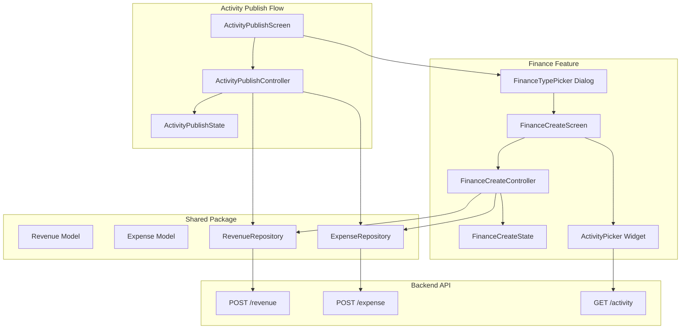

# Design Document: Activity Finance (Revenue/Expense)

## Overview

This feature extends the Palakat mobile app to support revenue and expense management within the activity publishing flow. Users can attach financial records to activities during creation, or create standalone financial records attached to existing activities. The implementation follows the existing UI patterns from the Activity Publish Screen and integrates with the backend's existing revenue/expense API endpoints.

### Key Features
- Finance Type Picker dialog for choosing between revenue and expense
- Reusable Finance Create Screen for both revenue and expense
- Activity Picker for standalone financial record creation
- Integration with Activity Publish flow for combined creation
- Indonesian Rupiah currency formatting

### Reusable Components

The implementation maximizes reuse of existing code:

- **ActivityRepository**: Will be extended to support fetching user's supervised activities for the picker
- **ScaffoldWidget**: Existing scaffold with loading state support
- **InputWidget**: Existing form input components
- **Gap, BaseColor, BaseTypography, BaseSize**: Existing UI constants
- **AppRoute, RouteParam**: Existing routing infrastructure
- **showDialogDatePickerWidget pattern**: For creating the Finance Type Picker dialog

## Architecture



## Components and Interfaces

### 1. Finance Models (palakat_shared)

#### Revenue Model
```dart
@freezed
abstract class Revenue with _$Revenue {
  const factory Revenue({
    int? id,
    required String accountNumber,
    required int amount,
    required int churchId,
    int? activityId,
    required PaymentMethod paymentMethod,
    DateTime? createdAt,
    DateTime? updatedAt,
    Activity? activity,
  }) = _Revenue;

  factory Revenue.fromJson(Map<String, dynamic> json) => _$RevenueFromJson(json);
}
```

#### Expense Model
```dart
@freezed
abstract class Expense with _$Expense {
  const factory Expense({
    int? id,
    required String accountNumber,
    required int amount,
    required int churchId,
    int? activityId,
    required PaymentMethod paymentMethod,
    DateTime? createdAt,
    DateTime? updatedAt,
    Activity? activity,
  }) = _Expense;

  factory Expense.fromJson(Map<String, dynamic> json) => _$ExpenseFromJson(json);
}
```

#### PaymentMethod Enum
```dart
enum PaymentMethod {
  @JsonValue('CASH')
  cash,
  @JsonValue('CASHLESS')
  cashless,
}
```

#### CreateRevenueRequest
```dart
@freezed
abstract class CreateRevenueRequest with _$CreateRevenueRequest {
  const factory CreateRevenueRequest({
    required String accountNumber,
    required int amount,
    required int churchId,
    int? activityId,
    required PaymentMethod paymentMethod,
  }) = _CreateRevenueRequest;

  factory CreateRevenueRequest.fromJson(Map<String, dynamic> json) => 
      _$CreateRevenueRequestFromJson(json);
}
```

#### CreateExpenseRequest
```dart
@freezed
abstract class CreateExpenseRequest with _$CreateExpenseRequest {
  const factory CreateExpenseRequest({
    required String accountNumber,
    required int amount,
    required int churchId,
    int? activityId,
    required PaymentMethod paymentMethod,
  }) = _CreateExpenseRequest;

  factory CreateExpenseRequest.fromJson(Map<String, dynamic> json) => 
      _$CreateExpenseRequestFromJson(json);
}
```

### 2. Finance Repositories (palakat_shared)

#### RevenueRepository
```dart
abstract class RevenueRepository {
  Future<Result<Revenue>> createRevenue({required CreateRevenueRequest request});
}

class RevenueRepositoryImpl implements RevenueRepository {
  final ApiService _apiService;
  
  @override
  Future<Result<Revenue>> createRevenue({required CreateRevenueRequest request}) async {
    return _apiService.post<Revenue>(
      '/revenue',
      data: request.toJson(),
      fromJson: Revenue.fromJson,
    );
  }
}
```

#### ExpenseRepository
```dart
abstract class ExpenseRepository {
  Future<Result<Expense>> createExpense({required CreateExpenseRequest request});
}

class ExpenseRepositoryImpl implements ExpenseRepository {
  final ApiService _apiService;
  
  @override
  Future<Result<Expense>> createExpense({required CreateExpenseRequest request}) async {
    return _apiService.post<Expense>(
      '/expense',
      data: request.toJson(),
      fromJson: Expense.fromJson,
    );
  }
}
```

### 3. Finance Type Enum
```dart
enum FinanceType {
  revenue,
  expense,
}

extension FinanceTypeExtension on FinanceType {
  String get displayName {
    switch (this) {
      case FinanceType.revenue:
        return 'Revenue';
      case FinanceType.expense:
        return 'Expense';
    }
  }
  
  IconData get icon {
    switch (this) {
      case FinanceType.revenue:
        return Icons.trending_up;
      case FinanceType.expense:
        return Icons.trending_down;
    }
  }
  
  Color get color {
    switch (this) {
      case FinanceType.revenue:
        return BaseColor.success;
      case FinanceType.expense:
        return BaseColor.error;
    }
  }
}
```

### 4. FinanceCreateState
```dart
@freezed
abstract class FinanceCreateState with _$FinanceCreateState {
  const factory FinanceCreateState({
    required FinanceType financeType,
    required bool isStandalone,
    
    // Form fields
    String? amount,
    String? accountNumber,
    PaymentMethod? paymentMethod,
    Activity? selectedActivity,
    
    // Error messages
    String? errorAmount,
    String? errorAccountNumber,
    String? errorPaymentMethod,
    String? errorActivity,
    
    // UI state
    @Default(false) bool loading,
    @Default(false) bool isFormValid,
    String? errorMessage,
    String? successMessage,
  }) = _FinanceCreateState;
}
```

### 5. FinanceCreateController
```dart
@riverpod
class FinanceCreateController extends _$FinanceCreateController {
  @override
  FinanceCreateState build(FinanceType financeType, bool isStandalone) {
    return FinanceCreateState(
      financeType: financeType,
      isStandalone: isStandalone,
    );
  }
  
  void onChangedAmount(String value);
  void onChangedAccountNumber(String value);
  void onSelectedPaymentMethod(PaymentMethod? method);
  void onSelectedActivity(Activity? activity);
  
  String? validateAmount(String? value);
  String? validateAccountNumber(String? value);
  String? validatePaymentMethod(PaymentMethod? value);
  String? validateActivity(Activity? value);
  
  Future<void> validateForm();
  
  /// For standalone mode: creates the record via API
  Future<bool> submit();
  
  /// For embedded mode: returns the finance data without API call
  FinanceData? getFinanceData();
}
```

### 6. FinanceData Transfer Object
```dart
/// Used to pass finance data back to ActivityPublishScreen
@freezed
abstract class FinanceData with _$FinanceData {
  const factory FinanceData({
    required FinanceType type,
    required int amount,
    required String accountNumber,
    required PaymentMethod paymentMethod,
  }) = _FinanceData;
}
```

### 7. ActivityPublishState Extension
```dart
@Freezed(makeCollectionsUnmodifiable: false)
abstract class ActivityPublishState with _$ActivityPublishState {
  const factory ActivityPublishState({
    // ... existing fields ...
    
    /// Attached finance data (revenue or expense)
    FinanceData? attachedFinance,
  }) = _ActivityPublishState;
}
```

### 8. ActivityPublishController Extension
```dart
// Add to existing controller
void onAttachedFinance(FinanceData? data) {
  state = state.copyWith(attachedFinance: data);
}

void removeAttachedFinance() {
  state = state.copyWith(attachedFinance: null);
}

/// Modified submit to handle finance creation after activity
Future<bool> submit() async {
  // ... existing validation and activity creation ...
  
  // After activity created successfully, create finance record if attached
  if (state.attachedFinance != null && createdActivityId != null) {
    await _createFinanceRecord(createdActivityId);
  }
  
  return success;
}
```

### 9. UI Components

#### FinanceTypePicker Dialog
```dart
Future<FinanceType?> showFinanceTypePickerDialog({
  required BuildContext context,
}) async {
  return showDialog<FinanceType>(
    context: context,
    builder: (context) => const FinanceTypePickerDialog(),
  );
}
```

#### FinanceCreateScreen
```dart
class FinanceCreateScreen extends ConsumerStatefulWidget {
  const FinanceCreateScreen({
    required this.financeType,
    required this.isStandalone,
    super.key,
  });

  final FinanceType financeType;
  final bool isStandalone;
}
```

#### ActivityPickerWidget
```dart
class ActivityPickerWidget extends ConsumerWidget {
  const ActivityPickerWidget({
    required this.selectedActivity,
    required this.onActivitySelected,
    required this.errorText,
    super.key,
  });

  final Activity? selectedActivity;
  final ValueChanged<Activity?> onActivitySelected;
  final String? errorText;
}
```

#### FinanceSummaryCard
```dart
/// Displays attached finance summary in ActivityPublishScreen
class FinanceSummaryCard extends StatelessWidget {
  const FinanceSummaryCard({
    required this.financeData,
    required this.onRemove,
    required this.onEdit,
    super.key,
  });

  final FinanceData financeData;
  final VoidCallback onRemove;
  final VoidCallback onEdit;
}
```

## Data Models

### Backend DTOs (Already Exist)

The backend already has the necessary DTOs and endpoints:

#### Revenue Create (POST /revenue)
```typescript
{
  accountNumber: string;
  amount: number;
  churchId: number;
  activityId?: number;
  paymentMethod: 'CASH' | 'CASHLESS';
}
```

#### Expense Create (POST /expense)
```typescript
{
  accountNumber: string;
  amount: number;
  churchId: number;
  activityId?: number;
  paymentMethod: 'CASH' | 'CASHLESS';
}
```


## Correctness Properties

*A property is a characteristic or behavior that should hold true across all valid executions of a system-essentially, a formal statement about what the system should do. Properties serve as the bridge between human-readable specifications and machine-verifiable correctness guarantees.*

### Property 1: Financial section visibility by activity type
*For any* Activity Publish Screen with activity type service or event, the financial record section SHALL be visible; for announcement type, the section SHALL be hidden.
**Validates: Requirements 1.1**

### Property 2: Finance type navigation correctness
*For any* finance type selection (revenue or expense), the Finance Create Screen SHALL receive the correct finance type parameter matching the user's selection.
**Validates: Requirements 1.3**

### Property 3: Attached finance data display completeness
*For any* FinanceData returned from the Finance Create Screen, the Activity Publish Screen SHALL display a summary containing the finance type, formatted amount, account number, and payment method.
**Validates: Requirements 1.4**

### Property 4: Finance removal clears state
*For any* state with attached finance data, calling removeAttachedFinance SHALL result in attachedFinance being null.
**Validates: Requirements 1.5**

### Property 5: Amount validation correctness
*For any* string input for amount, the validation SHALL pass only if the string represents a positive integer (greater than 0), and SHALL fail for empty strings, non-numeric strings, zero, and negative numbers.
**Validates: Requirements 2.2, 3.2**

### Property 6: Account number validation correctness
*For any* string input for account number, the validation SHALL pass only if the string is non-empty after trimming whitespace.
**Validates: Requirements 2.3, 3.3**

### Property 7: Finance data return completeness
*For any* valid form submission (amount > 0, non-empty account number, valid payment method), the returned FinanceData SHALL contain all input values unchanged.
**Validates: Requirements 2.5, 3.5**

### Property 8: Standalone mode shows activity picker
*For any* Finance Create Screen in standalone mode (isStandalone = true), the Activity Picker field SHALL be visible; in embedded mode (isStandalone = false), it SHALL be hidden.
**Validates: Requirements 4.1**

### Property 9: Selected activity display correctness
*For any* Activity selected in the Activity Picker, the picker field SHALL display the activity's title and date.
**Validates: Requirements 4.3**

### Property 10: Standalone submission calls API with correct data
*For any* standalone finance submission with valid data and selected activity, the API call SHALL include the correct activityId, amount, accountNumber, churchId, and paymentMethod.
**Validates: Requirements 4.4**

### Property 11: Combined creation order and ID passing
*For any* activity submission with attached finance data, the system SHALL first create the activity, then create the finance record using the returned activity ID.
**Validates: Requirements 5.1, 5.2**

### Property 12: Validation error display
*For any* form field with a non-null error message, the UI SHALL render the error text below the corresponding input field.
**Validates: Requirements 6.1**

### Property 13: Loading state disables submission
*For any* state where loading is true, the submit button SHALL be disabled and a loading indicator SHALL be visible.
**Validates: Requirements 6.2**

### Property 14: Currency formatting correctness
*For any* positive integer amount, the formatted display SHALL start with "Rp " prefix and use period (.) as thousand separator (e.g., 1500000 → "Rp 1.500.000").
**Validates: Requirements 6.4**

## Error Handling

| Scenario | Handling |
|----------|----------|
| Invalid amount (non-positive) | Display "Amount must be greater than 0" error |
| Empty account number | Display "Account number is required" error |
| No payment method selected | Display "Payment method is required" error |
| No activity selected (standalone) | Display "Activity is required" error |
| Network failure on submission | Display error message with retry button |
| Activity creation succeeds but finance fails | Show partial success message, activity is kept |
| Session expired | Display "Session expired. Please sign in again." |

## Testing Strategy

### Unit Tests
- Test `FinanceCreateController` validation methods
- Test `validateAmount` with various inputs (positive, zero, negative, non-numeric)
- Test `validateAccountNumber` with empty and non-empty strings
- Test currency formatting utility function
- Test `ActivityPublishController.submit()` with and without attached finance

### Property-Based Tests

The project uses **glados** package for property-based testing in Flutter/Dart.

Each property-based test MUST:
- Run a minimum of 100 iterations
- Be tagged with a comment referencing the correctness property: `// **Feature: activity-finance, Property {number}: {property_text}**`

Property tests to implement:
1. **Property 5**: Generate random strings, verify amount validation accepts only positive integers
2. **Property 6**: Generate random strings, verify account number validation accepts only non-empty strings
3. **Property 7**: Generate valid form data, verify returned FinanceData matches input exactly
4. **Property 14**: Generate random positive integers, verify currency format matches expected pattern

### Widget Tests
- Test FinanceCreateScreen renders correct fields for revenue vs expense
- Test FinanceCreateScreen shows/hides Activity Picker based on standalone mode
- Test FinanceSummaryCard displays all finance data correctly
- Test FinanceTypePicker dialog shows both options
- Test ActivityPublishScreen shows financial section for service/event types only

### Integration Tests
- Test full flow: Activity Publish → Finance Type Picker → Finance Create → Return to Activity Publish
- Test standalone finance creation with API call
- Test combined activity + finance creation flow

