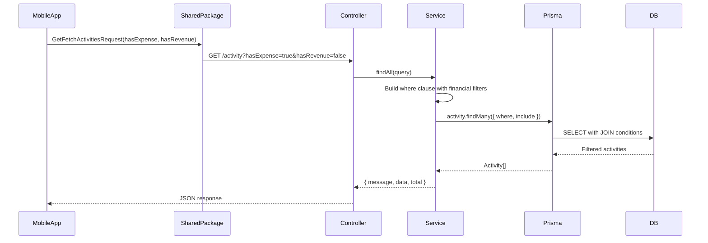

# Design Document: Activity Financial Filter

## Overview

This enhancement adds optional filtering capabilities to the Activity list endpoint (`GET /activity`) in the Backend_API. Users can filter activities based on whether they have associated financial records (Revenue and/or Expense).

The implementation spans three layers:
1. **Backend_API**: Extends `ActivityListQueryDto` with `hasExpense` and `hasRevenue` boolean query parameters
2. **Shared Package**: Extends `GetFetchActivitiesRequest` model with the new filter fields
3. **Mobile App**: Updates activity picker and supervised activities list to support the new filters

## Architecture

### Backend Changes

The enhancement follows the existing NestJS modular architecture:

```
apps/palakat_backend/src/activity/
├── dto/
│   └── activity-list.dto.ts    # Extended with hasExpense, hasRevenue
├── activity.controller.ts       # No changes needed (uses DTO)
├── activity.service.ts          # Modified findAll() with financial filters
└── activity.module.ts           # No changes needed
```

### Shared Package Changes

```
packages/palakat_shared/lib/core/models/request/
└── get_fetch_activity_request.dart  # Extended with hasExpense, hasRevenue
```

### Mobile App Changes

```
apps/palakat/lib/features/
├── finance/presentations/finance_create/widgets/
│   ├── activity_picker_controller.dart  # Can use new filters
│   └── activity_picker_state.dart       # Optional: add filter state
└── operations/presentations/supervised_activities_list/
    ├── supervised_activities_list_controller.dart  # Can use new filters
    └── supervised_activities_list_state.dart       # Optional: add filter state
```

### Data Flow



## Components and Interfaces

### Backend: ActivityListQueryDto (Extended)

```typescript
export class ActivityListQueryDto extends PaginationQueryDto {
  // ... existing fields ...

  @IsOptional()
  @Transform(({ value }) => {
    if (value === 'true') return true;
    if (value === 'false') return false;
    return value;
  })
  @IsBoolean()
  hasExpense?: boolean;

  @IsOptional()
  @Transform(({ value }) => {
    if (value === 'true') return true;
    if (value === 'false') return false;
    return value;
  })
  @IsBoolean()
  hasRevenue?: boolean;
}
```

### ActivityService.findAll() (Modified)

The service method builds Prisma where clauses based on the financial filter parameters:

```typescript
// hasExpense filter
if (hasExpense === true) {
  where.expense = { isNot: null };
} else if (hasExpense === false) {
  where.expense = { is: null };
}

// hasRevenue filter
if (hasRevenue === true) {
  where.revenue = { isNot: null };
} else if (hasRevenue === false) {
  where.revenue = { is: null };
}
```

### Prisma Query Patterns

Prisma supports relation filtering with `is` and `isNot` operators:

| Filter | Prisma Condition | SQL Equivalent |
|--------|------------------|----------------|
| `hasExpense=true` | `expense: { isNot: null }` | `WHERE expense_id IS NOT NULL` |
| `hasExpense=false` | `expense: { is: null }` | `WHERE expense_id IS NULL` |
| `hasRevenue=true` | `revenue: { isNot: null }` | `WHERE revenue_id IS NOT NULL` |
| `hasRevenue=false` | `revenue: { is: null }` | `WHERE revenue_id IS NULL` |

### Shared Package: GetFetchActivitiesRequest (Extended)

```dart
@Freezed(toJson: true, fromJson: true)
abstract class GetFetchActivitiesRequest with _$GetFetchActivitiesRequest {
  const factory GetFetchActivitiesRequest({
    int? churchId,
    int? membershipId,
    int? columnId,
    DateTime? startDate,
    DateTime? endDate,
    ActivityType? activityType,
    String? search,
    // New financial filter fields
    bool? hasExpense,
    bool? hasRevenue,
  }) = _GetFetchActivitiesRequest;

  factory GetFetchActivitiesRequest.fromJson(Map<String, dynamic> json) =>
      _$GetFetchActivitiesRequestFromJson(json);
}
```

### Mobile App: Activity Picker Usage Example

The activity picker can use the new filters to show only activities without financial records (for attaching new finances):

```dart
// In activity_picker_controller.dart
PaginationRequestWrapper<GetFetchActivitiesRequest> _buildRequest({
  required int page,
}) {
  return PaginationRequestWrapper(
    page: page,
    pageSize: _pageSize,
    sortBy: 'date',
    sortOrder: 'desc',
    data: GetFetchActivitiesRequest(
      membershipId: state.membershipId,
      search: state.searchQuery.isNotEmpty ? state.searchQuery : null,
      // Filter to show only activities without financial records
      hasExpense: false,
      hasRevenue: false,
    ),
  );
}
```

### Mobile App: Supervised Activities List Usage Example

The supervised activities list can add filter options for financial status:

```dart
// In supervised_activities_list_state.dart
@freezed
abstract class SupervisedActivitiesListState with _$SupervisedActivitiesListState {
  const factory SupervisedActivitiesListState({
    // ... existing fields ...
    // New financial filter fields
    bool? filterHasExpense,
    bool? filterHasRevenue,
  }) = _SupervisedActivitiesListState;
}

// In supervised_activities_list_controller.dart
void setFinancialFilter({bool? hasExpense, bool? hasRevenue}) {
  state = state.copyWith(
    filterHasExpense: hasExpense,
    filterHasRevenue: hasRevenue,
  );
  fetchActivities(refresh: true);
}
```

## Data Models

### Existing Relationships (No Changes)

```prisma
model Activity {
  id           Int       @id @default(autoincrement())
  // ... other fields ...
  revenue      Revenue?  // Optional one-to-one
  expense      Expense?  // Optional one-to-one
}

model Revenue {
  activityId   Int?      @unique
  activity     Activity? @relation(fields: [activityId], references: [id])
}

model Expense {
  activityId   Int?      @unique
  activity     Activity? @relation(fields: [activityId], references: [id])
}
```

The existing schema already supports the required relationships. No schema changes are needed.

## Correctness Properties

*A property is a characteristic or behavior that should hold true across all valid executions of a system-essentially, a formal statement about what the system should do. Properties serve as the bridge between human-readable specifications and machine-verifiable correctness guarantees.*

### Property 1: hasExpense filter correctness
*For any* set of activities and any boolean value for `hasExpense`, when the filter is applied, all returned activities SHALL have an expense record if `hasExpense=true`, and no returned activities SHALL have an expense record if `hasExpense=false`.
**Validates: Requirements 1.1, 1.2**

### Property 2: hasRevenue filter correctness
*For any* set of activities and any boolean value for `hasRevenue`, when the filter is applied, all returned activities SHALL have a revenue record if `hasRevenue=true`, and no returned activities SHALL have a revenue record if `hasRevenue=false`.
**Validates: Requirements 1.3, 1.4**

### Property 3: No filter returns all financial states
*For any* set of activities, when neither `hasExpense` nor `hasRevenue` filters are provided, the returned activities SHALL include activities with any combination of financial records (with expense only, with revenue only, with both, with neither).
**Validates: Requirements 1.5**

### Property 4: Combined filter AND logic
*For any* set of activities and any combination of `hasExpense` and `hasRevenue` values, the returned activities SHALL satisfy ALL filter conditions simultaneously (AND logic).
**Validates: Requirements 1.6, 1.7, 1.8**

### Property 5: DTO round-trip consistency
*For any* valid `ActivityListQueryDto` with financial filter values, serializing to query string and parsing back SHALL produce an equivalent DTO that results in the same filter behavior.
**Validates: Requirements 2.5**

### Property 6: Response structure consistency
*For any* financial filter combination, the response SHALL contain the same structure (message, data array, total count) and each activity SHALL include the same fields and relationships (supervisor, approvers) as unfiltered responses.
**Validates: Requirements 3.1, 3.2**

### Property 7: Total count accuracy
*For any* set of activities and any financial filter combination, the returned `total` count SHALL equal the actual number of activities in the database that match all applied filters.
**Validates: Requirements 3.3**

### Property 8: Pagination with filters
*For any* set of activities, any financial filter combination, and any valid pagination parameters (skip, take), the returned activities SHALL be a correct subset of the filtered results respecting pagination boundaries.
**Validates: Requirements 3.4**

## Error Handling

### Validation Errors

Invalid boolean values for `hasExpense` or `hasRevenue` will be caught by class-validator:

```json
{
  "statusCode": 400,
  "message": ["hasExpense must be a boolean value"],
  "error": "Bad Request"
}
```

### Edge Cases

| Scenario | Behavior |
|----------|----------|
| Empty result set | Returns `{ data: [], total: 0 }` |
| Filter with pagination beyond results | Returns empty data array |
| Conflicting filters (e.g., impossible combination) | Returns empty result (valid behavior) |

## Testing Strategy

### Dual Testing Approach

This implementation uses both unit tests and property-based tests:

- **Unit tests**: Verify specific examples, edge cases, and error conditions
- **Property-based tests**: Verify universal properties that should hold across all inputs

### Property-Based Testing Framework

**Library**: fast-check (already used in the project)

**Configuration**: Each property test runs a minimum of 100 iterations.

**Test File Location**: `apps/palakat_backend/test/property/activity-financial-filter.property.spec.ts`

### Property Test Annotations

Each property-based test MUST be tagged with:
```typescript
// **Feature: activity-financial-filter, Property {number}: {property_text}**
```

### Test Categories

1. **Unit Tests** (activity.service.spec.ts)
   - Validation of boolean query parameters
   - Error handling for invalid inputs
   - Basic filter functionality examples

2. **Property-Based Tests** (activity-financial-filter.property.spec.ts)
   - Property 1: hasExpense filter correctness
   - Property 2: hasRevenue filter correctness
   - Property 3: No filter returns all financial states
   - Property 4: Combined filter AND logic
   - Property 5: DTO round-trip consistency
   - Property 6: Response structure consistency
   - Property 7: Total count accuracy
   - Property 8: Pagination with filters

3. **Flutter Unit Tests** (packages/palakat_shared/test/)
   - GetFetchActivitiesRequest serialization with new fields
   - Round-trip JSON serialization

### Test Data Generation

Property tests will use fast-check generators to create:
- Random activities with various financial record combinations
- Random boolean filter values
- Random pagination parameters
- Random combinations with existing filters (activityType, search, etc.)

### Flutter Code Generation

After modifying `GetFetchActivitiesRequest`, run:
```bash
melos run build:runner
```
This regenerates the freezed and json_serializable files.
