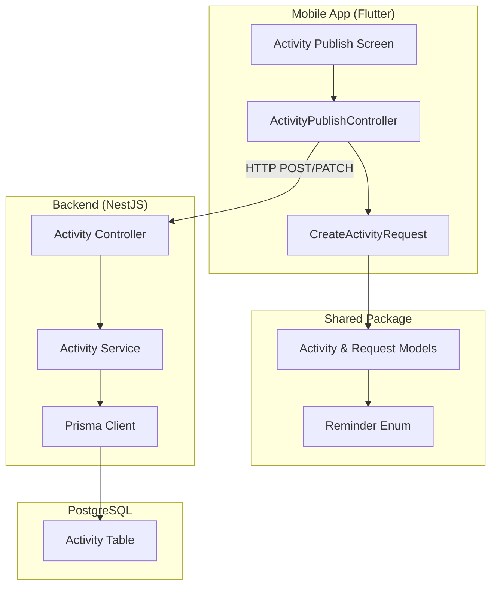

# Design Document: Activity Reminder Feature

## Overview

This feature extends the Palakat activity management system to support reminder preferences. The implementation spans three layers:

1. **Backend (NestJS)**: Add `reminder` field to the Activity Prisma model, update DTOs, and modify CRUD operations
2. **Shared Package (Dart)**: Update `CreateActivityRequest` and `Activity` models to include reminder field with proper JSON serialization
3. **Mobile App (Flutter)**: Wire the activity publish controller to include reminder data in API requests

## Architecture



## Components and Interfaces

### Backend Components

#### 1. Prisma Schema Update

Add `reminder` enum and field to the Activity model:

```prisma
enum Reminder {
  TEN_MINUTES
  THIRTY_MINUTES
  ONE_HOUR
  TWO_HOURS
}

model Activity {
  // ... existing fields
  reminder     Reminder?    // Optional reminder preference
}
```

#### 2. Create Activity DTO

```typescript
// apps/palakat_backend/src/activity/dto/create-activity.dto.ts
import { IsEnum, IsOptional, IsInt, IsString, IsNumber } from 'class-validator';
import { Bipra, ActivityType, Reminder } from '@prisma/client';

export class CreateActivityDto {
  @IsInt()
  supervisorId: number;

  @IsEnum(Bipra)
  bipra: Bipra;

  @IsString()
  title: string;

  @IsOptional()
  @IsString()
  description?: string;

  @IsOptional()
  @IsString()
  locationName?: string;

  @IsOptional()
  @IsNumber()
  locationLatitude?: number;

  @IsOptional()
  @IsNumber()
  locationLongitude?: number;

  @IsOptional()
  date?: Date;

  @IsOptional()
  @IsString()
  note?: string;

  @IsEnum(ActivityType)
  activityType: ActivityType;

  @IsOptional()
  @IsEnum(Reminder)
  reminder?: Reminder;
}
```

#### 3. Update Activity DTO

```typescript
// apps/palakat_backend/src/activity/dto/update-activity.dto.ts
import { PartialType } from '@nestjs/mapped-types';
import { CreateActivityDto } from './create-activity.dto';

export class UpdateActivityDto extends PartialType(CreateActivityDto) {}
```

### Shared Package Components

#### 1. Reminder Enum (Already Exists)

The `Reminder` enum already exists in `packages/palakat_shared/lib/core/constants/enums.dart`. We need to add JSON serialization annotations:

```dart
@JsonEnum(valueField: 'value')
enum Reminder {
  tenMinutes("10 Minutes Before", "TEN_MINUTES"),
  thirtyMinutes("30 Minutes Before", "THIRTY_MINUTES"),
  oneHour("1 Hour Before", "ONE_HOUR"),
  twoHour("2 Hour Before", "TWO_HOURS");

  const Reminder(this.name, this.value);

  final String name;
  final String value;
}
```

#### 2. CreateActivityRequest Update

Add reminder field to the request model:

```dart
@freezed
abstract class CreateActivityRequest with _$CreateActivityRequest {
  const factory CreateActivityRequest({
    required int supervisorId,
    required Bipra bipra,
    required String title,
    String? description,
    String? locationName,
    double? locationLatitude,
    double? locationLongitude,
    DateTime? date,
    String? note,
    required ActivityType activityType,
    Reminder? reminder,  // NEW FIELD
  }) = _CreateActivityRequest;

  factory CreateActivityRequest.fromJson(Map<String, dynamic> json) =>
      _$CreateActivityRequestFromJson(json);
}
```

#### 3. Activity Model Update

Ensure the Activity model includes the reminder field for deserialization from backend responses.

### Database Seeding

#### seed.ts Update

Update the `generateActivityData` function to include reminder values:

```typescript
import { Reminder } from '@prisma/client';

const REMINDER_VALUES = [
  Reminder.TEN_MINUTES,
  Reminder.THIRTY_MINUTES,
  Reminder.ONE_HOUR,
  Reminder.TWO_HOURS,
];

function generateActivityData(type: ActivityType, bipra: Bipra, index: number) {
  const title = randomElement(ACTIVITY_TITLES[type]);
  const weekStart = getStartOfWeek();
  const weekEnd = getEndOfWeek();
  const activityDate = randomDate(weekStart, weekEnd);

  // Only SERVICE and EVENT activities have reminders
  const reminder = type !== ActivityType.ANNOUNCEMENT
    ? randomElement(REMINDER_VALUES)
    : null;

  return {
    title: `${title} ${index}`,
    activityType: type,
    bipra,
    date: activityDate,
    description: randomBoolean(0.6)
      ? `Deskripsi lengkap untuk ${title} ${index}`
      : null,
    note: randomBoolean(0.7) ? `Catatan untuk ${title} ${index}` : null,
    reminder,
  };
}
```

### Mobile App Components

#### ActivityPublishController Update

Modify the `submit()` method to include reminder in the request:

```dart
final request = CreateActivityRequest(
  supervisorId: membership.id!,
  bipra: bipra,
  title: state.title ?? '',
  description: state.description,
  locationName: location?.name ?? state.location,
  locationLatitude: location?.latitude,
  locationLongitude: location?.longitude,
  date: activityDate,
  note: state.note,
  activityType: state.type,
  reminder: state.selectedReminder,  // NEW: Include reminder
);
```

## Data Models

### Database Schema Change

```sql
-- Add Reminder enum type
CREATE TYPE "Reminder" AS ENUM ('TEN_MINUTES', 'THIRTY_MINUTES', 'ONE_HOUR', 'TWO_HOURS');

-- Add reminder column to Activity table
ALTER TABLE "Activity" ADD COLUMN "reminder" "Reminder";
```

### API Request/Response Format

#### Create Activity Request
```json
{
  "supervisorId": 1,
  "bipra": "PKB",
  "title": "Sunday Service",
  "activityType": "SERVICE",
  "date": "2025-12-01T09:00:00.000Z",
  "locationName": "Main Church",
  "locationLatitude": 1.234,
  "locationLongitude": 5.678,
  "reminder": "ONE_HOUR"
}
```

#### Activity Response
```json
{
  "id": 1,
  "supervisorId": 1,
  "bipra": "PKB",
  "title": "Sunday Service",
  "activityType": "SERVICE",
  "date": "2025-12-01T09:00:00.000Z",
  "reminder": "ONE_HOUR",
  "location": {
    "id": 1,
    "name": "Main Church",
    "latitude": 1.234,
    "longitude": 5.678
  }
}
```

## Correctness Properties

*A property is a characteristic or behavior that should hold true across all valid executions of a system-essentially, a formal statement about what the system should do. Properties serve as the bridge between human-readable specifications and machine-verifiable correctness guarantees.*

Based on the prework analysis, the following correctness properties have been identified:

### Property 1: Reminder persistence on create
*For any* valid SERVICE or EVENT activity with a valid reminder value, creating the activity and then retrieving it SHALL return the same reminder value that was provided.
**Validates: Requirements 1.1, 2.1**

### Property 2: Reminder validation
*For any* reminder value, the backend SHALL accept it if and only if it is one of the valid enum values (TEN_MINUTES, THIRTY_MINUTES, ONE_HOUR, TWO_HOURS) or null.
**Validates: Requirements 1.3, 1.4, 3.3**

### Property 3: Announcement activities accept null reminder
*For any* ANNOUNCEMENT activity, the backend SHALL accept the request regardless of whether a reminder field is provided.
**Validates: Requirements 1.2**

### Property 4: Reminder included in list responses
*For any* set of activities with various reminder values, retrieving the list SHALL include the correct reminder value for each activity.
**Validates: Requirements 2.2, 2.3**

### Property 5: Reminder update persistence
*For any* existing activity and any valid reminder value (including null), updating the activity's reminder and then retrieving it SHALL return the updated reminder value.
**Validates: Requirements 3.1, 3.2**

### Property 6: CreateActivityRequest round-trip serialization
*For any* valid CreateActivityRequest with a reminder value, serializing to JSON and then deserializing SHALL produce an equivalent object.
**Validates: Requirements 4.1, 4.2, 4.3**

### Property 7: Activity model round-trip serialization
*For any* valid Activity model with a reminder value (including null), serializing to JSON and then deserializing SHALL produce an equivalent object.
**Validates: Requirements 5.1, 5.2, 5.3**

### Property 8: Controller includes reminder in request
*For any* activity publish state with a selected reminder, the submit method SHALL build a CreateActivityRequest that includes the selected reminder value.
**Validates: Requirements 6.1**

## Error Handling

### Backend Validation Errors

| Error Condition | HTTP Status | Error Message |
|----------------|-------------|---------------|
| Invalid reminder enum value | 400 Bad Request | "reminder must be one of: TEN_MINUTES, THIRTY_MINUTES, ONE_HOUR, TWO_HOURS" |
| Invalid activity type | 400 Bad Request | "activityType must be one of: SERVICE, EVENT, ANNOUNCEMENT" |

### Frontend Error Handling

- Display validation errors from backend in the form
- Handle network errors gracefully with retry option
- Show loading state during API calls

## Testing Strategy

### Dual Testing Approach

This feature requires both unit tests and property-based tests to ensure comprehensive coverage.

### Unit Tests

Unit tests will cover:
- Specific edge cases (null reminder, empty strings)
- Integration points between controller and service
- Error response formatting

### Property-Based Testing

Property-based tests will use **fast-check** (already configured in the backend) to verify:
- Reminder enum validation across all valid/invalid inputs
- Round-trip serialization consistency
- CRUD operation correctness with random valid data

Each property-based test MUST:
1. Be tagged with the format: `**Feature: activity-reminder, Property {number}: {property_text}**`
2. Run a minimum of 100 iterations
3. Reference the specific correctness property from this design document

### Test File Locations

- Backend property tests: `apps/palakat_backend/test/property/activity-reminder.property.spec.ts`
- Backend unit tests: `apps/palakat_backend/src/activity/activity.service.spec.ts`
- Frontend unit tests: `packages/palakat_shared/test/core/models/create_activity_request_test.dart`
