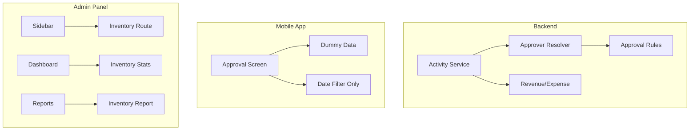
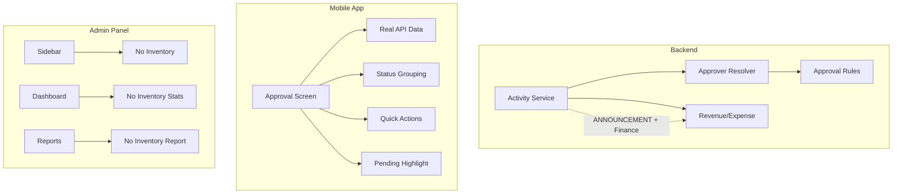

# Design Document: Announcement Financial Support, Admin Inventory Removal, and Approval Screen Redesign

## Overview

This design document covers three related improvements to the Palakat church management platform:

1. **Announcement Activity Financial Support**: Extend the existing activity-finance relationship to fully support ANNOUNCEMENT type activities with optional expense/revenue records.

2. **Admin Panel Inventory Removal**: Remove the unused inventory feature from palakat_admin, including navigation, routes, dashboard widgets, and report options.

3. **Mobile Approval Screen Redesign**: Redesign the approval screen to provide status-based grouping, quick actions, pending action highlighting, and real API integration.

## Architecture

### Current State



### Target State



## Components and Interfaces

### 1. Backend - Activity Service (Existing, No Changes Needed)

The backend already supports financial data for all activity types through the `CreateActivityDto.finance` field. The `ActivityType` enum includes `ANNOUNCEMENT`, and the activity service creates Revenue/Expense records when finance data is provided.

**Verification needed**: Confirm the approver resolver correctly handles ANNOUNCEMENT activities with financial data.

### 2. Admin Panel - Inventory Removal

**Files to Remove:**
- `apps/palakat_admin/lib/features/inventory/` (entire directory)

**Files to Modify:**
- `apps/palakat_admin/lib/main.dart` - Remove inventory route and import
- `packages/palakat_shared/lib/core/widgets/sidebar.dart` - Remove inventory nav item
- `apps/palakat_admin/lib/features/dashboard/presentation/screens/dashboard_screen.dart` - Remove inventory stat card
- `apps/palakat_admin/lib/features/dashboard/presentation/state/dashboard_screen_state.dart` - Remove inventory fields
- `apps/palakat_admin/lib/features/dashboard/presentation/state/dashboard_controller.dart` - Remove inventory data
- `apps/palakat_admin/lib/features/report/presentation/screens/report_screen.dart` - Remove inventory report option

### 3. Mobile App - Approval Screen Redesign

**New State Structure:**
```dart
@freezed
class ApprovalState with _$ApprovalState {
  const factory ApprovalState({
    Membership? membership,
    @Default(true) bool loadingScreen,
    @Default(false) bool isRefreshing,
    @Default(<Activity>[]) List<Activity> allActivities,
    // Status-based grouping
    @Default(<Activity>[]) List<Activity> pendingMyAction,
    @Default(<Activity>[]) List<Activity> pendingOthers,
    @Default(<Activity>[]) List<Activity> approved,
    @Default(<Activity>[]) List<Activity> rejected,
    // Filter state
    DateTime? filterStartDate,
    DateTime? filterEndDate,
    @Default(ApprovalFilterStatus.all) ApprovalFilterStatus statusFilter,
    String? errorMessage,
  }) = _ApprovalState;
}

enum ApprovalFilterStatus { all, pendingMyAction, pendingOthers, approved, rejected }
```

**New Controller Methods:**
```dart
class ApprovalController {
  // Fetch real data from API
  Future<void> fetchActivities();
  
  // Quick actions without navigation
  Future<void> approveActivity(int activityId, int approverId);
  Future<void> rejectActivity(int activityId, int approverId);
  
  // Filtering
  void setStatusFilter(ApprovalFilterStatus status);
  void setDateRange({DateTime? start, DateTime? end});
  
  // Refresh
  Future<void> refresh();
  
  // Internal grouping
  void _groupActivitiesByStatus();
}
```

**UI Components:**

1. **Pending Action Summary Badge** - Shows count of activities requiring user action
2. **Status Filter Chips** - Quick filter by approval status
3. **Activity Card with Quick Actions** - Approve/Reject buttons on card
4. **Financial Indicator Badge** - Shows revenue/expense icon when present
5. **Pull-to-Refresh** - RefreshIndicator wrapper

## Data Models

### Activity Response (Backend - Existing)

```typescript
interface ActivityResponse {
  id: number;
  title: string;
  description?: string;
  activityType: 'SERVICE' | 'EVENT' | 'ANNOUNCEMENT';
  date?: Date;
  supervisor: {
    id: number;
    account: { name: string; phone: string; };
  };
  approvers: Approver[];
  hasRevenue: boolean;
  hasExpense: boolean;
  revenue?: { id: number; amount: number; accountNumber: string; };
  expense?: { id: number; amount: number; accountNumber: string; };
}
```

### Approval Filter Status (Mobile - New)

```dart
enum ApprovalFilterStatus {
  all,
  pendingMyAction,
  pendingOthers,
  approved,
  rejected,
}
```

## Correctness Properties

*A property is a characteristic or behavior that should hold true across all valid executions of a system-essentially, a formal statement about what the system should do. Properties serve as the bridge between human-readable specifications and machine-verifiable correctness guarantees.*

### Property Reflection

After analyzing the acceptance criteria, the following redundancies were identified:
- Properties 1.1 and 1.2 can be combined since accepting finance data and creating the record are part of the same operation
- Properties 3.1 and 3.2 are related but distinct (grouping vs highlighting)
- Properties 3.3 and 3.9 can be combined into a single card content property

### Consolidated Properties

**Property 1: Announcement activity with finance creates linked record**
*For any* ANNOUNCEMENT activity created with a valid finance object, the system should create a corresponding Revenue or Expense record linked to that activity, and the activity detail response should include the financial data.
**Validates: Requirements 1.1, 1.2, 1.4**

**Property 2: Financial filter includes announcement activities**
*For any* query with hasExpense=true or hasRevenue=true filter, the results should include ANNOUNCEMENT activities that have the corresponding financial record, and exclude those that don't.
**Validates: Requirements 1.3**

**Property 3: Approver resolution considers financial account for announcements**
*For any* ANNOUNCEMENT activity created with a financialAccountNumberId, the approver resolution should include approvers from rules matching both the ANNOUNCEMENT activity type and the financial account number.
**Validates: Requirements 1.5**

**Property 4: Status grouping correctness**
*For any* list of activities with various approval statuses, grouping by status should correctly categorize activities into: pending my action (current user has UNCONFIRMED status), pending others (has UNCONFIRMED but not for current user), approved (all approvers APPROVED), and rejected (any approver REJECTED).
**Validates: Requirements 3.1**

**Property 5: Pending action prioritization**
*For any* approval screen state, activities requiring the current user's action should appear before activities pending other approvers' actions in the display order.
**Validates: Requirements 3.2**

**Property 6: Activity card displays required information**
*For any* activity displayed in the approval list, the card should contain: title, supervisor name, date, activity type, overall approval status, and financial indicator (if hasRevenue or hasExpense is true).
**Validates: Requirements 3.3, 3.9**

**Property 7: Quick action buttons visibility**
*For any* activity where the current user has UNCONFIRMED approval status, the activity card should display approve and reject action buttons.
**Validates: Requirements 3.4**

**Property 8: Quick action updates status**
*For any* approve or reject action on an activity card, the approval status should be updated and the activity should move to the appropriate status group without requiring page navigation.
**Validates: Requirements 3.5**

**Property 9: Date filter preserves status grouping**
*For any* date range filter applied to the approval screen, the filtered results should maintain correct status grouping (pending my action, pending others, approved, rejected).
**Validates: Requirements 3.6**

**Property 10: Pending count accuracy**
*For any* approval screen state, the pending action count badge should equal the number of activities where the current user has UNCONFIRMED approval status.
**Validates: Requirements 3.7**

## Error Handling

### Backend
- Invalid finance data returns 400 Bad Request with validation errors
- Non-existent financial account number returns 404 Not Found
- Approver update for non-existent approver returns 404 Not Found

### Mobile App
- API errors display error message with retry option
- Network errors show offline indicator
- Quick action failures show snackbar with error message and don't update local state

### Admin Panel
- Direct navigation to /inventory redirects to /dashboard
- No error states needed for removal (feature simply doesn't exist)

## Testing Strategy

### Dual Testing Approach

This implementation uses both unit tests and property-based tests:
- **Unit tests**: Verify specific examples, edge cases, and integration points
- **Property-based tests**: Verify universal properties that should hold across all inputs

### Property-Based Testing Library

**Backend (NestJS)**: `fast-check` - Already used in the project for property-based testing

### Test Categories

#### Backend Tests

1. **Property Tests** (fast-check, minimum 100 iterations each):
   - Announcement activity with finance creates linked record (Property 1)
   - Financial filter includes announcement activities (Property 2)
   - Approver resolution considers financial account (Property 3)

2. **Unit Tests**:
   - Activity creation with ANNOUNCEMENT type and finance DTO
   - Activity query with hasExpense/hasRevenue filters for ANNOUNCEMENT type
   - Approver resolver with ANNOUNCEMENT + financial account rules

#### Mobile App Tests

1. **Property Tests** (using `glados` or similar Dart PBT library):
   - Status grouping correctness (Property 4)
   - Pending action prioritization (Property 5)
   - Activity card content completeness (Property 6)
   - Quick action button visibility (Property 7)
   - Date filter preserves status grouping (Property 9)
   - Pending count accuracy (Property 10)

2. **Unit Tests**:
   - ApprovalController.fetchActivities() API integration
   - ApprovalController.approveActivity() status update
   - ApprovalController.rejectActivity() status update
   - Status filter application
   - Date range filter application

3. **Widget Tests**:
   - ApprovalScreen renders status groups
   - ActivityCard displays all required information
   - Quick action buttons trigger correct callbacks
   - Pull-to-refresh triggers data reload

#### Admin Panel Tests

1. **Unit Tests**:
   - Sidebar does not contain inventory navigation
   - Dashboard state does not include inventory fields
   - Report screen does not include inventory option

2. **Integration Tests**:
   - /inventory route redirects or shows 404
   - App compiles without inventory imports

### Test Annotation Format

All property-based tests must be annotated with:
```
**Feature: announcement-financial-admin-cleanup-approval-redesign, Property {number}: {property_text}**
```

