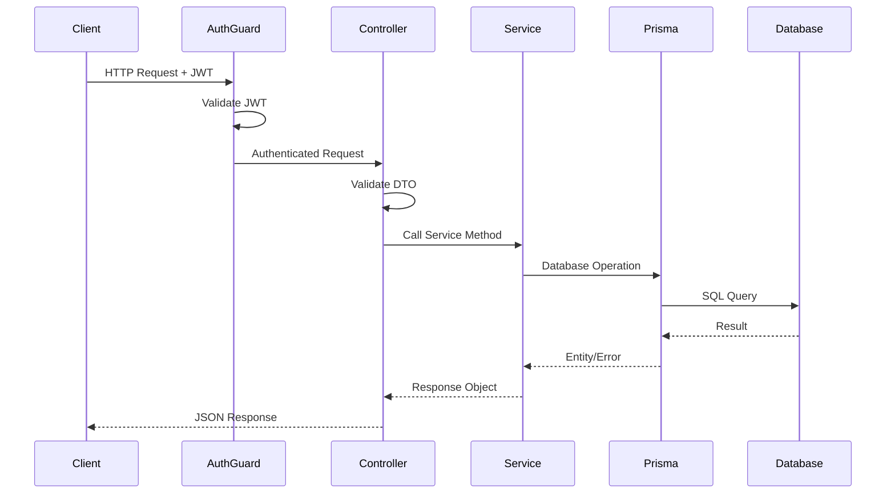

# Design Document: Approver Module

## Overview

The Approver Module provides a REST API for managing approver records in the Palakat church management system. Approvers are church members assigned to review and approve/reject activities. This module follows the existing NestJS patterns established in the codebase, providing full CRUD operations with JWT authentication, validation, and consistent response formatting.

## Architecture

The module follows the standard NestJS modular architecture:

```
apps/palakat_backend/src/approver/
├── dto/
│   ├── create-approver.dto.ts
│   ├── update-approver.dto.ts
│   └── approver-list.dto.ts
├── approver.controller.ts
├── approver.service.ts
└── approver.module.ts
```

### Request Flow



## Components and Interfaces

### ApproverController

Handles HTTP requests and delegates to the service layer.

```typescript
@UseGuards(AuthGuard('jwt'))
@Controller('approver')
export class ApproverController {
  constructor(private readonly approverService: ApproverService) {}

  @Post()
  async create(@Body() createApproverDto: CreateApproverDto): Promise<ApiResponse>

  @Get()
  async findAll(@Query() query: ApproverListQueryDto): Promise<ApiResponse>

  @Get(':id')
  async findOne(@Param('id', ParseIntPipe) id: number): Promise<ApiResponse>

  @Patch(':id')
  async update(
    @Param('id', ParseIntPipe) id: number,
    @Body() updateApproverDto: UpdateApproverDto
  ): Promise<ApiResponse>

  @Delete(':id')
  async remove(@Param('id', ParseIntPipe) id: number): Promise<ApiResponse>
}
```

### ApproverService

Contains business logic for approver operations.

```typescript
@Injectable()
export class ApproverService {
  constructor(private prisma: PrismaService) {}

  async create(createApproverDto: CreateApproverDto): Promise<ApiResponse>
  async findAll(query: ApproverListQueryDto): Promise<ApiResponse>
  async findOne(id: number): Promise<ApiResponse>
  async update(id: number, updateApproverDto: UpdateApproverDto): Promise<ApiResponse>
  async remove(id: number): Promise<ApiResponse>
}
```

### DTOs

#### CreateApproverDto
```typescript
export class CreateApproverDto {
  @IsInt()
  @Min(1)
  membershipId: number;

  @IsInt()
  @Min(1)
  activityId: number;
}
```

#### UpdateApproverDto
```typescript
export class UpdateApproverDto {
  @IsEnum(ApprovalStatus)
  status: ApprovalStatus;
}
```

#### ApproverListQueryDto
```typescript
export class ApproverListQueryDto extends PaginationQueryDto {
  @IsOptional()
  @Type(() => Number)
  @IsInt()
  @Min(1)
  membershipId?: number;

  @IsOptional()
  @Type(() => Number)
  @IsInt()
  @Min(1)
  activityId?: number;

  @IsOptional()
  @IsEnum(ApprovalStatus)
  status?: ApprovalStatus;
}
```

## Data Models

The module operates on the existing Prisma `Approver` model:

```prisma
model Approver {
  id           Int            @id @default(autoincrement())
  membershipId Int
  membership   Membership     @relation(fields: [membershipId], references: [id])
  activityId   Int
  activity     Activity       @relation(fields: [activityId], references: [id], onDelete: Cascade)
  status       ApprovalStatus @default(UNCONFIRMED)
  createdAt    DateTime       @default(now())
  updatedAt    DateTime       @updatedAt

  @@unique([activityId, membershipId])
  @@index([activityId])
  @@index([membershipId])
  @@index([status])
}

enum ApprovalStatus {
  UNCONFIRMED
  APPROVED
  REJECTED
}
```

### Response Format

All endpoints return responses in the standard format:

```typescript
interface ApiResponse {
  message: string;
  data: any;
  total?: number; // For list endpoints
}
```

## Correctness Properties

*A property is a characteristic or behavior that should hold true across all valid executions of a system-essentially, a formal statement about what the system should do. Properties serve as the bridge between human-readable specifications and machine-verifiable correctness guarantees.*

### Property 1: Create initializes with UNCONFIRMED status
*For any* valid membershipId and activityId combination, creating an approver SHALL result in a record with status equal to UNCONFIRMED.
**Validates: Requirements 1.1**

### Property 2: Duplicate creation is rejected
*For any* existing approver record, attempting to create another approver with the same membershipId and activityId SHALL result in a rejection error.
**Validates: Requirements 1.2**

### Property 3: Filter consistency
*For any* list query with filters (membershipId, activityId, or status), all returned approver records SHALL match the specified filter criteria.
**Validates: Requirements 2.2, 2.3, 2.4**

### Property 4: Status update persistence
*For any* existing approver and any valid ApprovalStatus value, updating the approver's status SHALL result in the record having that exact status when retrieved.
**Validates: Requirements 3.1**

### Property 5: Delete removes record
*For any* existing approver, deleting it SHALL result in the record no longer being retrievable by its ID.
**Validates: Requirements 4.1**

### Property 6: Response format consistency
*For any* successful API response from the Approver Module, the response SHALL contain both `message` (string) and `data` fields.
**Validates: Requirements 5.5**

## Error Handling

| Scenario | HTTP Status | Error Message |
|----------|-------------|---------------|
| Invalid DTO validation | 400 | Validation error details |
| Duplicate approver | 400 | "Approver already exists for this activity and membership" |
| Approver not found | 404 | "Approver with ID {id} not found" |
| Membership not found | 404 | "Membership with ID {id} not found" |
| Activity not found | 404 | "Activity with ID {id} not found" |
| Unauthenticated request | 401 | "Unauthorized" |

Errors are handled by the existing `PrismaExceptionFilter` for database-level errors and NestJS built-in validation pipes for DTO validation.

## Testing Strategy

### Dual Testing Approach

The module uses both unit tests and property-based tests for comprehensive coverage:

- **Unit tests**: Verify specific examples, edge cases, and error conditions
- **Property-based tests**: Verify universal properties that should hold across all inputs

### Property-Based Testing

The module uses **fast-check** as specified in the project's tech stack for property-based testing.

Each property-based test:
- Runs a minimum of 100 iterations
- Is tagged with the correctness property it implements using format: `**Feature: approver-module, Property {number}: {property_text}**`
- Tests core logic without mocking where possible

### Test Files

```
apps/palakat_backend/src/approver/
├── approver.service.spec.ts      # Unit tests for service
├── approver.controller.spec.ts   # Unit tests for controller
└── approver.property.spec.ts     # Property-based tests
```

### Unit Test Coverage

- Service methods: create, findAll, findOne, update, remove
- Controller endpoint routing and DTO validation
- Error handling for not found and duplicate scenarios

### Property Test Coverage

Each correctness property from the design is implemented as a property-based test:
1. Create initializes with UNCONFIRMED status
2. Duplicate creation is rejected
3. Filter consistency for list queries
4. Status update persistence
5. Delete removes record
6. Response format consistency
