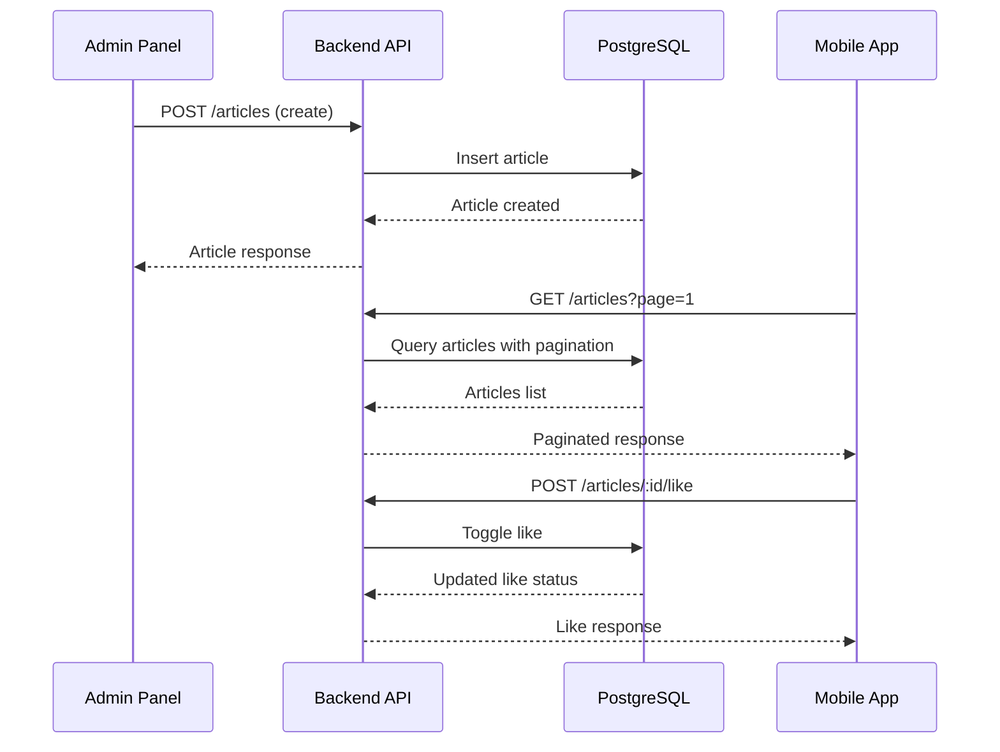

# Design Document

## Overview

The Articles feature enables church administrators to publish content (preaching materials and game instructions) through the admin panel, which church members can browse, search, filter, and like via the mobile app. This feature follows the existing Palakat architecture patterns with NestJS backend, Flutter mobile app, and Flutter web admin panel.

## Architecture

The feature integrates into the existing monorepo structure:

```
palakat_monorepo/
├── apps/
│   ├── palakat/                    # Mobile app - article browsing, search, like
│   │   └── lib/features/article/   # New feature module
│   ├── palakat_admin/              # Admin panel - article CRUD
│   │   └── lib/features/article/   # New feature module
│   └── palakat_backend/            # Backend API - article endpoints
│       └── src/article/            # New module
└── packages/
    └── palakat_shared/             # Shared models and repository
        └── lib/core/models/        # Article model
```

### Data Flow



## Components and Interfaces

### Backend Module (NestJS)

```typescript
// article.controller.ts
@Controller('articles')
@UseGuards(JwtAuthGuard)
export class ArticleController {
  @Get()
  findAll(@Query() query: FindArticlesDto, @Req() req): Promise<PaginatedResponse<Article>>
  
  @Get(':id')
  findOne(@Param('id') id: number, @Req() req): Promise<ArticleWithLikeStatus>
  
  @Post()
  create(@Body() dto: CreateArticleDto, @Req() req): Promise<Article>
  
  @Patch(':id')
  update(@Param('id') id: number, @Body() dto: UpdateArticleDto, @Req() req): Promise<Article>
  
  @Delete(':id')
  remove(@Param('id') id: number, @Req() req): Promise<void>
  
  @Post(':id/like')
  toggleLike(@Param('id') id: number, @Req() req): Promise<LikeResponse>
}

// article.service.ts
@Injectable()
export class ArticleService {
  constructor(private prisma: PrismaService) {}
  
  async findAll(churchId: number, query: FindArticlesDto): Promise<PaginatedResponse<Article>>
  async findOne(id: number, churchId: number, accountId: number): Promise<ArticleWithLikeStatus>
  async create(churchId: number, dto: CreateArticleDto): Promise<Article>
  async update(id: number, churchId: number, dto: UpdateArticleDto): Promise<Article>
  async remove(id: number, churchId: number): Promise<void>
  async toggleLike(articleId: number, accountId: number): Promise<LikeResponse>
}
```

### Mobile App (Flutter)

```dart
// article_controller.dart
@riverpod
class ArticleController extends _$ArticleController {
  Future<void> fetchArticles({int page = 1, String? search, ArticleType? type});
  Future<void> loadMore();
  Future<void> refresh();
  Future<void> toggleLike(int articleId);
}

// article_detail_controller.dart
@riverpod
class ArticleDetailController extends _$ArticleDetailController {
  Future<void> fetchArticle(int id);
  Future<void> toggleLike();
}

// article_screen.dart
class ArticleScreen extends ConsumerWidget {
  // Displays article list with search, filter, infinite scroll
}

// article_detail_screen.dart
class ArticleDetailScreen extends ConsumerWidget {
  // Displays full article content with like button
}
```

### Admin Panel (Flutter)

```dart
// article_controller.dart (admin)
@riverpod
class ArticleController extends _$ArticleController {
  Future<void> fetchArticles({ArticleType? type});
  Future<void> createArticle(CreateArticleDto dto);
  Future<void> updateArticle(int id, UpdateArticleDto dto);
  Future<void> deleteArticle(int id);
}

// article_screen.dart (admin)
class ArticleScreen extends ConsumerStatefulWidget {
  // Data table with filtering, opens drawer for create/edit
}

// article_form_drawer.dart
class ArticleFormDrawer extends ConsumerWidget {
  // Form with title, content (rich text), type, thumbnail
}
```

### Shared Package

```dart
// article.dart (model)
@freezed
class Article with _$Article {
  const factory Article({
    int? id,
    required String title,
    required String content,
    required ArticleType type,
    String? thumbnailUrl,
    required int likeCount,
    bool? isLikedByUser,
    int? churchId,
    DateTime? createdAt,
    DateTime? updatedAt,
  }) = _Article;
  
  factory Article.fromJson(Map<String, dynamic> json) => _$ArticleFromJson(json);
}

// article_type.dart (enum)
enum ArticleType {
  @JsonValue('PREACHING')
  preaching,
  @JsonValue('GAME')
  game,
}

// article_repository.dart
class ArticleRepository {
  Future<PaginatedResponse<Article>> getArticles({int page, String? search, ArticleType? type});
  Future<Article> getArticle(int id);
  Future<Article> createArticle(CreateArticleDto dto);
  Future<Article> updateArticle(int id, UpdateArticleDto dto);
  Future<void> deleteArticle(int id);
  Future<LikeResponse> toggleLike(int articleId);
}
```

## Data Models

### Database Schema (Prisma)

```prisma
model Article {
  id           Int          @id @default(autoincrement())
  title        String
  content      String       @db.Text
  type         ArticleType
  thumbnailUrl String?
  churchId     Int
  church       Church       @relation(fields: [churchId], references: [id], onDelete: Cascade)
  likes        ArticleLike[]
  createdAt    DateTime     @default(now())
  updatedAt    DateTime     @updatedAt

  @@index([churchId])
  @@index([type])
  @@index([createdAt])
}

model ArticleLike {
  id        Int      @id @default(autoincrement())
  articleId Int
  article   Article  @relation(fields: [articleId], references: [id], onDelete: Cascade)
  accountId Int
  account   Account  @relation(fields: [accountId], references: [id], onDelete: Cascade)
  createdAt DateTime @default(now())

  @@unique([articleId, accountId])
  @@index([articleId])
  @@index([accountId])
}

enum ArticleType {
  PREACHING
  GAME
}
```

### DTOs (Backend)

```typescript
// create-article.dto.ts
export class CreateArticleDto {
  @IsString()
  @IsNotEmpty()
  title: string;

  @IsString()
  @IsNotEmpty()
  content: string;

  @IsEnum(ArticleType)
  type: ArticleType;

  @IsOptional()
  @IsUrl()
  thumbnailUrl?: string;
}

// update-article.dto.ts
export class UpdateArticleDto extends PartialType(CreateArticleDto) {}

// find-articles.dto.ts
export class FindArticlesDto extends PaginationDto {
  @IsOptional()
  @IsString()
  search?: string;

  @IsOptional()
  @IsEnum(ArticleType)
  type?: ArticleType;
}
```

## Correctness Properties

*A property is a characteristic or behavior that should hold true across all valid executions of a system-essentially, a formal statement about what the system should do. Properties serve as the bridge between human-readable specifications and machine-verifiable correctness guarantees.*

### Property 1: Article Creation Stores All Fields

*For any* valid article data (title, content, type, thumbnailUrl), creating an article and then retrieving it SHALL return an article with all fields matching the input data.

**Validates: Requirements 1.1, 8.3**

---

### Property 2: Timestamps Are UTC

*For any* created article, the createdAt and updatedAt timestamps SHALL be stored in UTC format and be within a reasonable time window of the creation time.

**Validates: Requirements 1.2**

---

### Property 3: Like Count Accuracy

*For any* article with N likes, retrieving the article SHALL return a likeCount equal to N.

**Validates: Requirements 1.3**

---

### Property 4: Cascade Delete Removes Likes

*For any* article with associated likes, deleting the article SHALL also remove all associated likes from the database.

**Validates: Requirements 1.4**

---

### Property 5: Search Returns Case-Insensitive Title Matches

*For any* search term S and article with title T, the article SHALL be included in search results if and only if T contains S (case-insensitive).

**Validates: Requirements 4.2, 8.7**

---

### Property 6: Filter Returns Correct Type Subset

*For any* filter type F and set of articles, filtering SHALL return exactly the articles where article.type equals F.

**Validates: Requirements 2.5, 5.1**

---

### Property 7: Like Toggle Is Idempotent Round-Trip

*For any* article and user, toggling like twice SHALL return the article to its original like state (liked → unliked → liked, or unliked → liked → unliked).

**Validates: Requirements 7.3, 8.6**

---

### Property 8: Like Button State Reflects User Status

*For any* article and user, the isLikedByUser field SHALL be true if and only if a like record exists for that user and article.

**Validates: Requirements 7.2, 8.2**

---

### Property 9: Pagination Returns Correct Page

*For any* page P and page size S with total articles N, the paginated response SHALL contain at most S articles and represent the correct offset (P-1)*S.

**Validates: Requirements 8.1**

---

### Property 10: Church Data Isolation

*For any* user in Church A requesting articles, the results SHALL NOT include any articles belonging to Church B.

**Validates: Requirements 9.1, 9.3**

---

### Property 11: Article Associated With Creator's Church

*For any* article created by an administrator, the article's churchId SHALL equal the administrator's church membership churchId.

**Validates: Requirements 9.2**

---

### Property 12: Article Card Displays All Required Fields

*For any* article, the rendered article card SHALL contain the title, type badge, like count, and publication date.

**Validates: Requirements 3.4**

---

### Property 13: Detail Screen Displays All Fields

*For any* article, the detail screen SHALL display the title, thumbnail (if present), type, content, like count, and publication date.

**Validates: Requirements 6.2**

---

### Property 14: Article Update Persists Changes

*For any* article update with new values, retrieving the article after update SHALL return the updated values.

**Validates: Requirements 8.4**

---

## Error Handling

### API Errors

| Error | HTTP Status | Response |
|-------|-------------|----------|
| Article not found | 404 | `{ message: "Article not found" }` |
| Unauthorized access | 401 | `{ message: "Unauthorized" }` |
| Cross-church access | 403 | `{ message: "Forbidden" }` |
| Validation error | 400 | `{ message: "Validation failed", errors: [...] }` |

### Mobile App Error States

- Network errors: Display retry button with error message
- Loading states: Show shimmer/skeleton placeholders
- Empty states: Show appropriate message with illustration

### Admin Panel Error States

- Form validation: Inline field errors
- API errors: Snackbar notifications
- Delete confirmation: Modal dialog

## Testing Strategy

### Dual Testing Approach

The project uses both unit tests and property-based tests:

1. **Unit Tests**: Verify specific examples, edge cases, and error conditions
2. **Property Tests**: Verify universal properties across generated inputs

### Property-Based Testing Libraries

- **Flutter**: `kiri_check` package
- **Backend**: `fast-check` ^4.3.0

### Test Configuration

- Minimum 100 iterations per property test
- Each property test tagged with design document reference
- Format: `**Feature: articles, Property {number}: {property_text}**`

### Test File Locations

```
apps/palakat_backend/test/property/
├── article.property.spec.ts          # Properties 1-5, 7-11, 14
└── article-isolation.property.spec.ts # Property 10 (critical)

apps/palakat/test/features/article/
├── article_controller_test.dart      # Unit tests
└── article_property_test.dart        # Properties 6, 12, 13

packages/palakat_shared/test/core/models/
└── article_test.dart                 # Model serialization tests
```

### Key Test Scenarios

**Backend Property Tests:**
- Generate random valid article data, create, retrieve, verify fields match
- Generate articles with varying like counts, verify count accuracy
- Generate search terms and article titles, verify case-insensitive matching
- Generate multi-church scenarios, verify data isolation
- Generate like toggle sequences, verify round-trip consistency

**Frontend Property Tests:**
- Generate random articles, verify card contains all required fields
- Generate filter selections, verify correct subset returned
- Generate articles with various content, verify detail screen displays all fields

