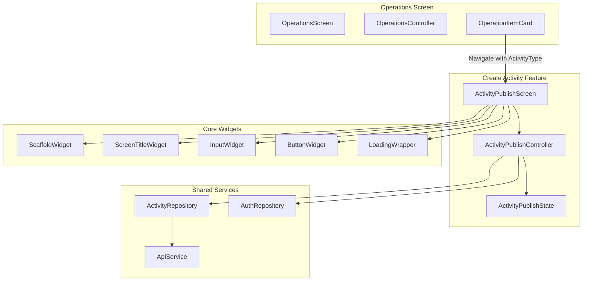

# Design Document: Create Activity Screen

## Overview

The Create Activity Screen is a form-based screen in the Palakat mobile app that enables church members to create new activities (services, events, or announcements). The screen adapts its form fields based on the activity type passed from the Operations screen, providing a streamlined experience for each activity category.

The implementation follows the existing feature module pattern with Riverpod for state management, Freezed for immutable state classes, and reuses existing widgets from the core widget library.

## Architecture



## Components and Interfaces

### ActivityPublishScreen

The main screen widget that renders the activity creation form.

```dart
class ActivityPublishScreen extends ConsumerWidget {
  const ActivityPublishScreen({
    super.key,
    required this.type,
  });

  final ActivityType type;
}
```

**Responsibilities:**
- Render form fields based on activity type
- Display author information section
- Handle user interactions and delegate to controller
- Show loading and error states

### ActivityPublishController

Riverpod controller managing form state and business logic.

```dart
@riverpod
class ActivityPublishController extends _$ActivityPublishController {
  @override
  ActivityPublishState build(ActivityType activityType);
  
  // Form field handlers
  void onChangedBipra(String value);
  void onChangedTitle(String value);
  void onChangedLocation(String value);
  void onChangedPinpointLocation(String value);
  void onChangedDate(String value);
  void onChangedTime(String value);
  void onChangedReminder(String value);
  void onChangedNote(String value);
  void onChangedDescription(String value);
  void onChangedFile(String value);
  
  // Validation
  Future<void> validateForm();
  String? validateBipra(String? value);
  String? validateTitle(String? value);
  String? validateLocation(String? value);
  String? validatePinpointLocation(String? value);
  String? validateDate(String? value);
  String? validateTime(String? value);
  String? validateReminder(String? value);
  String? validateDescription(String? value);
  String? validateFile(String? value);
  
  // Submission
  Future<bool> submit();
  
  // Author info
  Future<void> fetchAuthorInfo();
}
```

### ActivityPublishState

Immutable state class for the form.

```dart
@freezed
abstract class ActivityPublishState with _$ActivityPublishState {
  const factory ActivityPublishState({
    required ActivityType type,
    // Form fields
    String? bipra,
    String? title,
    String? location,
    String? pinpointLocation,
    String? date,
    String? time,
    String? reminder,
    String? note,
    String? description,
    String? file,
    // Error messages
    String? errorBipra,
    String? errorTitle,
    String? errorLocation,
    String? errorPinpointLocation,
    String? errorDate,
    String? errorTime,
    String? errorReminder,
    String? errorNote,
    String? errorDescription,
    String? errorFile,
    // UI state
    @Default(false) bool loading,
    @Default(false) bool isFormValid,
    String? errorMessage,
    // Author info
    String? authorName,
    String? churchName,
    String? currentDate,
  }) = _ActivityPublishState;
}
```

### ActivityRepository

Repository for activity-related API operations.

```dart
abstract class ActivityRepository {
  Future<Result<Activity>> createActivity(CreateActivityRequest request);
}

@freezed
class CreateActivityRequest with _$CreateActivityRequest {
  const factory CreateActivityRequest({
    required int supervisorId,
    required Bipra bipra,
    required String title,
    String? description,
    int? locationId,
    DateTime? date,
    String? note,
    required ActivityType activityType,
  }) = _CreateActivityRequest;
}
```

## Data Models

### Activity (Backend Response)

```dart
@freezed
class Activity with _$Activity {
  const factory Activity({
    required int id,
    required int supervisorId,
    required Bipra bipra,
    required String title,
    String? description,
    int? locationId,
    DateTime? date,
    String? note,
    required ActivityType activityType,
    required DateTime createdAt,
    required DateTime updatedAt,
    Membership? supervisor,
    Location? location,
  }) = _Activity;
  
  factory Activity.fromJson(Map<String, dynamic> json) => _$ActivityFromJson(json);
}
```

### Form Field Configuration

```dart
enum FormFieldType {
  bipra,
  title,
  location,
  pinpointLocation,
  date,
  time,
  reminder,
  note,
  description,
  file,
}

extension ActivityTypeFields on ActivityType {
  List<FormFieldType> get requiredFields {
    switch (this) {
      case ActivityType.service:
      case ActivityType.event:
        return [
          FormFieldType.bipra,
          FormFieldType.title,
          FormFieldType.location,
          FormFieldType.pinpointLocation,
          FormFieldType.date,
          FormFieldType.time,
          FormFieldType.reminder,
        ];
      case ActivityType.announcement:
        return [
          FormFieldType.bipra,
          FormFieldType.title,
          FormFieldType.description,
          FormFieldType.file,
        ];
    }
  }
  
  List<FormFieldType> get optionalFields {
    switch (this) {
      case ActivityType.service:
      case ActivityType.event:
        return [FormFieldType.note];
      case ActivityType.announcement:
        return [];
    }
  }
}
```

## Correctness Properties

*A property is a characteristic or behavior that should hold true across all valid executions of a system-essentially, a formal statement about what the system should do. Properties serve as the bridge between human-readable specifications and machine-verifiable correctness guarantees.*

Based on the prework analysis, the following correctness properties have been identified:

### Property 1: Activity type initialization
*For any* ActivityType passed to the screen, the controller state SHALL be initialized with that exact activity type.
**Validates: Requirements 1.1**

### Property 2: Form fields match activity type
*For any* ActivityType, the set of form fields returned by `requiredFields` and `optionalFields` SHALL match the specification: SERVICE/EVENT types return location-based fields, ANNOUNCEMENT type returns description/file fields.
**Validates: Requirements 2.1, 2.2, 2.3**

### Property 3: State updates on field change
*For any* form field and any valid input value, calling the corresponding `onChanged` handler SHALL result in the state containing that exact value for that field.
**Validates: Requirements 2.4**

### Property 4: Validation errors for empty required fields
*For any* combination of empty required fields based on activity type, calling `validateForm` SHALL set error messages for exactly those empty required fields and no others.
**Validates: Requirements 3.1, 3.2**

### Property 5: Form validity when all required fields valid
*For any* state where all required fields (based on activity type) contain non-empty valid values, `isFormValid` SHALL be true after validation.
**Validates: Requirements 3.3**

### Property 6: Date formatting consistency
*For any* valid DateTime, formatting it for display SHALL produce a string matching the pattern "EEEE, dd MMM yyyy" (e.g., "Wednesday, 26 Nov 2025").
**Validates: Requirements 5.2**

### Property 7: Time formatting consistency
*For any* valid TimeOfDay, formatting it for display SHALL produce a string matching the pattern "HH:mm" (e.g., "14:30").
**Validates: Requirements 5.4**

### Property 8: Loading state during submission
*For any* valid form submission, the loading state SHALL be true while the API request is in progress and false after completion.
**Validates: Requirements 6.2**

### Property 9: Error state on API failure
*For any* API failure response, the state SHALL contain a non-null error message describing the failure.
**Validates: Requirements 6.4**

### Property 10: Author info matches signed-in account
*For any* signed-in account with membership, the authorName in state SHALL equal the account's name and churchName SHALL equal the membership's church name.
**Validates: Requirements 7.1, 7.2**

## Error Handling

### Validation Errors

| Field | Error Condition | Error Message |
|-------|-----------------|---------------|
| Bipra | Empty/null | "Must be selected" |
| Title | Empty/null | "Title is required" |
| Location | Empty/null (SERVICE/EVENT) | "Location is required" |
| Pinpoint Location | Empty/null (SERVICE/EVENT) | "Pinpoint location is required" |
| Date | Empty/null (SERVICE/EVENT) | "Date is required" |
| Time | Empty/null (SERVICE/EVENT) | "Time is required" |
| Reminder | Empty/null (SERVICE/EVENT) | "Reminder is required" |
| Description | Empty/null (ANNOUNCEMENT) | "Description is required" |
| File | Empty/null (ANNOUNCEMENT) | "File is required" |

### API Errors

| Error Type | User Message | Recovery Action |
|------------|--------------|-----------------|
| Network Error | "Unable to connect. Please check your internet connection." | Retry button |
| Server Error | "Something went wrong. Please try again." | Retry button |
| Validation Error | Display server validation message | Fix form and retry |
| Authentication Error | "Session expired. Please sign in again." | Navigate to login |

## Testing Strategy

### Dual Testing Approach

This feature uses both unit tests and property-based tests for comprehensive coverage:

- **Unit tests**: Verify specific examples, edge cases, and integration points
- **Property-based tests**: Verify universal properties that should hold across all inputs

### Property-Based Testing Framework

**Library**: `glados` (Dart property-based testing library)

**Configuration**: Each property test runs a minimum of 100 iterations.

### Test Categories

#### 1. Controller State Tests (Property-Based)
- Test that activity type initialization works for all ActivityType values
- Test that field changes update state correctly for any valid input
- Test that validation produces correct errors for any combination of empty fields

#### 2. Validation Logic Tests (Property-Based)
- Test that form validity is correctly computed for any state
- Test that error messages are cleared when valid input is provided

#### 3. Formatting Tests (Property-Based)
- Test date formatting for any valid DateTime
- Test time formatting for any valid TimeOfDay

#### 4. Integration Tests (Unit)
- Test API submission with mock repository
- Test navigation flow with mock router
- Test author info fetching

### Test Annotation Format

Each property-based test MUST be tagged with:
```dart
// **Feature: create-activity-screen, Property {number}: {property_text}**
```

Example:
```dart
// **Feature: create-activity-screen, Property 1: Activity type initialization**
Glados<ActivityType>().test('controller initializes with provided activity type', (type) {
  final controller = ActivityPublishController();
  final state = controller.build(type);
  expect(state.type, equals(type));
});
```
