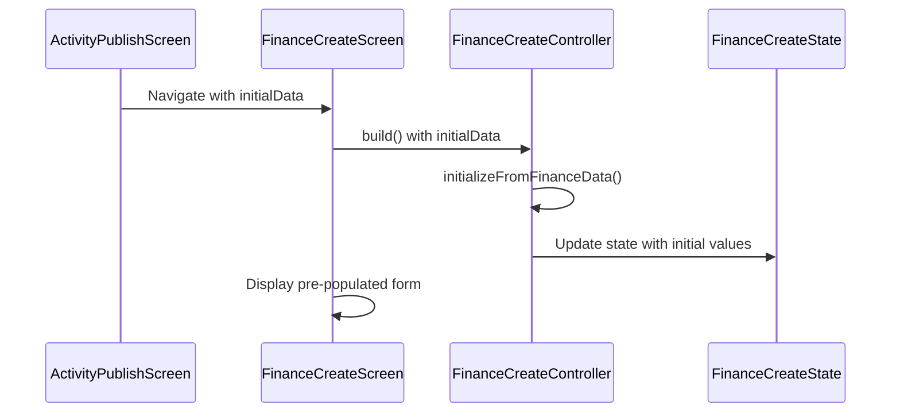

# Design Document: Finance Edit Pre-populate

## Overview

This feature enhances the Finance Create Screen to accept and display initial values when editing an attached financial record from the Activity Publish Screen. The implementation involves:

1. Adding an optional `initialData` parameter to `FinanceCreateScreen`
2. Adding an initialization method to `FinanceCreateController` to populate state from `FinanceData`
3. Updating the Activity Publish Screen to pass existing finance data when editing

## Architecture

The feature follows the existing Riverpod architecture pattern:



## Components and Interfaces

### FinanceCreateScreen Changes

Add optional `initialData` parameter:

```dart
class FinanceCreateScreen extends ConsumerStatefulWidget {
  const FinanceCreateScreen({
    required this.financeType,
    required this.isStandalone,
    this.initialData, // NEW: Optional initial data for editing
    super.key,
  });

  final FinanceType financeType;
  final bool isStandalone;
  final FinanceData? initialData; // NEW
}
```

### FinanceCreateController Changes

Add initialization method and update build signature:

```dart
@riverpod
class FinanceCreateController extends _$FinanceCreateController {
  @override
  FinanceCreateState build(
    FinanceType financeType,
    bool isStandalone,
    FinanceData? initialData, // NEW: Optional initial data
  ) {
    if (initialData != null) {
      return _createInitializedState(financeType, isStandalone, initialData);
    }
    return FinanceCreateState(
      financeType: financeType,
      isStandalone: isStandalone,
    );
  }

  /// Creates state initialized from existing FinanceData.
  /// Requirements: 1.1, 1.2, 1.3, 1.4
  FinanceCreateState _createInitializedState(
    FinanceType financeType,
    bool isStandalone,
    FinanceData data,
  ) {
    // Format amount for display
    final formattedAmount = _formatAmountForDisplay(data.amount);
    
    // Create FinancialAccountNumber from data if available
    FinancialAccountNumber? accountNumber;
    if (data.financialAccountNumberId != null) {
      accountNumber = FinancialAccountNumber(
        id: data.financialAccountNumberId,
        accountNumber: data.accountNumber,
        description: data.accountDescription,
      );
    }

    // Validate and compute form validity
    final isValid = data.amount > 0 &&
        data.accountNumber.isNotEmpty &&
        data.paymentMethod != null;

    return FinanceCreateState(
      financeType: financeType,
      isStandalone: isStandalone,
      amount: formattedAmount,
      selectedFinancialAccountNumber: accountNumber,
      paymentMethod: data.paymentMethod,
      isFormValid: isValid,
    );
  }

  String _formatAmountForDisplay(int amount) {
    // Format as Indonesian Rupiah (e.g., 1000000 -> "1.000.000")
    return amount.toString().replaceAllMapped(
      RegExp(r'(\d{1,3})(?=(\d{3})+(?!\d))'),
      (Match m) => '${m[1]}.',
    );
  }
}
```

### ActivityPublishScreen Changes

Update `_handleEditFinance` to pass existing data:

```dart
Future<void> _handleEditFinance(
  ActivityPublishState state,
  ActivityPublishController controller,
  BuildContext context,
) async {
  final currentFinance = state.attachedFinance;
  if (currentFinance == null) return;

  // Navigate with existing finance data for pre-population
  final financeData = await Navigator.of(context).push<FinanceData>(
    MaterialPageRoute(
      builder: (context) => FinanceCreateScreen(
        financeType: currentFinance.type,
        isStandalone: false,
        initialData: currentFinance, // NEW: Pass existing data
      ),
    ),
  );

  if (financeData != null && mounted) {
    controller.onAttachedFinance(financeData);
  }
}
```

### Delete Confirmation Dialog

Add confirmation dialog before removing attached finance:

```dart
/// Shows confirmation dialog before removing attached financial record.
/// Requirements: 3.1, 3.2, 3.3, 3.4
Future<void> _handleRemoveFinance(
  ActivityPublishController controller,
  BuildContext context,
) async {
  final confirmed = await showDialog<bool>(
    context: context,
    builder: (context) => AlertDialog(
      title: const Text('Remove Financial Record?'),
      content: const Text(
        'Are you sure you want to remove this financial record? '
        'This action cannot be undone.',
      ),
      actions: [
        TextButton(
          onPressed: () => Navigator.of(context).pop(false),
          child: const Text('Cancel'),
        ),
        TextButton(
          onPressed: () => Navigator.of(context).pop(true),
          style: TextButton.styleFrom(foregroundColor: BaseColor.error),
          child: const Text('Remove'),
        ),
      ],
    ),
  );

  if (confirmed == true) {
    controller.removeAttachedFinance();
  }
}
```

Update `FinanceSummaryCard` to use the confirmation handler:

```dart
FinanceSummaryCard(
  financeData: state.attachedFinance!,
  onRemove: () => _handleRemoveFinance(controller, context), // Updated
  onEdit: () => _handleEditFinance(state, controller, context),
)
```

## Data Models

No new data models required. The existing `FinanceData` model contains all necessary fields:

- `type`: FinanceType (revenue/expense)
- `amount`: int (amount in smallest currency unit)
- `accountNumber`: String (account number string)
- `accountDescription`: String? (account description)
- `paymentMethod`: PaymentMethod (CASH/CASHLESS)
- `financialAccountNumberId`: int? (ID for linking to predefined account)

## Correctness Properties

*A property is a characteristic or behavior that should hold true across all valid executions of a system-essentially, a formal statement about what the system should do. Properties serve as the bridge between human-readable specifications and machine-verifiable correctness guarantees.*

### Property 1: Amount field initialization preserves value

*For any* valid FinanceData with a positive amount, when the controller is initialized with that data, the state's amount field SHALL contain a string representation of the original amount value.

**Validates: Requirements 1.1**

### Property 2: Account number initialization preserves selection

*For any* valid FinanceData with a financialAccountNumberId, when the controller is initialized with that data, the state's selectedFinancialAccountNumber SHALL have matching id and accountNumber values.

**Validates: Requirements 1.2**

### Property 3: Payment method initialization preserves selection

*For any* valid FinanceData with a payment method, when the controller is initialized with that data, the state's paymentMethod SHALL equal the original payment method.

**Validates: Requirements 1.3**

### Property 4: Form validity reflects complete initial data

*For any* FinanceData with all required fields populated (amount > 0, non-empty accountNumber, valid paymentMethod), when the controller is initialized with that data, the state's isFormValid SHALL be true.

**Validates: Requirements 1.4, 2.1**

### Property 5: Validation updates after field modification

*For any* controller initialized with valid FinanceData, when a field is modified to an invalid value (e.g., empty amount), the corresponding error field SHALL be non-null and isFormValid SHALL be false.

**Validates: Requirements 2.3**

### Property 6: Confirmed deletion removes attached finance

*For any* ActivityPublishState with a non-null attachedFinance, when the user confirms deletion in the dialog, the resulting state's attachedFinance SHALL be null.

**Validates: Requirements 3.3**

### Property 7: Cancelled deletion preserves attached finance

*For any* ActivityPublishState with a non-null attachedFinance, when the user cancels deletion in the dialog, the resulting state's attachedFinance SHALL equal the original attachedFinance value.

**Validates: Requirements 3.4**

## Error Handling

1. **Null initialData**: When `initialData` is null, the controller creates default empty state (existing behavior)
2. **Missing financialAccountNumberId**: When `financialAccountNumberId` is null but `accountNumber` is present, create a partial `FinancialAccountNumber` for display purposes
3. **Invalid amount**: If amount is 0 or negative, still populate the field but mark form as invalid

## Testing Strategy

### Property-Based Testing

Use `fast-check` library for property-based testing of the controller initialization logic.

**Test Configuration:**
- Minimum 100 iterations per property test
- Use custom generators for FinanceData with various field combinations

**Property Tests:**

1. **Amount Initialization Property Test**
   - Generate random positive integers for amount
   - Verify formatted string can be parsed back to original value
   - Tag: `**Feature: finance-edit-prepopulate, Property 1: Amount field initialization preserves value**`

2. **Account Number Initialization Property Test**
   - Generate random account numbers and IDs
   - Verify state reflects input values
   - Tag: `**Feature: finance-edit-prepopulate, Property 2: Account number initialization preserves selection**`

3. **Payment Method Initialization Property Test**
   - Generate all PaymentMethod enum values
   - Verify state matches input
   - Tag: `**Feature: finance-edit-prepopulate, Property 3: Payment method initialization preserves selection**`

4. **Form Validity Property Test**
   - Generate complete vs incomplete FinanceData
   - Verify isFormValid matches completeness
   - Tag: `**Feature: finance-edit-prepopulate, Property 4: Form validity reflects complete initial data**`

5. **Validation Update Property Test**
   - Initialize with valid data, then modify to invalid
   - Verify error states update correctly
   - Tag: `**Feature: finance-edit-prepopulate, Property 5: Validation updates after field modification**`

6. **Confirmed Deletion Property Test**
   - Generate random FinanceData attached to state
   - Simulate confirmation action
   - Verify attachedFinance becomes null
   - Tag: `**Feature: finance-edit-prepopulate, Property 6: Confirmed deletion removes attached finance**`

7. **Cancelled Deletion Property Test**
   - Generate random FinanceData attached to state
   - Simulate cancellation action
   - Verify attachedFinance remains unchanged
   - Tag: `**Feature: finance-edit-prepopulate, Property 7: Cancelled deletion preserves attached finance**`

### Unit Tests

- Test edge cases: zero amount, empty account number, null payment method
- Test amount formatting for various magnitudes (hundreds, thousands, millions)
- Test that existing onChange handlers still work after initialization
- Test confirmation dialog displays correct message text
- Test dialog button actions (confirm/cancel) trigger correct callbacks

