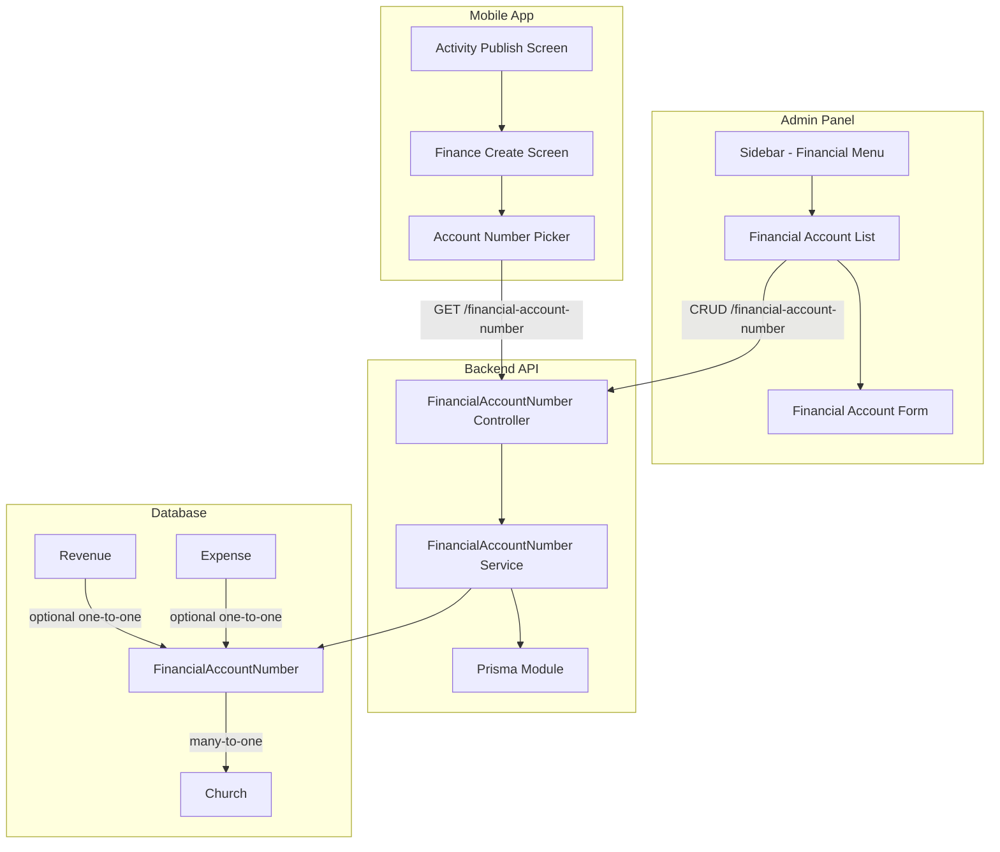

# Design Document: Financial Account Number Management

## Overview

This feature introduces centralized management of financial account numbers across the Palakat platform. The implementation spans three layers:

1. **Backend**: New `FinancialAccountNumber` Prisma model with NestJS CRUD module
2. **Admin Panel**: New "Financial" menu under Administration with account number management UI
3. **Mobile App**: Searchable account number picker widget and UX improvements for financial input confirmation

The design prioritizes:
- Data consistency through predefined account numbers
- User experience with searchable dropdowns
- Backward compatibility with existing Revenue/Expense records

## Architecture



## Components and Interfaces

### Backend Components

#### 1. FinancialAccountNumber Module (`src/financial-account-number/`)

```typescript
// financial-account-number.module.ts
@Module({
  imports: [PrismaModule],
  controllers: [FinancialAccountNumberController],
  providers: [FinancialAccountNumberService],
  exports: [FinancialAccountNumberService],
})
export class FinancialAccountNumberModule {}
```

#### 2. Controller Interface

```typescript
// financial-account-number.controller.ts
@Controller('financial-account-number')
@UseGuards(JwtAuthGuard)
export class FinancialAccountNumberController {
  @Get()
  findAll(@Query() query: FindAllDto, @Req() req): Promise<PaginatedResponse<FinancialAccountNumber>>
  
  @Get(':id')
  findOne(@Param('id') id: number): Promise<FinancialAccountNumber>
  
  @Post()
  create(@Body() dto: CreateFinancialAccountNumberDto, @Req() req): Promise<FinancialAccountNumber>
  
  @Patch(':id')
  update(@Param('id') id: number, @Body() dto: UpdateFinancialAccountNumberDto): Promise<FinancialAccountNumber>
  
  @Delete(':id')
  remove(@Param('id') id: number): Promise<void>
}
```

#### 3. DTOs

```typescript
// dto/create-financial-account-number.dto.ts
export class CreateFinancialAccountNumberDto {
  @IsString()
  @IsNotEmpty()
  accountNumber: string;

  @IsString()
  @IsOptional()
  description?: string;
}

// dto/update-financial-account-number.dto.ts
export class UpdateFinancialAccountNumberDto extends PartialType(CreateFinancialAccountNumberDto) {}

// dto/find-all.dto.ts
export class FindAllDto extends PaginationDto {
  @IsString()
  @IsOptional()
  search?: string;
}
```

### Admin Panel Components

#### 1. Financial Feature Module (`lib/features/financial/`)

```
lib/features/financial/
├── data/
│   └── financial_account_repository.dart
└── presentations/
    ├── financial_account_list/
    │   ├── financial_account_list_controller.dart
    │   ├── financial_account_list_state.dart
    │   ├── financial_account_list_screen.dart
    │   └── widgets/
    │       └── financial_account_card.dart
    └── financial_account_form/
        ├── financial_account_form_controller.dart
        ├── financial_account_form_state.dart
        └── financial_account_form_dialog.dart
```

#### 2. Repository Interface

```dart
abstract class FinancialAccountRepository {
  Future<PaginatedResponse<FinancialAccountNumber>> getAll({
    int page = 1,
    int limit = 20,
    String? search,
  });
  
  Future<FinancialAccountNumber> getById(int id);
  Future<FinancialAccountNumber> create(CreateFinancialAccountDto dto);
  Future<FinancialAccountNumber> update(int id, UpdateFinancialAccountDto dto);
  Future<void> delete(int id);
}
```

### Mobile App Components

#### 1. Account Number Picker Widget

```dart
// lib/core/widgets/account_number_picker/
class AccountNumberPicker extends ConsumerWidget {
  final FinancialAccountNumber? selectedAccount;
  final ValueChanged<FinancialAccountNumber> onSelected;
  final String? errorText;
}

class AccountNumberPickerDialog extends ConsumerStatefulWidget {
  final FinancialAccountNumber? initialSelection;
}
```

#### 2. Updated Finance Create Screen

The existing `FinanceCreateScreen` will be modified to:
- Replace `InputWidget<String>.text` for account number with `AccountNumberPicker`
- Ensure the submit button is clearly labeled for embedded mode

## Data Models

### Prisma Schema Addition

```prisma
model FinancialAccountNumber {
  id            Int       @id @default(autoincrement())
  accountNumber String
  description   String?
  churchId      Int
  church        Church    @relation(fields: [churchId], references: [id], onDelete: Cascade)
  createdAt     DateTime  @default(now())
  updatedAt     DateTime  @updatedAt
  revenue       Revenue?
  expense       Expense?

  @@unique([churchId, accountNumber])
  @@index([churchId])
  @@index([accountNumber])
}
```

### Updated Revenue Model

```prisma
model Revenue {
  id                        Int                      @id @default(autoincrement())
  accountNumber             String                   // Keep for backward compatibility
  amount                    Int
  churchId                  Int
  church                    Church                   @relation(fields: [churchId], references: [id])
  activityId                Int?                     @unique
  activity                  Activity?                @relation(fields: [activityId], references: [id])
  paymentMethod             PaymentMethod
  financialAccountNumberId  Int?                     @unique
  financialAccountNumber    FinancialAccountNumber?  @relation(fields: [financialAccountNumberId], references: [id])
  createdAt                 DateTime                 @default(now())
  updatedAt                 DateTime                 @updatedAt
}
```

### Updated Expense Model

```prisma
model Expense {
  id                        Int                      @id @default(autoincrement())
  accountNumber             String                   // Keep for backward compatibility
  amount                    Int
  churchId                  Int
  church                    Church                   @relation(fields: [churchId], references: [id])
  activityId                Int?                     @unique
  activity                  Activity?                @relation(fields: [activityId], references: [id])
  paymentMethod             PaymentMethod
  financialAccountNumberId  Int?                     @unique
  financialAccountNumber    FinancialAccountNumber?  @relation(fields: [financialAccountNumberId], references: [id])
  createdAt                 DateTime                 @default(now())
  updatedAt                 DateTime                 @updatedAt
}
```

### Dart Models

```dart
// packages/palakat_shared/lib/core/models/financial_account_number.dart
@freezed
class FinancialAccountNumber with _$FinancialAccountNumber {
  const factory FinancialAccountNumber({
    required int id,
    required String accountNumber,
    String? description,
    required int churchId,
    required DateTime createdAt,
    required DateTime updatedAt,
  }) = _FinancialAccountNumber;

  factory FinancialAccountNumber.fromJson(Map<String, dynamic> json) =>
      _$FinancialAccountNumberFromJson(json);
}
```

## Correctness Properties

*A property is a characteristic or behavior that should hold true across all valid executions of a system-essentially, a formal statement about what the system should do. Properties serve as the bridge between human-readable specifications and machine-verifiable correctness guarantees.*

### Property 1: Create-Read Round Trip
*For any* valid account number and description, creating a FinancialAccountNumber and then retrieving it by ID should return a record with matching accountNumber and description values.
**Validates: Requirements 1.3, 5.2**

### Property 2: Delete Removes Record
*For any* existing FinancialAccountNumber, deleting it should result in subsequent retrieval attempts returning not found.
**Validates: Requirements 1.5, 5.4**

### Property 3: Church Relationship Integrity
*For any* created FinancialAccountNumber, the associated churchId should match the authenticated user's church, and querying by churchId should include the created record.
**Validates: Requirements 2.2, 5.1**

### Property 4: Uniqueness Within Church
*For any* church, attempting to create two FinancialAccountNumbers with the same accountNumber string should fail on the second attempt with a uniqueness violation error.
**Validates: Requirements 2.5**

### Property 5: Search Filter Correctness
*For any* search query string, all returned FinancialAccountNumbers should have either accountNumber or description containing the search string (case-insensitive).
**Validates: Requirements 2.6, 5.5**

### Property 6: Optional Relationship Linking
*For any* Revenue or Expense record, linking it to a FinancialAccountNumber should succeed, and the linked record should be retrievable with the relationship intact.
**Validates: Requirements 2.3, 2.4**

### Property 7: Account Number Picker Filter
*For any* search query in the AccountNumberPicker, the displayed results should only contain FinancialAccountNumbers where accountNumber or description contains the query string.
**Validates: Requirements 3.3**

### Property 8: Form Validation and Submission
*For any* Finance_Create_Screen input, tapping the confirm button should either return valid FinanceData (when all required fields are filled) or display validation errors (when required fields are missing).
**Validates: Requirements 4.2, 4.3**

### Property 9: List Display Completeness
*For any* FinancialAccountNumber in the list view, the rendered output should contain the accountNumber, description (if present), and createdAt date.
**Validates: Requirements 1.6**

## Error Handling

### Backend Error Handling

| Error Condition | HTTP Status | Error Code | Message |
|----------------|-------------|------------|---------|
| Account number already exists in church | 409 Conflict | `DUPLICATE_ACCOUNT_NUMBER` | "Account number already exists for this church" |
| Account number not found | 404 Not Found | `NOT_FOUND` | "Financial account number not found" |
| Unauthorized access | 401 Unauthorized | `UNAUTHORIZED` | "Authentication required" |
| Invalid input data | 400 Bad Request | `VALIDATION_ERROR` | Field-specific validation messages |
| Account number in use by Revenue/Expense | 400 Bad Request | `IN_USE` | "Cannot delete account number that is in use" |

### Frontend Error Handling

- Display toast/snackbar for API errors
- Show inline validation errors for form fields
- Handle network errors with retry option
- Show empty state when no account numbers exist

## Testing Strategy

### Dual Testing Approach

This feature uses both unit tests and property-based tests:
- **Unit tests**: Verify specific examples, edge cases, and integration points
- **Property-based tests**: Verify universal properties across all valid inputs using fast-check

### Property-Based Testing

- **Library**: fast-check (already in project dependencies)
- **Minimum iterations**: 100 per property test
- **Test annotation format**: `**Feature: financial-account-number, Property {number}: {property_text}**`

### Backend Tests

1. **Unit Tests** (`test/financial-account-number.spec.ts`)
   - Controller endpoint routing
   - Service method behavior with mocked Prisma
   - DTO validation

2. **Property Tests** (`test/property/financial-account-number.property.spec.ts`)
   - Property 1: Create-Read Round Trip
   - Property 2: Delete Removes Record
   - Property 4: Uniqueness Within Church
   - Property 5: Search Filter Correctness

3. **E2E Tests** (`test/financial-account-number.e2e-spec.ts`)
   - Full CRUD flow with real database
   - Authentication and authorization

### Frontend Tests (Admin Panel)

1. **Unit Tests**
   - Repository methods
   - Controller state management
   - Form validation logic

2. **Widget Tests**
   - List screen rendering
   - Form dialog behavior
   - Error state display

### Mobile App Tests

1. **Unit Tests**
   - AccountNumberPicker filtering logic
   - Finance form validation

2. **Property Tests**
   - Property 7: Account Number Picker Filter
   - Property 8: Form Validation and Submission

3. **Widget Tests**
   - AccountNumberPicker widget rendering
   - Selected state display
   - Empty state handling
