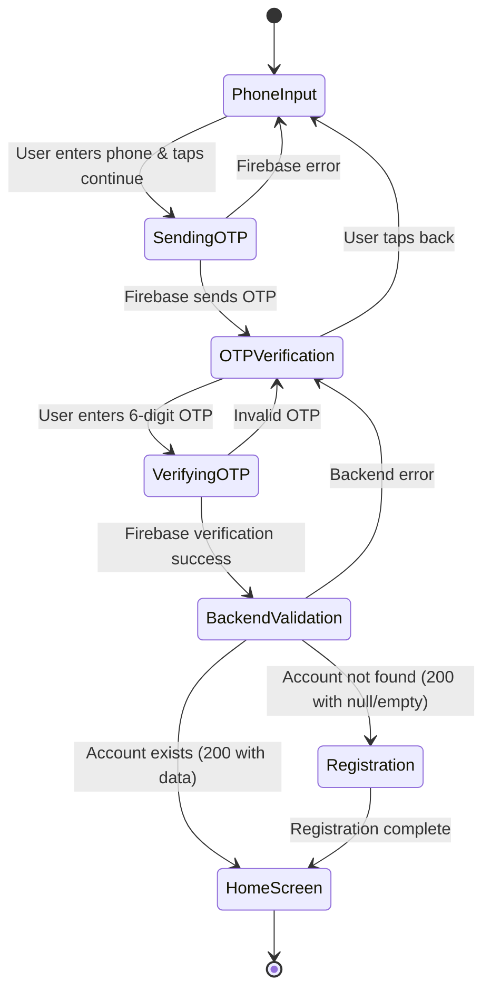

# Design Document

## Overview

This design document outlines the architecture and implementation approach for redesigning the Palakat mobile app authentication screens with Firebase Phone Authentication integration. The solution implements a secure, user-friendly authentication flow that validates users against the backend after Firebase verification succeeds.

### Key Design Principles

1. **Security First**: Firebase handles phone verification, backend validates account existence
2. **Design System Compliance**: Consistent with Material 3 and existing teal color scheme
3. **User Experience**: Clear feedback, minimal friction, intuitive flow
4. **State Management**: Riverpod for reactive state management
5. **Error Resilience**: Graceful error handling with clear user feedback

## Architecture

### High-Level Flow

```
User Input Phone → Firebase Phone Auth → OTP Verification → Backend Validation → Success/Registration
```

### Component Structure

```
features/authentication/
├── presentations/
│   ├── authentication_controller.dart       # Riverpod controller
│   ├── authentication_controller.g.dart     # Generated
│   ├── authentication_state.dart            # Freezed state
│   ├── authentication_state.freezed.dart    # Generated
│   ├── phone_input_screen.dart              # Phone number input UI
│   ├── otp_verification_screen.dart         # OTP input UI
│   └── widgets/
│       ├── phone_input_card.dart            # Phone input card component
│       ├── otp_input_card.dart              # OTP input card component
│       └── country_code_selector.dart       # Country code picker
└── data/
    └── firebase_auth_repository.dart        # Firebase operations
```


### Authentication Flow Diagram



## Components and Interfaces

### 1. Authentication State (Freezed Model)

**File**: `authentication_state.dart`

```dart
@freezed
class AuthenticationState with _$AuthenticationState {
  const factory AuthenticationState({
    // Phone input
    @Default('') String phoneNumber,
    @Default('+62') String countryCode,
    @Default('') String fullPhoneNumber,
    
    // OTP
    @Default('') String otp,
    @Default(false) bool showOtpScreen,
    
    // Timer
    @Default(120) int remainingSeconds,
    @Default(false) bool canResendOtp,
    
    // Loading states
    @Default(false) bool isSendingOtp,
    @Default(false) bool isVerifyingOtp,
    @Default(false) bool isValidatingAccount,
    
    // Error handling
    String? errorMessage,
    
    // Firebase
    String? verificationId,
    int? resendToken,
    
    // Result
    Account? account,
    AuthTokens? tokens,
  }) = _AuthenticationState;
}
```

### 2. Firebase Auth Repository

**File**: `firebase_auth_repository.dart`

**Purpose**: Handles all Firebase Phone Authentication operations

**Key Methods**:

- `verifyPhoneNumber()`: Initiates Firebase phone verification
- `verifyOtp()`: Verifies the OTP code with Firebase
- `resendOtp()`: Resends OTP using resend token
- `signOut()`: Signs out from Firebase

**Dependencies**:
- `firebase_auth` package
- `firebase_core` for initialization

**Implementation Notes**:
- Uses `PhoneAuthProvider` for verification
- Handles automatic verification on Android
- Manages verification callbacks (codeSent, verificationCompleted, verificationFailed)
- Returns `Result<T, Failure>` for consistent error handling

### 3. Authentication Controller (Riverpod)

**File**: `authentication_controller.dart`

**Purpose**: Manages authentication state and orchestrates the flow

**Key Methods**:

```dart
// Phone input
void onPhoneNumberChanged(String value)
void onCountryCodeChanged(String code)
Future<void> sendOtp()

// OTP verification
void onOtpChanged(String value)
Future<void> verifyOtp()
Future<void> resendOtp()

// Navigation
void showOtpScreen()
void goBackToPhoneInput()

// Timer
void startTimer()
void stopTimer()

// Validation
bool validatePhoneNumber()
bool validateOtp()

// Error handling
void clearError()
```

**State Management**:
- Uses Riverpod's `@riverpod` annotation
- Emits new states immutably using Freezed's `copyWith`
- Manages timer lifecycle with `ref.onDispose`

### 4. Phone Input Screen

**File**: `phone_input_screen.dart`

**Purpose**: First screen where users enter their phone number

**UI Components**:
- Background with gradient or solid color
- Centered card with phone input
- Country code selector (dropdown)
- Phone number text field
- Continue button
- Error message display

**Design Specifications**:
- Card: `BaseColor.cardBackground1` with 16px border radius
- Elevation: 1 with subtle shadow
- Icon: Phone icon in teal circle (`BaseColor.teal[100]` background)
- Typography: `BaseTypography.titleMedium` for title, `bodyMedium` for labels
- Input: Uses `InputWidget.text` with numeric keyboard
- Button: `ButtonWidget.primary` with loading state

**Behavior**:
- Auto-format phone number with spacing
- Validate on continue tap
- Show loading indicator during Firebase call
- Display errors below the card
- Navigate to OTP screen on success

### 5. OTP Verification Screen

**File**: `otp_verification_screen.dart`

**Purpose**: Screen where users enter the 6-digit OTP

**UI Components**:
- Back button (top-left)
- Centered card with OTP input
- 6-digit PIN input (using Pinput package)
- Masked phone number display
- Countdown timer
- Resend OTP button
- Error message display

**Design Specifications**:
- Card: Same styling as phone input screen
- Icon: Security/lock icon in teal circle
- PIN boxes: 56x56px, 12px border radius, teal border when focused
- Timer: MM:SS format in `BaseColor.secondaryText`
- Resend button: Disabled state when timer active

**Behavior**:
- Auto-focus on mount
- Auto-submit when 6 digits entered
- Start 120-second countdown on mount
- Enable resend button when timer reaches 0
- Show loading during verification
- Navigate to home or registration based on backend response

## Data Models

### Phone Number Formatting

**Utility Class**: `PhoneNumberFormatter`

```dart
class PhoneNumberFormatter {
  static String format(String phone, String countryCode) {
    // Remove non-digits
    // Add spacing based on country format
    // Return formatted string
  }
  
  static String toE164(String phone, String countryCode) {
    // Convert to E.164 format for Firebase
    // Example: +6281234567890
  }
  
  static String mask(String phone) {
    // Mask middle digits
    // Example: +62 812 **** 7890
  }
}
```

### Country Code Model

```dart
class CountryCode {
  final String code;        // +62
  final String name;        // Indonesia
  final String flag;        // 🇮🇩
  final String dialCode;    // 62
  
  const CountryCode({
    required this.code,
    required this.name,
    required this.flag,
    required this.dialCode,
  });
}
```

**Supported Countries** (Initial):
- Indonesia (+62)
- Malaysia (+60)
- Singapore (+65)
- Philippines (+63)

### Firebase Auth Result

```dart
sealed class FirebaseAuthResult {}

class FirebaseAuthSuccess extends FirebaseAuthResult {
  final String verificationId;
  final int? resendToken;
}

class FirebaseAuthError extends FirebaseAuthResult {
  final String message;
  final String? code;
}

class FirebaseAuthAutoVerified extends FirebaseAuthResult {
  final PhoneAuthCredential credential;
}
```

## Error Handling

### Error Types and Messages

| Error Type | User Message | Action |
|------------|-------------|--------|
| Invalid phone format | "Please enter a valid phone number" | Stay on phone screen |
| Firebase network error | "Network error. Please check your connection" | Show retry button |
| Firebase quota exceeded | "Too many attempts. Please try again later" | Disable for 1 minute |
| Invalid OTP | "Invalid verification code. Please try again" | Clear OTP input |
| OTP expired | "Verification code expired. Please request a new one" | Enable resend |
| Backend 404 | Navigate to registration | Automatic |
| Backend 500 | "Server error. Please try again" | Show retry button |
| Backend network error | "Cannot connect to server" | Show retry button |

### Error Display Component

**Widget**: `AuthErrorDisplay`

```dart
class AuthErrorDisplay extends StatelessWidget {
  final String message;
  final VoidCallback? onRetry;
  
  // Displays error in a card with:
  // - Error icon in red circle
  // - Error message in red text
  // - Optional retry button
}
```

## Testing Strategy

### Unit Tests

**Controller Tests** (`authentication_controller_test.dart`):
- Phone number validation logic
- OTP validation logic
- Timer countdown functionality
- State transitions
- Error handling

**Repository Tests** (`firebase_auth_repository_test.dart`):
- Mock Firebase Auth calls
- Verify correct parameters passed
- Test error scenarios
- Test auto-verification flow

**Formatter Tests** (`phone_number_formatter_test.dart`):
- E.164 conversion
- Display formatting
- Masking logic

### Widget Tests

**Phone Input Screen Tests**:
- Renders correctly
- Country code selector works
- Phone input accepts only numbers
- Continue button disabled when invalid
- Error messages display correctly

**OTP Screen Tests**:
- Renders correctly
- Timer counts down
- Resend button enables at 0
- Auto-submit on 6 digits
- Back navigation works

### Integration Tests

**Full Auth Flow**:
- Complete phone → OTP → validation flow
- Error recovery scenarios
- Back navigation preserves state
- Session persistence after success

### Test Data

**Valid Test Phone Numbers** (Firebase Test Mode):
- +62 812 3456 7890 → OTP: 123456
- +62 813 9876 5432 → OTP: 654321

**Mock Backend Responses**:
- Existing user: Returns account with membership
- New user: Returns empty/null data
- Error: Returns 500 with error message

## Design System Implementation

### Color Palette Usage

**Primary Actions**:
- Button background: `BaseColor.primary3` (black)
- Button text: `BaseColor.white`
- Focus/hover: `BaseColor.primary2`

**Accent Elements**:
- Icon backgrounds: `BaseColor.teal[100]`
- Icon colors: `BaseColor.teal[700]`
- Active borders: `BaseColor.teal[700]`
- Links: `BaseColor.teal[600]`

**Neutral Elements**:
- Card background: `BaseColor.cardBackground1`
- Input borders: `BaseColor.neutral20`
- Disabled text: `BaseColor.secondaryText`
- Placeholder text: `BaseColor.secondaryText`

**Feedback Colors**:
- Error background: `BaseColor.red[50]`
- Error border: `BaseColor.red[200]`
- Error text: `BaseColor.red[800]`
- Error icon: `BaseColor.red[700]`

### Typography Scale

**Screen Titles**: `BaseTypography.titleMedium.copyWith(fontWeight: FontWeight.bold)`
**Body Text**: `BaseTypography.bodyMedium`
**Labels**: `BaseTypography.bodyMedium.copyWith(color: BaseColor.secondaryText)`
**Hints**: `BaseTypography.bodySmall.copyWith(color: BaseColor.secondaryText)`
**Errors**: `BaseTypography.bodySmall.copyWith(color: BaseColor.red[800])`

### Spacing System

**Card Padding**: `EdgeInsets.all(BaseSize.w16)`
**Element Spacing**: `Gap.h12`, `Gap.h16` (vertical), `Gap.w8`, `Gap.w12` (horizontal)
**Screen Padding**: `EdgeInsets.all(BaseSize.w12)`
**Icon Size**: `BaseSize.w16` (small), `BaseSize.w32` (container)

### Component Specifications

**Input Card**:
```dart
Material(
  color: BaseColor.cardBackground1,
  elevation: 1,
  shadowColor: Colors.black.withValues(alpha: 0.05),
  surfaceTintColor: BaseColor.teal[50],
  shape: RoundedRectangleBorder(
    borderRadius: BorderRadius.circular(16),
  ),
)
```

**Icon Container**:
```dart
Container(
  width: BaseSize.w32,
  height: BaseSize.w32,
  decoration: BoxDecoration(
    color: BaseColor.teal[100],
    shape: BoxShape.circle,
  ),
  child: Icon(
    Icons.phone_outlined,
    size: BaseSize.w16,
    color: BaseColor.teal[700],
  ),
)
```

**PIN Input Box** (Pinput):
```dart
PinTheme(
  width: 56,
  height: 56,
  textStyle: TextStyle(
    fontSize: 20,
    color: BaseColor.black,
    fontWeight: FontWeight.w600,
  ),
  decoration: BoxDecoration(
    border: Border.all(color: BaseColor.secondaryText),
    borderRadius: BorderRadius.circular(12),
    color: BaseColor.cardBackground1,
  ),
)
```

## Dependencies

### New Packages Required

Add to `pubspec.yaml`:

```yaml
dependencies:
  # Firebase
  firebase_core: ^3.8.1
  firebase_auth: ^5.3.3
  
  # Phone number utilities
  intl_phone_number_input: ^0.7.4  # For country code picker
  
  # Existing (verify versions)
  pinput: ^5.0.0  # Already in use
  riverpod_annotation: ^2.3.5
  freezed_annotation: ^2.4.4
  go_router: ^16.0.0
  dio: ^5.7.0
```

### Firebase Configuration

**Android** (`android/app/build.gradle`):
- Ensure `minSdkVersion >= 21`
- Add Firebase dependencies

**iOS** (`ios/Podfile`):
- Ensure `platform :ios, '13.0'` or higher
- Enable Firebase Phone Auth capability

**Firebase Console Setup**:
1. Enable Phone Authentication in Firebase Console
2. Add SHA-1 and SHA-256 fingerprints for Android
3. Configure test phone numbers for development
4. Set up reCAPTCHA for web (if supporting web)

### Environment Configuration

Add to `.env`:
```
FIREBASE_API_KEY=your_api_key
FIREBASE_APP_ID=your_app_id
FIREBASE_MESSAGING_SENDER_ID=your_sender_id
FIREBASE_PROJECT_ID=your_project_id
```

## Implementation Phases

### Phase 1: Firebase Setup and Repository
1. Add Firebase dependencies
2. Configure Firebase for Android/iOS
3. Create `FirebaseAuthRepository`
4. Implement phone verification methods
5. Add error handling utilities

### Phase 2: State Management
1. Update `AuthenticationState` with new fields
2. Implement `AuthenticationController` methods
3. Add timer management
4. Implement validation logic

### Phase 3: UI Components
1. Create `PhoneInputScreen`
2. Create `OTPVerificationScreen`
3. Build reusable widgets (country selector, error display)
4. Implement phone number formatting utilities

### Phase 4: Integration
1. Connect Firebase repository to controller
2. Integrate backend validation endpoint
3. Implement navigation flow
4. Add session persistence

### Phase 5: Polish and Testing
1. Add loading states and animations
2. Implement error recovery
3. Write unit tests
4. Write widget tests
5. Perform integration testing
6. Test on physical devices

## Security Considerations

### Firebase Security
- Use Firebase App Check to prevent abuse
- Implement rate limiting on backend
- Validate phone numbers server-side
- Use secure token storage (Hive with encryption)

### Backend Validation
- Verify Firebase ID token on backend (optional enhancement)
- Implement request throttling
- Log authentication attempts
- Monitor for suspicious patterns

### Data Protection
- Never log phone numbers in plain text
- Encrypt tokens in local storage
- Clear sensitive data on logout
- Implement session timeout

## Performance Optimization

### Lazy Loading
- Load Firebase only when needed
- Defer country code list initialization
- Use const constructors where possible

### State Optimization
- Minimize state rebuilds
- Use `select` for specific state slices
- Debounce phone input validation

### Network Optimization
- Cache country code data
- Implement request retry with exponential backoff
- Use connection state monitoring

## Accessibility

### Screen Reader Support
- Add semantic labels to all interactive elements
- Announce state changes (OTP sent, error occurred)
- Provide text alternatives for icons

### Keyboard Navigation
- Ensure tab order is logical
- Support enter key for form submission
- Provide keyboard shortcuts where appropriate

### Visual Accessibility
- Maintain 4.5:1 contrast ratio for text
- Use color + icon for error states (not color alone)
- Support dynamic text sizing
- Provide clear focus indicators

## Migration Strategy

### Backward Compatibility
- Keep existing authentication as fallback
- Feature flag for new auth flow
- Gradual rollout to users

### Data Migration
- No user data migration needed
- Update session format if needed
- Maintain existing token structure

### Rollback Plan
- Keep old authentication code
- Feature flag to switch back
- Monitor error rates post-deployment
