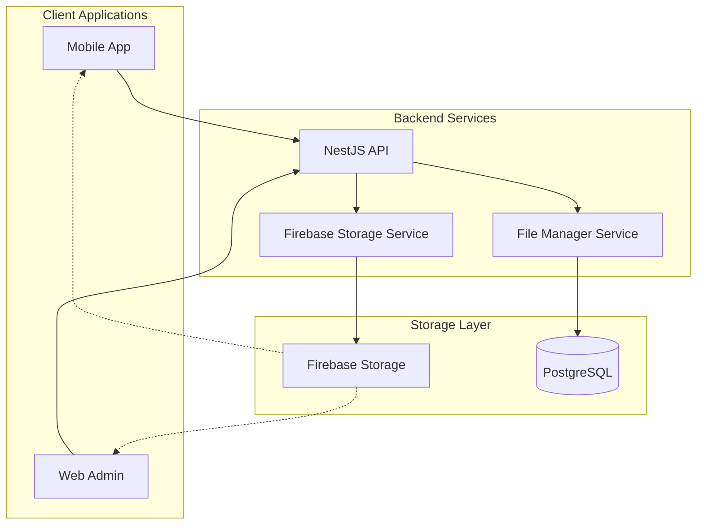

# Firebase Storage Integration Design Document

## Overview

This design document outlines the integration of Firebase Storage into the Palakat church management platform. The integration will replace the current URL-only file management system with a comprehensive cloud storage solution that provides secure file uploads, organized storage, and efficient file serving across all platform components.

The solution leverages the existing Firebase project configuration and extends the current FileManager model to support actual file storage operations while maintaining backward compatibility with existing file references.

## Architecture

### High-Level Architecture



### Storage Organization Structure

Files will be organized in Firebase Storage using the following hierarchical structure:

```
palakat-e70af.firebasestorage.app/
├── churches/
│   └── {churchId}/
│       ├── documents/
│       │   ├── {year}/
│       │   │   └── {filename}
│       │   └── thumbnails/
│       ├── reports/
│       │   ├── {year}/
│       │   │   └── {filename}
│       │   └── generated/
│       ├── activities/
│       │   └── {activityId}/
│       │       └── {filename}
│       └── members/
│           └── {membershipId}/
│               ├── profile/
│               └── documents/
├── system/
│   ├── templates/
│   └── backups/
└── temp/
    └── uploads/
        └── {uploadId}/
```

## Components and Interfaces

### Backend Components

#### 1. Firebase Storage Service (`FirebaseStorageService`)

**Location:** `apps/palakat_backend/src/storage/firebase-storage.service.ts`

**Responsibilities:**
- Initialize Firebase Admin SDK
- Handle file uploads to Firebase Storage
- Generate signed URLs for secure file access
- Manage file deletion and cleanup
- Organize files in structured paths

**Key Methods:**
```typescript
interface FirebaseStorageService {
  uploadFile(file: Express.Multer.File, path: string): Promise<string>
  deleteFile(path: string): Promise<void>
  generateSignedUrl(path: string, expiresIn?: number): Promise<string>
  getFileMetadata(path: string): Promise<FileMetadata>
  listFiles(prefix: string): Promise<string[]>
}
```

#### 2. Enhanced File Service (`FileService`)

**Location:** `apps/palakat_backend/src/file/file.service.ts` (Enhanced)

**Responsibilities:**
- Coordinate between Firebase Storage and database operations
- Handle file upload workflow
- Manage file metadata in PostgreSQL
- Implement access control and permissions
- Handle file cleanup and orphan detection

**Key Methods:**
```typescript
interface EnhancedFileService {
  uploadFile(file: Express.Multer.File, metadata: FileUploadMetadata): Promise<FileManager>
  getFileWithSignedUrl(id: number, userId: number): Promise<FileWithUrl>
  deleteFile(id: number, userId: number): Promise<void>
  cleanupOrphanedFiles(): Promise<CleanupResult>
}
```

#### 3. File Upload Controller (`FileUploadController`)

**Location:** `apps/palakat_backend/src/file/file-upload.controller.ts` (New)

**Responsibilities:**
- Handle multipart file uploads
- Validate file types and sizes
- Generate upload tokens
- Coordinate upload workflow

#### 4. Storage Configuration Service (`StorageConfigService`)

**Location:** `apps/palakat_backend/src/storage/storage-config.service.ts` (New)

**Responsibilities:**
- Manage Firebase Admin SDK configuration
- Handle environment-specific settings
- Provide storage bucket references

### Frontend Components

#### 1. File Upload Service (Mobile)

**Location:** `apps/palakat/lib/core/services/file_upload_service.dart` (New)

**Responsibilities:**
- Handle file selection from device
- Compress images before upload
- Show upload progress
- Retry failed uploads

#### 2. File Upload Service (Admin)

**Location:** `apps/palakat_admin/lib/core/services/file_upload_service.dart` (New)

**Responsibilities:**
- Handle file selection from browser
- Validate file types and sizes
- Manage upload state
- Display upload progress

#### 3. File Manager Repository (Shared)

**Location:** `packages/palakat_shared/lib/core/repositories/file_repository.dart` (Enhanced)

**Responsibilities:**
- API communication for file operations
- Cache file metadata
- Handle signed URL refresh

## Data Models

### Enhanced FileManager Model

```prisma
model FileManager {
  id           Int       @id @default(autoincrement())
  filename     String    // Original filename
  storagePath  String    // Firebase Storage path
  contentType  String    // MIME type
  sizeInBytes  Int       // File size in bytes
  sizeInKB     Float     // Backward compatibility
  url          String?   // Legacy field, will be deprecated
  uploadedBy   Int?      // User who uploaded the file
  churchId     Int?      // Associated church
  createdAt    DateTime  @default(now())
  updatedAt    DateTime  @updatedAt
  
  // Relationships
  report       Report?
  document     Document?
  uploader     Account?  @relation(fields: [uploadedBy], references: [id])
  church       Church?   @relation(fields: [churchId], references: [id])
  
  @@index([churchId])
  @@index([uploadedBy])
  @@index([storagePath])
}
```

### File Upload DTOs

```typescript
// Backend DTOs
export class FileUploadDto {
  @IsString()
  @IsOptional()
  description?: string;

  @IsEnum(FileCategory)
  category: FileCategory;

  @IsInt()
  @IsOptional()
  churchId?: number;

  @IsInt()
  @IsOptional()
  relatedId?: number; // Activity, Document, etc.
}

export class FileUploadResponseDto {
  id: number;
  filename: string;
  contentType: string;
  sizeInBytes: number;
  storagePath: string;
  signedUrl: string;
  expiresAt: Date;
}
```

### Flutter Models

```dart
// Shared models
@freezed
class FileUploadRequest with _$FileUploadRequest {
  const factory FileUploadRequest({
    required String filename,
    required String contentType,
    required int sizeInBytes,
    required FileCategory category,
    int? churchId,
    int? relatedId,
    String? description,
  }) = _FileUploadRequest;
}

@freezed
class FileUploadResult with _$FileUploadResult {
  const factory FileUploadResult({
    required int id,
    required String filename,
    required String signedUrl,
    required DateTime expiresAt,
    required String storagePath,
  }) = _FileUploadResult;
}
```

## Correctness Properties

*A property is a characteristic or behavior that should hold true across all valid executions of a system-essentially, a formal statement about what the system should do. Properties serve as the bridge between human-readable specifications and machine-verifiable correctness guarantees.*

### Property Reflection

After analyzing all acceptance criteria, several properties can be consolidated to eliminate redundancy:

- Properties 1.2, 3.3, 4.1, and 4.4 all relate to file organization and can be combined into a comprehensive storage organization property
- Properties 1.3, 3.4, and 6.1 all relate to database-storage consistency and can be unified
- Properties 5.1, 5.3, and access control aspects can be combined into a comprehensive authorization property
- Properties 7.3 and 7.4 both relate to retry mechanisms and can be consolidated

### Core Properties

**Property 1: File validation consistency**
*For any* file upload attempt, the system should validate file type and size according to configured rules before processing
**Validates: Requirements 1.1, 2.1**

**Property 2: Storage organization consistency**
*For any* uploaded file, the system should store it in Firebase Storage using the hierarchical path structure: `churches/{churchId}/{category}/{year}/{filename}` where category separates documents, reports, and user-generated content
**Validates: Requirements 1.2, 3.3, 4.1, 4.4**

**Property 3: Database-storage consistency**
*For any* successful file operation (upload, delete), the FileManager database record should accurately reflect the Firebase Storage state
**Validates: Requirements 1.3, 3.4, 6.1**

**Property 4: Upload progress reporting**
*For any* file upload from mobile clients, the system should report progress updates and allow cancellation at any point during the upload
**Validates: Requirements 2.2**

**Property 5: UI state consistency**
*For any* completed file operation, the user interface should reflect the updated file state immediately
**Validates: Requirements 1.4, 2.3**

**Property 6: Network resilience**
*For any* file operation that fails due to network issues, the system should implement retry logic with exponential backoff
**Validates: Requirements 2.4, 7.3, 7.4**

**Property 7: Security token generation**
*For any* authenticated file upload request, the system should generate a secure, time-limited upload token
**Validates: Requirements 3.1**

**Property 8: Authorization enforcement**
*For any* file access request, the system should verify user permissions based on church membership and role-based access controls
**Validates: Requirements 3.2, 5.1, 5.3**

**Property 9: Path security validation**
*For any* file upload, the system should prevent path traversal attacks and ensure files are stored only in authorized locations
**Validates: Requirements 4.3**

**Property 10: Signed URL generation**
*For any* authorized file access request, the system should generate time-limited signed URLs that expire according to security policies
**Validates: Requirements 5.2, 5.4**

**Property 11: Cleanup data integrity**
*For any* cleanup operation, the system should preserve all files that have active database references and only remove truly orphaned files
**Validates: Requirements 6.2, 6.3**

**Property 12: Cleanup reporting consistency**
*For any* completed cleanup operation, the system should accurately report the number of files removed and storage space freed
**Validates: Requirements 6.4**

**Property 13: Error message specificity**
*For any* file operation failure, the system should provide specific, actionable error messages to users
**Validates: Requirements 7.1, 7.5**

<function_calls>
<invoke name="prework">
<parameter name="featureName">firebase-storage-integration

## Error Handling

### Error Categories

1. **Validation Errors**
   - Invalid file types
   - File size exceeding limits
   - Missing required metadata

2. **Authentication/Authorization Errors**
   - Expired tokens
   - Insufficient permissions
   - Invalid user context

3. **Storage Errors**
   - Firebase Storage quota exceeded
   - Network connectivity issues
   - Storage bucket access denied

4. **Database Errors**
   - FileManager record creation failures
   - Constraint violations
   - Transaction rollback scenarios

### Error Handling Strategy

```typescript
// Centralized error handling
export class FileOperationError extends Error {
  constructor(
    public readonly code: FileErrorCode,
    public readonly message: string,
    public readonly details?: any
  ) {
    super(message);
  }
}

export enum FileErrorCode {
  INVALID_FILE_TYPE = 'INVALID_FILE_TYPE',
  FILE_TOO_LARGE = 'FILE_TOO_LARGE',
  STORAGE_QUOTA_EXCEEDED = 'STORAGE_QUOTA_EXCEEDED',
  UNAUTHORIZED_ACCESS = 'UNAUTHORIZED_ACCESS',
  NETWORK_ERROR = 'NETWORK_ERROR',
  DATABASE_ERROR = 'DATABASE_ERROR'
}
```

### Retry Logic

- **Network errors**: Exponential backoff with maximum 3 retries
- **Authentication errors**: Token refresh followed by single retry
- **Temporary storage errors**: Linear backoff with maximum 2 retries
- **Permanent errors**: No retry, immediate user notification

## Testing Strategy

### Dual Testing Approach

The Firebase Storage integration will use both unit testing and property-based testing to ensure comprehensive coverage:

**Unit Testing:**
- Specific file upload scenarios with known inputs
- Error condition handling with mocked failures
- Integration points between services
- Authentication and authorization edge cases

**Property-Based Testing:**
- File validation across random file types and sizes
- Storage path generation consistency
- Database-storage synchronization
- Access control enforcement across various user roles
- Cleanup operations with random file sets

### Property-Based Testing Configuration

The system will use **fast-check** for backend property-based testing and **kiri_check** for Flutter property-based testing. Each property-based test will run a minimum of 100 iterations to ensure thorough coverage of the input space.

### Test Tagging Requirements

Each property-based test must be tagged with a comment explicitly referencing the correctness property from this design document using the format: **Feature: firebase-storage-integration, Property {number}: {property_text}**

### Testing Libraries

- **Backend**: Jest with fast-check for property-based testing
- **Flutter**: mocktail for mocking, kiri_check for property-based testing
- **Integration**: Supertest for API testing with real Firebase Storage (test bucket)

### Test Environment Setup

- Dedicated Firebase Storage bucket for testing: `palakat-test.firebasestorage.app`
- Isolated PostgreSQL database for test data
- Mock Firebase Admin SDK for unit tests
- Real Firebase Storage integration for property-based tests

## Implementation Phases

### Phase 1: Backend Foundation
1. Set up Firebase Admin SDK configuration
2. Create FirebaseStorageService with core upload/download functionality
3. Enhance FileService to coordinate storage and database operations
4. Update FileManager model with new fields
5. Create file upload endpoints with validation

### Phase 2: Security and Access Control
1. Implement signed URL generation
2. Add role-based access control for file operations
3. Create upload token system
4. Add audit logging for file operations

### Phase 3: Frontend Integration
1. Create file upload services for mobile and admin apps
2. Implement upload progress tracking
3. Add file compression for mobile images
4. Create file management UI components

### Phase 4: Advanced Features
1. Implement file cleanup and orphan detection
2. Add batch upload capabilities
3. Create file versioning system
4. Implement storage analytics and monitoring

### Phase 5: Testing and Optimization
1. Comprehensive property-based test suite
2. Performance optimization for large files
3. CDN integration for file serving
4. Monitoring and alerting setup

## Dependencies and Integration Points

### External Dependencies
- **firebase-admin**: Firebase Admin SDK for server-side operations
- **multer**: File upload handling in NestJS
- **sharp**: Image processing and compression
- **mime-types**: File type detection and validation

### Flutter Dependencies
- **firebase_storage**: Firebase Storage client SDK
- **image_picker**: File selection from device
- **file_picker**: File selection for documents
- **dio**: HTTP client for upload progress tracking

### Integration Points
- **Authentication**: Leverages existing JWT-based auth system
- **Church Management**: Files are associated with church entities
- **Activity System**: Files can be attached to activities
- **Document Management**: Replaces current URL-only document storage
- **Report Generation**: Stores generated reports in structured format

## Migration Strategy

### Backward Compatibility
- Existing `url` field in FileManager will be maintained during transition
- Legacy file references will continue to work
- Gradual migration of existing files to Firebase Storage

### Migration Steps
1. Deploy new Firebase Storage integration alongside existing system
2. Update file upload flows to use Firebase Storage
3. Migrate existing files from external URLs to Firebase Storage
4. Update file access patterns to use signed URLs
5. Deprecate legacy URL field after full migration

### Data Migration Script
```typescript
// Migration utility to move existing files to Firebase Storage
export class FileMigrationService {
  async migrateExistingFiles(): Promise<MigrationResult> {
    // Download files from existing URLs
    // Upload to Firebase Storage
    // Update FileManager records
    // Verify data integrity
  }
}
```