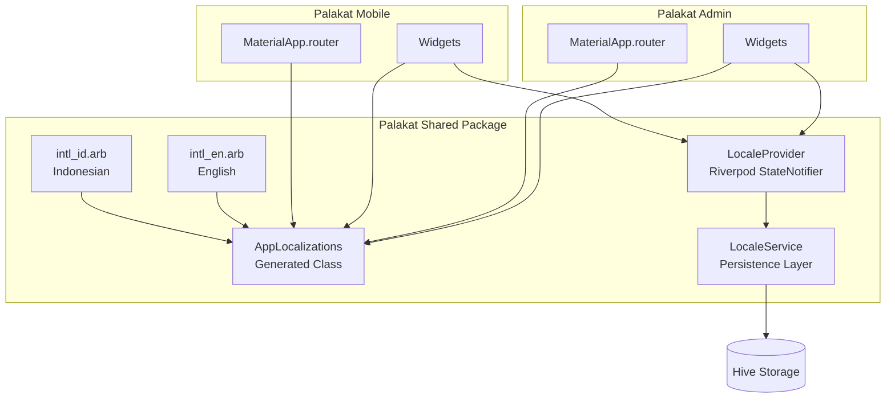

# Design Document: Multi-Language Support

## Overview

This design document outlines the architecture and implementation approach for adding multi-language support (Indonesian and English) to the Palakat mobile app and admin panel. The solution leverages Flutter's built-in localization system with the `intl` package, integrated with Riverpod for state management and Hive for persistence.

The implementation follows a centralized approach where all translations reside in the shared package (`palakat_shared`), ensuring consistency across both applications while allowing app-specific overrides when needed.

## Architecture



## Components and Interfaces

### 1. Localization Files (ARB)

Location: `packages/palakat_shared/lib/l10n/`

```
l10n/
├── intl_id.arb          # Indonesian translations (default)
├── intl_en.arb          # English translations
└── l10n.yaml            # Localization configuration
```

**ARB File Structure (Centralized - Single Source of Truth):**

All translations for both apps are stored in ONE pair of ARB files in the shared package. Keys are organized by category using prefixes for easy maintenance:

```json
{
  "@@locale": "id",
  
  "// App-wide": "",
  "appTitle": "Palakat",
  "@appTitle": { "description": "The application title" },
  
  "// Navigation (nav_)": "",
  "nav_dashboard": "Dasbor",
  "nav_members": "Anggota",
  "nav_activity": "Kegiatan",
  "nav_revenue": "Pendapatan",
  "nav_expense": "Pengeluaran",
  "nav_report": "Laporan",
  "nav_church": "Gereja",
  "nav_document": "Dokumen",
  "nav_approval": "Persetujuan",
  "nav_financial": "Keuangan",
  "nav_billing": "Tagihan",
  "nav_account": "Akun",
  
  "// Buttons (btn_)": "",
  "btn_continue": "Lanjutkan",
  "btn_cancel": "Batal",
  "btn_save": "Simpan",
  "btn_delete": "Hapus",
  "btn_retry": "Coba Lagi",
  "btn_signIn": "Masuk",
  "btn_signOut": "Keluar",
  "btn_resendCode": "Kirim Ulang Kode",
  
  "// Labels (lbl_)": "",
  "lbl_email": "Email",
  "lbl_phone": "Nomor Telepon",
  "lbl_password": "Kata Sandi",
  "lbl_language": "Bahasa",
  
  "// Status (status_)": "",
  "status_approved": "Disetujui",
  "status_pending": "Menunggu",
  "status_rejected": "Ditolak",
  "status_draft": "Draf",
  
  "// Errors (err_)": "",
  "err_networkError": "Kesalahan jaringan. Periksa koneksi Anda.",
  "err_serverError": "Kesalahan server. Coba lagi nanti.",
  "err_unauthorized": "Sesi Anda telah berakhir. Silakan masuk kembali.",
  "err_invalidCredentials": "Email/telepon atau kata sandi salah.",
  
  "// Auth (auth_)": "",
  "auth_welcomeBack": "Selamat Datang Kembali",
  "auth_signInSubtitle": "Masuk ke akun admin Anda",
  "auth_verifyOtp": "Verifikasi OTP",
  "auth_enterCode": "Masukkan kode verifikasi yang dikirim ke",
  "auth_verificationSuccessful": "Verifikasi Berhasil",
  
  "// Dashboard (dashboard_)": "",
  "dashboard_title": "Dasbor",
  "dashboard_subtitle": "Ringkasan kegiatan gereja Anda.",
  "dashboard_totalMembers": "Total Anggota",
  "dashboard_totalRevenue": "Total Pendapatan",
  "dashboard_totalExpense": "Total Pengeluaran",
  "dashboard_recentActivity": "Aktivitas Terbaru",
  
  "// Pluralization example": "",
  "memberCount": "{count, plural, =0{Tidak ada anggota} =1{1 anggota} other{{count} anggota}}",
  "@memberCount": {
    "placeholders": {
      "count": { "type": "int" }
    }
  }
}
```

### 2. LocaleService

Handles persistence of locale preference to Hive storage.

```dart
/// Service for persisting and retrieving locale preferences
class LocaleService {
  static const _kLocaleKey = 'app.locale';
  
  /// Serialize locale to string for storage
  String serializeLocale(Locale locale) => locale.languageCode;
  
  /// Deserialize string to Locale
  Locale deserializeLocale(String code) => Locale(code);
  
  /// Save locale preference
  Future<void> saveLocale(Locale locale);
  
  /// Load saved locale, returns null if not set
  Future<Locale?> loadLocale();
  
  /// Clear saved locale
  Future<void> clearLocale();
}
```

### 3. LocaleProvider (Riverpod)

Manages locale state across the application.

```dart
/// Supported locales
const supportedLocales = [
  Locale('id'), // Indonesian (default)
  Locale('en'), // English
];

/// Default locale
const defaultLocale = Locale('id');

/// Locale state notifier
@riverpod
class LocaleController extends _$LocaleController {
  @override
  Locale build() {
    _loadPersistedLocale();
    return defaultLocale;
  }
  
  Future<void> setLocale(Locale locale);
  Future<void> _loadPersistedLocale();
}
```

### 4. AppLocalizations Integration

Generated class providing type-safe access to translations.

```dart
/// Extension for easy access
extension LocalizationsX on BuildContext {
  AppLocalizations get l10n => AppLocalizations.of(this)!;
}

/// Usage in widgets
Text(context.l10n.dashboard)
Text(context.l10n.memberCount(42))
```

### 5. Language Selector Widget

Reusable widget for language selection.

```dart
/// Language selector dropdown/dialog
class LanguageSelector extends ConsumerWidget {
  /// Available language options
  static const languages = [
    LanguageOption(locale: Locale('id'), name: 'Bahasa Indonesia', flag: '🇮🇩'),
    LanguageOption(locale: Locale('en'), name: 'English', flag: '🇺🇸'),
  ];
  
  @override
  Widget build(BuildContext context, WidgetRef ref);
}
```

## Data Models

### LanguageOption

```dart
@freezed
class LanguageOption with _$LanguageOption {
  const factory LanguageOption({
    required Locale locale,
    required String name,
    required String flag,
  }) = _LanguageOption;
}
```

### Locale Serialization

```dart
/// Locale serialization utilities
class LocaleSerializer {
  /// Convert Locale to storable string
  static String serialize(Locale locale) => locale.languageCode;
  
  /// Parse string back to Locale
  static Locale deserialize(String code) => Locale(code);
  
  /// Check if locale is supported
  static bool isSupported(Locale locale) => 
      supportedLocales.contains(locale);
}
```

## Correctness Properties

*A property is a characteristic or behavior that should hold true across all valid executions of a system-essentially, a formal statement about what the system should do. Properties serve as the bridge between human-readable specifications and machine-verifiable correctness guarantees.*

Based on the prework analysis, the following properties have been identified:

### Property 1: Locale Round-Trip Consistency
*For any* supported locale, serializing it to a string and then deserializing back SHALL produce a locale equal to the original.

**Validates: Requirements 7.1, 7.2, 7.3**

### Property 2: Locale Persistence Consistency
*For any* supported locale, when saved to storage and then loaded, the retrieved locale SHALL equal the saved locale.

**Validates: Requirements 1.5, 1.6, 5.4**

### Property 3: Locale Change Notification
*For any* locale change via LocaleController, all registered listeners SHALL be notified with the new locale value.

**Validates: Requirements 1.4, 5.1**

### Property 4: Date Formatting Locale Awareness
*For any* DateTime value and any supported locale, formatting the date SHALL produce output consistent with that locale's conventions.

**Validates: Requirements 3.4, 4.6**

### Property 5: Number Formatting Locale Awareness
*For any* numeric value and any supported locale, formatting the number SHALL produce output consistent with that locale's conventions.

**Validates: Requirements 3.5**

## Error Handling

### Missing Translations
- The `intl` code generator will fail if a key exists in one ARB file but not the other
- Runtime fallback: If a translation is somehow missing, display the key name wrapped in brackets (e.g., `[missing_key]`)

### Invalid Locale
- If a persisted locale string is invalid or unsupported, fall back to the default locale (Indonesian)
- Log a warning for debugging purposes

### Storage Failures
- If Hive storage fails to save, log the error but don't crash the app
- The locale will still work for the current session but won't persist

## Testing Strategy

### Dual Testing Approach

This feature requires both unit tests and property-based tests:

1. **Unit Tests**: Verify specific examples and edge cases
2. **Property-Based Tests**: Verify universal properties across all inputs

### Property-Based Testing Library

**Library**: `kiri_check` (already in project dependencies)

Configuration: Each property test will run a minimum of 100 iterations.

### Unit Tests

1. **LocaleService Tests**
   - Test saving and loading locale
   - Test handling of missing/invalid data
   - Test default locale behavior

2. **LocaleController Tests**
   - Test initial state is Indonesian
   - Test locale switching
   - Test persistence integration

3. **Widget Tests**
   - Test LanguageSelector displays options
   - Test locale change updates UI

### Property-Based Tests

Each property test MUST be tagged with the format:
`**Feature: multi-language-support, Property {number}: {property_text}**`

1. **Locale Round-Trip Property**
   - Generate random supported locales
   - Verify serialize → deserialize returns original

2. **Persistence Consistency Property**
   - Generate random supported locales
   - Verify save → load returns original

3. **Notification Property**
   - Generate random locale sequences
   - Verify all changes trigger notifications

4. **Date Formatting Property**
   - Generate random DateTime values
   - Verify formatting differs appropriately by locale

5. **Number Formatting Property**
   - Generate random numeric values
   - Verify formatting differs appropriately by locale

## Implementation Notes

### MaterialApp Configuration

Both apps need to configure localization delegates:

```dart
MaterialApp.router(
  locale: ref.watch(localeControllerProvider),
  supportedLocales: supportedLocales,
  localizationsDelegates: [
    AppLocalizations.delegate,
    GlobalMaterialLocalizations.delegate,
    GlobalWidgetsLocalizations.delegate,
    GlobalCupertinoLocalizations.delegate,
  ],
  // ...
)
```

### Code Generation

Add to `pubspec.yaml`:
```yaml
flutter:
  generate: true
```

Create `l10n.yaml`:
```yaml
arb-dir: lib/l10n
template-arb-file: intl_id.arb
output-localization-file: app_localizations.dart
output-class: AppLocalizations
```

### Migration Strategy

1. Start with shared UI strings (navigation, common buttons)
2. Migrate feature-specific strings incrementally
3. Use `// TODO: l10n` comments to track remaining hardcoded strings

