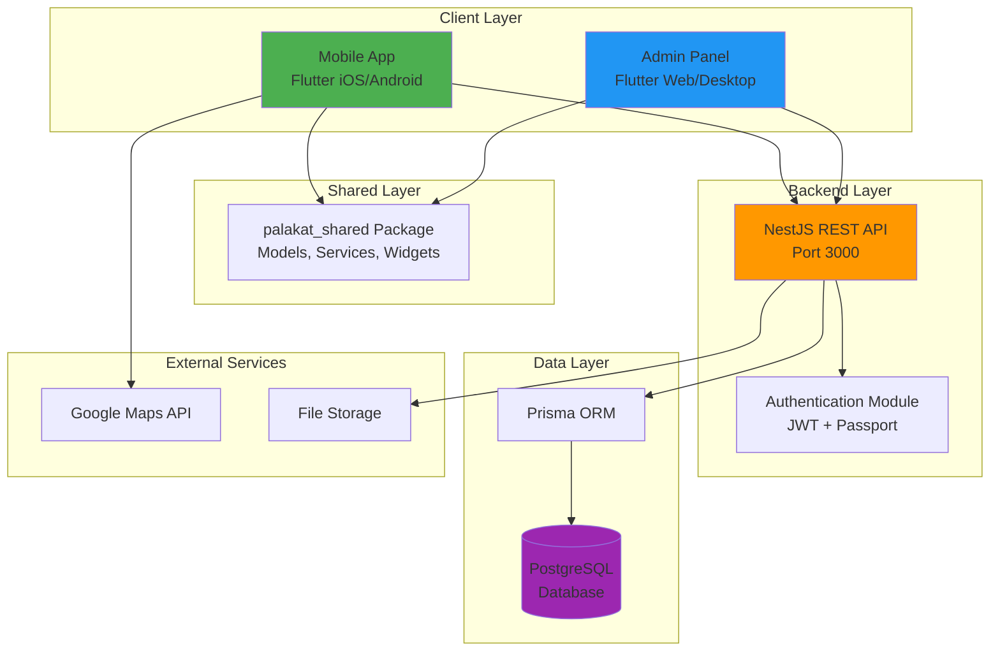
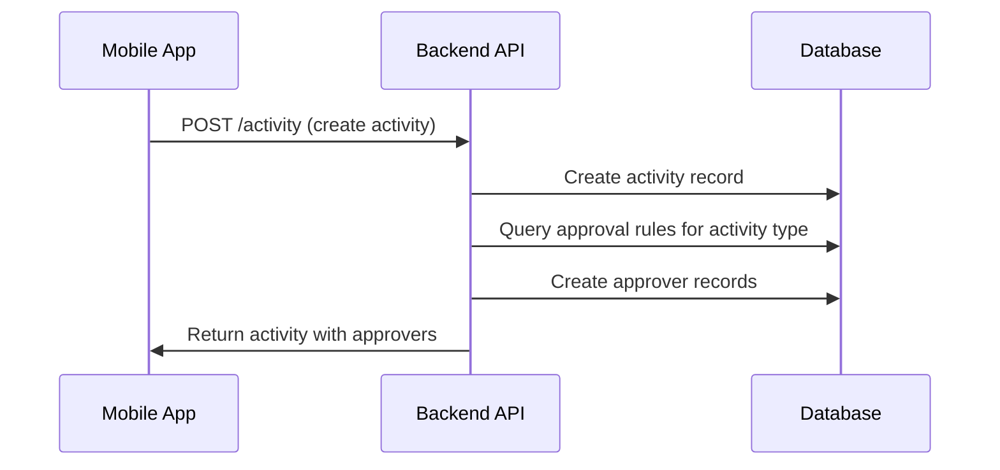

# Design Document

## Overview

The Palakat system is architected as a three-tier application with clear separation of concerns:

1. **Mobile Application Layer** - Flutter-based mobile app for church members (iOS/Android)
2. **Admin Application Layer** - Flutter-based web/desktop app for church administrators
3. **Backend API Layer** - NestJS REST API with PostgreSQL database

The system follows a monorepo structure managed by Melos (Flutter) and pnpm (Node.js), enabling code sharing through the `palakat_shared` package while maintaining independent deployment of each application.

### Design Principles

- **Separation of Concerns**: Clear boundaries between presentation, business logic, and data layers
- **Code Reusability**: Shared package for common models, services, and widgets
- **Scalability**: Multi-tenant architecture supporting multiple churches
- **Security**: JWT-based authentication with refresh token rotation
- **Performance**: Database indexing, pagination, and efficient queries

## Architecture

### System Architecture Diagram



### Mobile App Architecture

The mobile app follows a feature-based layered architecture:

```
Feature Module
├── Data Layer (Repositories)
│   └── Handles API communication and data transformation
├── Presentation Layer
│   ├── Controllers (Business Logic + State Management)
│   ├── States (Immutable State Classes)
│   ├── Screens (UI Components)
│   └── Widgets (Feature-specific UI)
└── Domain Layer (via palakat_shared)
    └── Models, Services, Constants
```

**State Management**: Riverpod with code generation
- Controllers use `@riverpod` annotation for automatic provider generation
- States use `@freezed` for immutable data classes
- Repositories use `@riverpod` for dependency injection

**Navigation**: go_router with declarative routing
- Routes defined in `AppRoute` constants
- Data passed via `extra` parameter with `RouteParam` wrapper

**Local Storage**: Hive for key-value storage
- Authentication tokens (secure storage)
- User preferences

### Admin Panel Architecture

The admin panel shares the same architectural patterns as the mobile app but optimized for desktop/web:

- Responsive layout with side drawer navigation (desktop) and bottom navigation (mobile)
- Data tables with pagination controls
- Form-heavy interfaces for CRUD operations
- Real-time data updates without page refresh

### Backend API Architecture

The backend follows NestJS modular architecture:

```
Module Structure
├── Controller Layer
│   └── HTTP endpoints, request validation, response formatting
├── Service Layer
│   └── Business logic, data transformation, orchestration
├── Repository Layer (Prisma)
│   └── Database queries, transactions, data persistence
└── Common Layer
    ├── Guards (Authentication, Authorization)
    ├── Interceptors (Logging, Pagination)
    ├── Filters (Exception handling)
    └── Utilities (Helpers, Validators)
```

**Authentication Flow**:
1. Client requests client token with API credentials
2. User signs in with phone + password
3. Backend validates credentials and returns JWT access token + refresh token
4. Client includes access token in Authorization header for protected endpoints
5. When access token expires, client uses refresh token to get new access token
6. On sign out, refresh token is invalidated

## Components and Interfaces

### Core Components

#### 1. Authentication System

**Components**:
- `AuthController` - Handles sign-in, sign-out, token refresh, validation
- `AuthService` - Implements authentication logic, token generation
- `JwtStrategy` - Validates JWT tokens for protected routes
- `ClientStrategy` - Validates API client credentials

**Interfaces**:
```typescript
interface SignInDto {
  phone: string;
  password: string;
}

interface AuthResponse {
  accessToken: string;
  refreshToken: string;
  user: {
    id: number;
    name: string;
    phone: string;
    email?: string;
  };
}

interface RefreshDto {
  refreshToken: string;
}
```

**Security Features**:
- Password hashing with bcryptjs
- Failed login attempt tracking with account lockout
- Refresh token rotation (one-time use)
- JWT expiration (15 minutes for access, 7 days for refresh)

#### 2. Activity Management System

**Components**:
- `ActivityController` - CRUD endpoints for activities
- `ActivityService` - Business logic for activity operations
- `ActivityRepository` (Prisma) - Database operations

**Key Features**:
- Automatic approver assignment based on approval rules
- Activity filtering by date, type, BIPRA, status
- Cascade deletion of approvers when activity is deleted
- Support for activity-linked financial records

**Data Flow**:


#### 3. Approval Workflow System

**Components**:
- `ApprovalRuleController` - Manage approval rules
- `ApprovalRuleService` - Rule evaluation and assignment logic
- `ApproverService` - Approver status management

**Approval Rule Evaluation**:
1. When activity is created, system identifies activity type and BIPRA
2. System queries active approval rules for the church
3. System retrieves membership positions associated with matching rules
4. System finds all members holding those positions
5. System creates approver records for each identified member

**Approval States**:
- `UNCONFIRMED` - Initial state, awaiting review
- `APPROVED` - Approver has approved the activity
- `REJECTED` - Approver has rejected the activity

#### 4. Member Management System

**Components**:
- `MembershipController` - Member CRUD operations
- `MembershipService` - Member business logic
- `AccountController` - Account management
- `AccountService` - Account operations

**Member Data Structure**:
- Account (authentication credentials, personal info)
- Membership (church affiliation, column, positions)
- MembershipPosition (roles within church)

**Relationships**:
- One Account → One Membership (1:1)
- One Membership → Many MembershipPositions (1:N)
- One Membership → One Column (N:1)
- One Membership → One Church (N:1)

#### 5. Financial Management System

**Components**:
- `RevenueController` - Revenue CRUD operations
- `ExpenseController` - Expense CRUD operations
- `RevenueService` - Revenue business logic
- `ExpenseService` - Expense business logic

**Financial Record Structure**:
```typescript
interface FinancialRecord {
  id: number;
  accountNumber: string;
  amount: number;
  paymentMethod: 'CASH' | 'CASHLESS';
  churchId: number;
  activityId?: number; // Optional link to activity
  createdAt: Date;
  updatedAt: Date;
}
```

**Features**:
- Optional activity association for event-based finances
- Payment method tracking (cash vs cashless)
- Account number for financial reconciliation
- Date range filtering and reporting

#### 6. Digital Song Book System

**Components**:
- `SongController` - Song CRUD operations
- `SongPartController` - Song part management
- `SongService` - Song business logic

**Song Structure**:
```typescript
interface Song {
  id: number;
  title: string;
  index: number; // Unique song number
  book: 'NKB' | 'NNBT' | 'KJ' | 'DSL';
  link: string; // External reference
  parts: SongPart[];
}

interface SongPart {
  id: number;
  index: number; // Part order
  name: string; // e.g., "Verse 1", "Chorus"
  content: string; // Lyrics
  songId: number;
}
```

**Mobile App Features**:
- Browse songs by book
- Search by title or index
- View song with all parts in order

#### 7. Document and Report System

**Components**:
- `DocumentController` - Document management
- `ReportController` - Report generation
- `FileController` - File upload/download
- `FileService` - File storage operations

**File Management**:
- Files stored with URL and size tracking
- One-to-one relationship with documents/reports
- Support for manual and system-generated reports
- Account number association for financial documents

#### 8. Location and Church System

**Components**:
- `ChurchController` - Church management
- `LocationController` - Location CRUD
- `ColumnController` - Column management

**Church Structure**:
```typescript
interface Church {
  id: number;
  name: string;
  phoneNumber?: string;
  email?: string;
  description?: string;
  documentAccountNumber?: string;
  location: Location;
  columns: Column[];
  memberships: Membership[];
}

interface Location {
  id: number;
  name: string;
  latitude: number;
  longitude: number;
}
```

**Multi-Church Support**:
- All church-specific data includes churchId foreign key
- Data queries filtered by user's church affiliation
- Separate columns, members, and activities per church

### Shared Package (palakat_shared)

The shared package provides reusable code for both Flutter apps:

**Exports**:
- `models.dart` - Freezed data models with JSON serialization
- `services.dart` - ApiService, LocalStorageService, ApproverService
- `repositories.dart` - Data repositories with Riverpod
- `widgets.dart` - Reusable UI components (tables, cards, forms)
- `utils.dart` - Date helpers, validators, error mappers
- `extensions.dart` - String, number, and domain extensions
- `constants.dart` - Enums, presets, configuration
- `theme.dart` - Material 3 theme configuration
- `validation.dart` - Form validators

**Key Services**:

**ApiService**:
- Dio-based HTTP client
- Automatic token injection
- Request/response logging
- Error transformation

**LocalStorageService**:
- Hive-based key-value storage
- Secure token storage

**ApproverService**:
- Approver status management
- Approval workflow helpers

## Data Models

### Core Entities

#### Account
```dart
@freezed
class Account with _$Account {
  const factory Account({
    required int id,
    required String name,
    required String phone,
    String? email,
    required Gender gender,
    required MaritalStatus maritalStatus,
    required DateTime dob,
    required bool isActive,
    required bool claimed,
    Membership? membership,
  }) = _Account;
  
  factory Account.fromJson(Map<String, dynamic> json) => _$AccountFromJson(json);
}
```

#### Activity
```dart
@freezed
class Activity with _$Activity {
  const factory Activity({
    required int id,
    required int supervisorId,
    required Bipra bipra,
    required String title,
    String? description,
    int? locationId,
    DateTime? date,
    String? note,
    required ActivityType activityType,
    required DateTime createdAt,
    required DateTime updatedAt,
    Membership? supervisor,
    List<Approver>? approvers,
    Location? location,
    Revenue? revenue,
    Expense? expense,
  }) = _Activity;
  
  factory Activity.fromJson(Map<String, dynamic> json) => _$ActivityFromJson(json);
}
```

#### Approver
```dart
@freezed
class Approver with _$Approver {
  const factory Approver({
    required int id,
    required int membershipId,
    required int activityId,
    required ApprovalStatus status,
    required DateTime createdAt,
    required DateTime updatedAt,
    Membership? membership,
  }) = _Approver;
  
  factory Approver.fromJson(Map<String, dynamic> json) => _$ApproverFromJson(json);
}
```

### Enumerations

```dart
enum Gender { MALE, FEMALE }

enum MaritalStatus { MARRIED, SINGLE }

enum Bipra { PKB, WKI, PMD, RMJ, ASM }

enum ActivityType { SERVICE, EVENT, ANNOUNCEMENT }

enum ApprovalStatus { UNCONFIRMED, APPROVED, REJECTED }

enum Book { NKB, NNBT, KJ, DSL }

enum PaymentMethod { CASH, CASHLESS }

enum GeneratedBy { MANUAL, SYSTEM }
```

### Database Schema

The PostgreSQL database uses Prisma ORM with the following key relationships:

**One-to-One**:
- Account ↔ Membership
- Church ↔ Location
- Activity ↔ Revenue
- Activity ↔ Expense
- Report ↔ FileManager
- Document ↔ FileManager

**One-to-Many**:
- Church → Columns
- Church → Memberships
- Church → Revenues
- Church → Expenses
- Church → Documents
- Church → Reports
- Church → ApprovalRules
- Column → Memberships
- Membership → MembershipPositions
- Membership → Activities (as supervisor)
- Membership → Approvers
- Activity → Approvers
- Song → SongParts
- ApprovalRule → MembershipPositions

**Indexes**:
- Activity: date, supervisorId, activityType, bipra
- Approver: activityId, membershipId, status
- Membership: churchId + columnId
- Account: phone (unique), email (unique)
- Song: index (unique)

## Error Handling

### Backend Error Handling

**Global Exception Filter**:
- Catches all unhandled exceptions
- Transforms Prisma errors to HTTP errors
- Returns standardized error response format

**Error Response Format**:
```typescript
interface ErrorResponse {
  statusCode: number;
  message: string | string[];
  error: string;
  timestamp: string;
  path: string;
}
```

**Common Error Scenarios**:
- 400 Bad Request - Validation failures
- 401 Unauthorized - Invalid/missing token
- 403 Forbidden - Insufficient permissions
- 404 Not Found - Resource doesn't exist
- 409 Conflict - Unique constraint violation
- 500 Internal Server Error - Unexpected errors

### Frontend Error Handling

**Error Mapper Utility**:
- Transforms API errors to user-friendly messages
- Handles network errors
- Handles timeout errors

**Error Display**:
- Toast messages for transient errors
- Dialog boxes for critical errors
- Inline validation messages for form errors
- Retry mechanisms for network failures

## Testing Strategy

### Backend Testing

**Unit Tests**:
- Service layer business logic
- Utility functions
- Data transformations
- Validation logic

**Integration Tests (E2E)**:
- Authentication flows
- CRUD operations
- Approval workflow
- Multi-church data isolation

**Test Tools**:
- Jest for unit tests
- Supertest for E2E tests
- Test database with Prisma migrations

**Test Coverage Goals**:
- Service layer: 80%+ coverage
- Controllers: 70%+ coverage
- Critical paths: 100% coverage

### Frontend Testing

**Unit Tests**:
- Utility functions
- Extensions
- Validators
- Data transformations

**Widget Tests**:
- Reusable widgets in palakat_shared
- Form validation
- State management logic

**Integration Tests**:
- Navigation flows
- Authentication flow
- Activity creation and approval flow

**Test Tools**:
- Flutter test framework
- Mockito for mocking
- Integration test driver

**Test Coverage Goals**:
- Utilities: 80%+ coverage
- Widgets: 70%+ coverage
- Critical user flows: 100% coverage

### Manual Testing

**Mobile App**:
- Device compatibility (iOS/Android)
- Google Maps integration
- Performance on low-end devices

**Admin Panel**:
- Browser compatibility (Chrome, Firefox, Safari, Edge)
- Responsive design across screen sizes
- Data table performance with large datasets
- File upload/download

**End-to-End Scenarios**:
- Complete activity approval workflow
- Member onboarding and account claiming
- Financial record creation and reporting
- Song book browsing and search
- Multi-church data isolation

## Performance Considerations

### Database Optimization

**Indexing Strategy**:
- Composite indexes on frequently joined columns
- Indexes on foreign keys
- Indexes on date fields for range queries
- Unique indexes on natural keys

**Query Optimization**:
- Use Prisma's `select` to fetch only needed fields
- Use `include` judiciously to avoid N+1 queries
- Implement cursor-based pagination for large datasets
- Use database views for complex aggregations

### API Performance

**Caching**:
- Cache static data (songs, church info) with TTL
- Use ETags for conditional requests
- Implement Redis for session storage (future enhancement)

**Pagination**:
- Default page size: 20 records
- Maximum page size: 100 records
- Return total count for UI pagination controls

**Rate Limiting**:
- Implement rate limiting per user/IP (future enhancement)
- Protect against brute force attacks on auth endpoints

### Mobile App Performance

**Lazy Loading**:
- Infinite scroll for activity lists
- On-demand image loading with caching
- Deferred loading of non-critical data

**Asset Optimization**:
- Compressed images
- SVG icons where possible
- Font subsetting for OpenSans

### Admin Panel Performance

**Virtual Scrolling**:
- Render only visible table rows
- Lazy load data as user scrolls

**Debouncing**:
- Search input debouncing (300ms)
- Form auto-save debouncing

**Code Splitting**:
- Lazy load feature modules
- Separate bundles for admin vs mobile

## Security Considerations

### Authentication Security

- Passwords hashed with bcryptjs (10 rounds)
- JWT tokens signed with HS256 algorithm
- Refresh tokens stored hashed in database
- Account lockout after 5 failed login attempts (30 minute lockout)
- Refresh token rotation (one-time use)

### Authorization Security

- Role-based access control via JWT claims
- Church-level data isolation
- Protected routes require valid JWT
- Admin endpoints require admin role

### Data Security

- Input validation on all endpoints
- SQL injection prevention via Prisma parameterized queries
- XSS prevention via React/Flutter automatic escaping
- CORS configuration for allowed origins
- HTTPS enforcement in production

### File Upload Security

- File type validation
- File size limits
- Virus scanning (future enhancement)
- Secure file storage with access controls

## Deployment Architecture

### Development Environment

- Local PostgreSQL via Docker Compose
- Backend on localhost:3000
- Mobile app via Flutter DevTools
- Admin panel on localhost (web) or desktop

### Production Environment (Recommended)

**Backend**:
- Containerized NestJS app (Docker)
- Managed PostgreSQL (AWS RDS, Google Cloud SQL, or similar)
- Load balancer for horizontal scaling
- Environment variables for configuration

**Mobile App**:
- iOS: App Store distribution
- Android: Google Play Store distribution

**Admin Panel**:
- Web: Static hosting (Vercel, Netlify, AWS S3 + CloudFront)
- Desktop: Standalone executables for Windows/macOS/Linux

**File Storage**:
- AWS S3, Google Cloud Storage, or similar
- CDN for file delivery

**Monitoring**:
- Application logging (Winston, Sentry)
- Performance monitoring (New Relic, Datadog)
- Uptime monitoring (Pingdom, UptimeRobot)

## Future Enhancements

### Phase 2 Features

1. **Advanced Reporting**
   - Custom report builder
   - Financial dashboards with charts
   - Export to PDF/Excel

2. **Communication Features**
   - In-app messaging between members
   - Announcement broadcast system
   - Email notifications (future enhancement)

3. **Calendar Integration**
   - Calendar view of activities
   - iCal export

4. **Enhanced Approval Workflow**
   - Conditional approval rules
   - Approval delegation
   - Approval comments and feedback

5. **Mobile App Enhancements**
   - Dark mode
   - Multiple language support
   - Accessibility improvements

6. **Admin Panel Enhancements**
   - Bulk operations
   - Advanced filtering and search
   - Audit log viewer

### Technical Debt and Improvements

1. **Testing**
   - Increase test coverage to 80%+
   - Implement automated E2E testing
   - Performance testing and benchmarking

2. **Performance**
   - Implement Redis caching
   - Database query optimization
   - CDN for static assets

3. **Security**
   - Two-factor authentication
   - OAuth integration (Google, Facebook)
   - Security audit and penetration testing

4. **DevOps**
   - CI/CD pipeline automation
   - Automated database migrations
   - Blue-green deployment strategy

5. **Monitoring**
   - Comprehensive logging
   - Error tracking and alerting
   - Performance monitoring and APM
