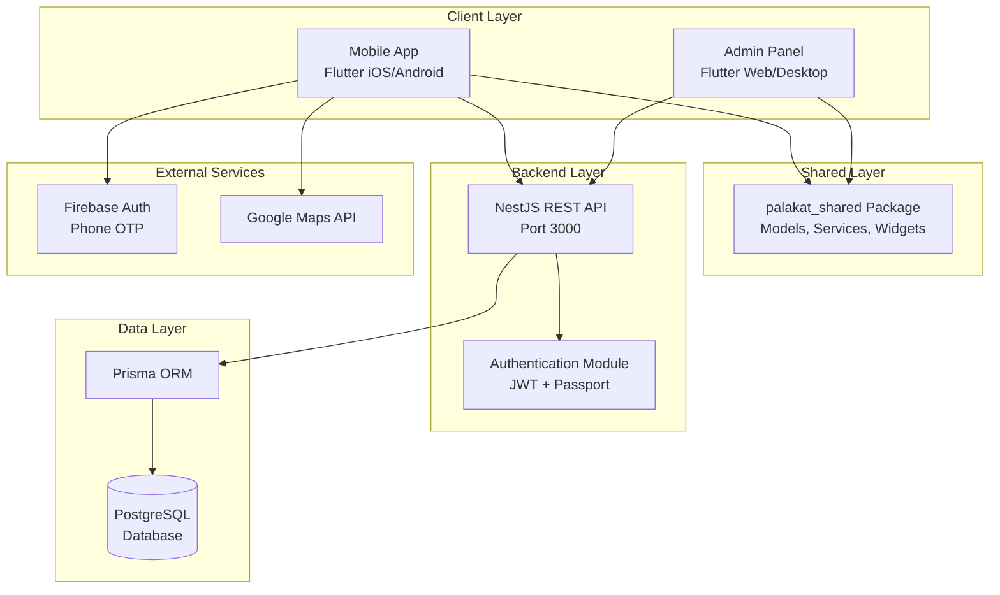
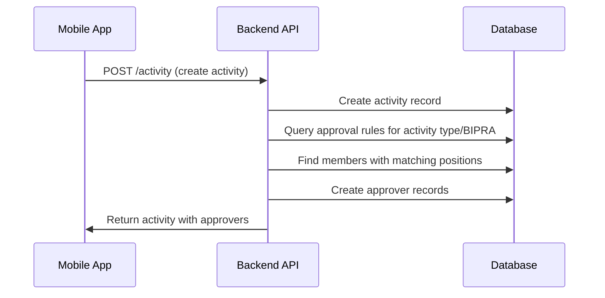
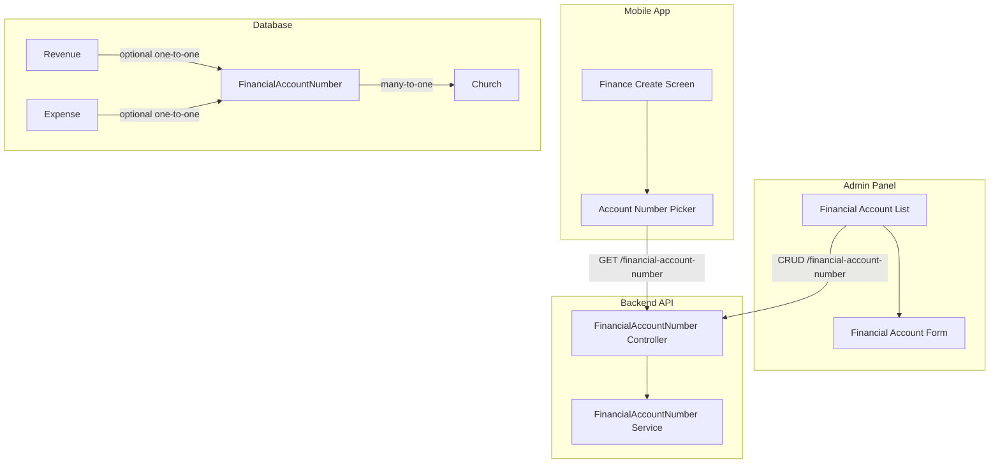
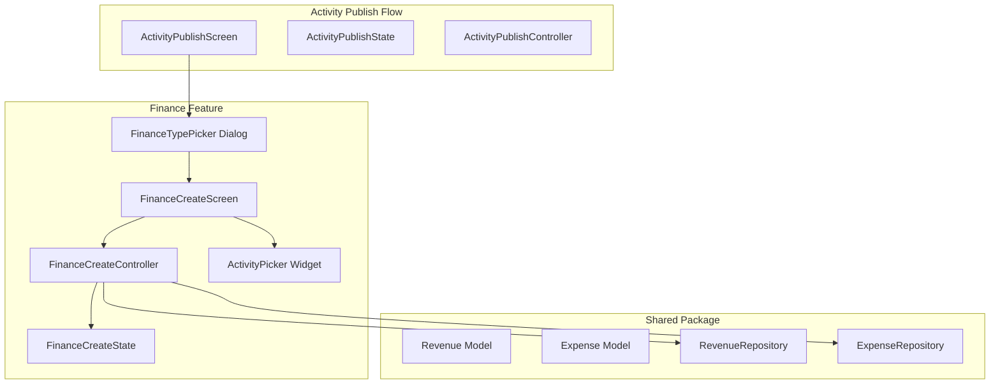
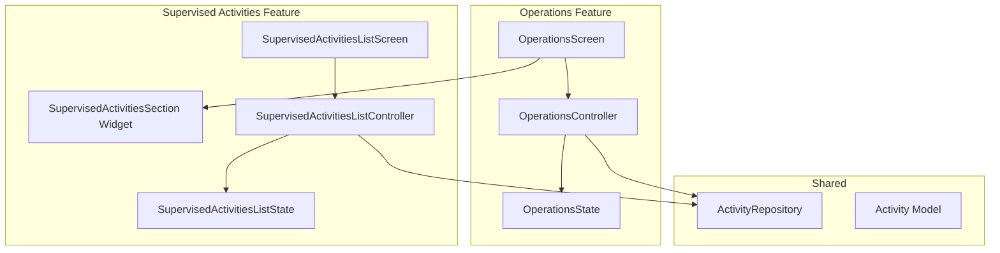
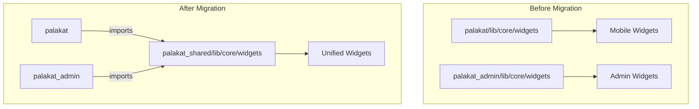
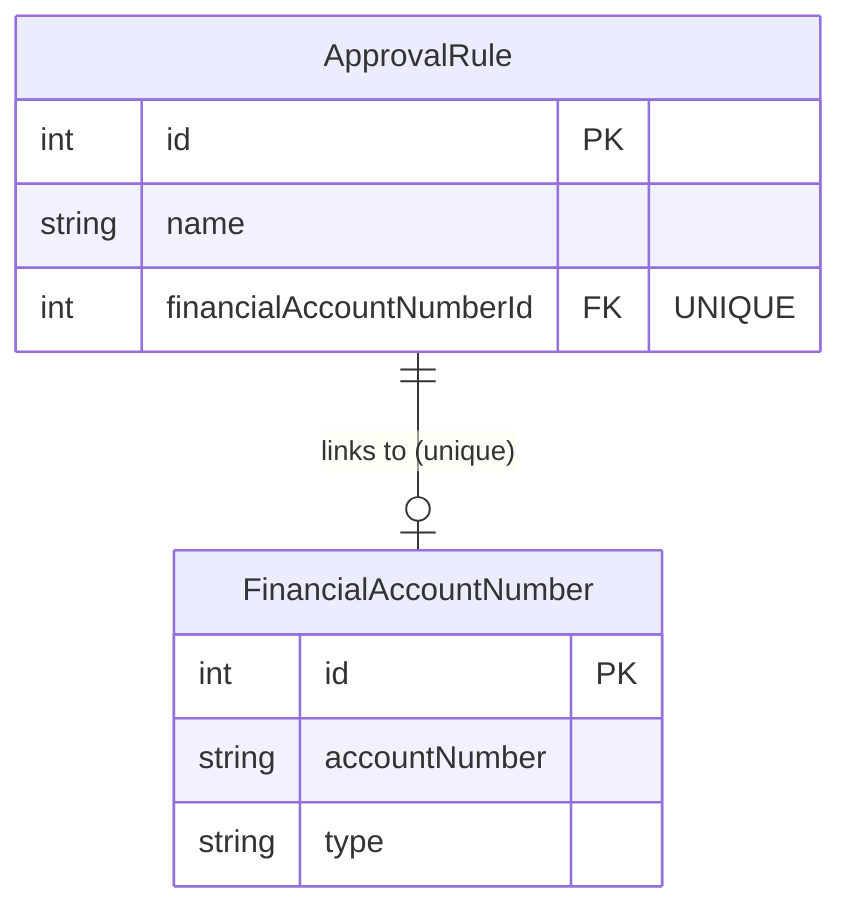
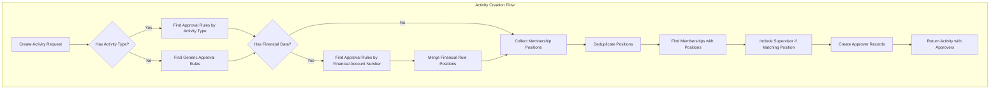

# Design Document

## Overview

The Palakat system is architected as a three-tier application with clear separation of concerns:

1. **Mobile Application Layer** - Flutter-based mobile app for church members (iOS/Android)
2. **Admin Application Layer** - Flutter-based web/desktop app for church administrators
3. **Backend API Layer** - NestJS REST API with PostgreSQL database

The system follows a monorepo structure managed by Melos (Flutter) and pnpm (Node.js), enabling code sharing through the `palakat_shared` package while maintaining independent deployment of each application.

### Design Principles

- **Separation of Concerns**: Clear boundaries between presentation, business logic, and data layers
- **Code Reusability**: Shared package for common models, services, and widgets
- **Scalability**: Multi-tenant architecture supporting multiple churches
- **Security**: JWT-based authentication with refresh token rotation
- **Performance**: Database indexing, pagination, and efficient queries

## Architecture

### System Architecture Diagram



### Mobile App Architecture

The mobile app follows a feature-based layered architecture:

```
Feature Module
├── Data Layer (Repositories)
│   └── Handles API communication and data transformation
├── Presentation Layer
│   ├── Controllers (Business Logic + State Management)
│   ├── States (Immutable State Classes)
│   ├── Screens (UI Components)
│   └── Widgets (Feature-specific UI)
└── Domain Layer (via palakat_shared)
    └── Models, Services, Constants
```

**State Management**: Riverpod with code generation
- Controllers use `@riverpod` annotation for automatic provider generation
- States use `@freezed` for immutable data classes
- Repositories use `@riverpod` for dependency injection

**Navigation**: go_router with declarative routing
- Routes defined in `AppRoute` constants
- Data passed via `extra` parameter with `RouteParam` wrapper

**Local Storage**: Hive for key-value storage
- Authentication tokens (secure storage)
- User preferences

### Backend API Architecture

The backend follows NestJS modular architecture:

```
Module Structure
├── Controller Layer
│   └── HTTP endpoints, request validation, response formatting
├── Service Layer
│   └── Business logic, data transformation, orchestration
├── Repository Layer (Prisma)
│   └── Database queries, transactions, data persistence
└── Common Layer
    ├── Guards (Authentication, Authorization)
    ├── Interceptors (Logging, Pagination)
    ├── Filters (Exception handling)
    └── Utilities (Helpers, Validators)
```

## Components and Interfaces

### 1. Authentication System

**Components**:
- `AuthController` - Handles sign-in, sign-out, token refresh, validation
- `AuthService` - Implements authentication logic, token generation
- `JwtStrategy` - Validates JWT tokens for protected routes
- `ClientStrategy` - Validates API client credentials

**Interfaces**:
```typescript
interface SignInDto {
  phone: string;
  password: string;
}

interface AuthResponse {
  accessToken: string;
  refreshToken: string;
  user: Account;
}

interface ValidateDto {
  phone: string;
}
```

**Security Features**:
- Password hashing with bcryptjs (10 rounds)
- Failed login attempt tracking with account lockout (5 attempts, 30 min lockout)
- Refresh token rotation (one-time use)
- JWT expiration (15 minutes for access, 7 days for refresh)

### 2. Activity Management System

**Components**:
- `ActivityController` - CRUD endpoints for activities
- `ActivityService` - Business logic for activity operations
- `ApproverService` - Approver status management

**Data Flow**:


**Approval States**:
- `UNCONFIRMED` - Initial state, awaiting review
- `APPROVED` - Approver has approved the activity
- `REJECTED` - Approver has rejected the activity

### 3. Financial Account Number System

**Components**:
- `FinancialAccountNumberController` - CRUD endpoints for account numbers
- `FinancialAccountNumberService` - Business logic for account number management
- `AccountNumberPicker` (Mobile) - Searchable dropdown widget

**Architecture**:


### 4. Activity Finance System

**Components**:
- `FinanceCreateScreen` - Form for creating revenue/expense records
- `FinanceCreateController` - Form state and validation logic
- `FinanceTypePicker` - Dialog for selecting revenue or expense
- `FinanceSummaryCard` - Displays attached finance summary
- `RevenueRepository` / `ExpenseRepository` - API integration

**Architecture**:


### 5. Supervised Activities System

**Components**:
- `SupervisedActivitiesSection` - Widget for Operations screen
- `SupervisedActivitiesListScreen` - Full list with filters
- `SupervisedActivitiesListController` - State management with filtering

**Architecture**:


### 6. Digital Song Book System

**Components**:
- `SongController` - Song CRUD operations
- `SongPartController` - Song part management
- `SongService` - Song business logic
- `SongRepository` (Flutter) - API integration for mobile/admin

**Song Structure**:
```typescript
interface Song {
  id: number;
  title: string;
  index: number;
  book: 'NKB' | 'NNBT' | 'KJ' | 'DSL';
  link: string;
  parts: SongPart[];
}

interface SongPart {
  id: number;
  index: number;
  name: string;
  content: string;
  songId: number;
}
```

### 7. UI Design System

**Color System**:
- Primary Color: Teal (0xFF009688)
- Surface Colors: Neutral grays with teal undertone
- Semantic Colors: Tonal variations of primary (error remains red)

**Component Patterns**:
- Category Cards: Collapsible sections with teal headers
- Operation Cards: Icon + title + description + chevron
- Song Cards: Same pattern as operation cards
- Shadows: Subtle elevation with 16px border radius
- Spacing: 8px grid system
- Touch targets: Minimum 48x48 pixels

## Data Models

### Core Entities

#### Account
```dart
@freezed
class Account with _$Account {
  const factory Account({
    required int id,
    required String name,
    required String phone,
    String? email,
    required Gender gender,
    required MaritalStatus maritalStatus,
    required DateTime dob,
    required bool isActive,
    required bool claimed,
    Membership? membership,
  }) = _Account;
}
```

#### Activity
```dart
@freezed
class Activity with _$Activity {
  const factory Activity({
    required int id,
    required int supervisorId,
    required Bipra bipra,
    required String title,
    String? description,
    int? locationId,
    DateTime? date,
    String? note,
    required ActivityType activityType,
    Reminder? reminder,
    required DateTime createdAt,
    required DateTime updatedAt,
    Membership? supervisor,
    List<Approver>? approvers,
    Location? location,
  }) = _Activity;
}
```

#### FinancialAccountNumber
```dart
@freezed
class FinancialAccountNumber with _$FinancialAccountNumber {
  const factory FinancialAccountNumber({
    required int id,
    required String accountNumber,
    String? description,
    required int churchId,
    required DateTime createdAt,
    required DateTime updatedAt,
  }) = _FinancialAccountNumber;
}
```

### Enumerations

```dart
enum Gender { MALE, FEMALE }
enum MaritalStatus { MARRIED, SINGLE }
enum Bipra { PKB, WKI, PMD, RMJ, ASM }
enum ActivityType { SERVICE, EVENT, ANNOUNCEMENT }
enum ApprovalStatus { UNCONFIRMED, APPROVED, REJECTED }
enum Book { NKB, NNBT, KJ, DSL }
enum PaymentMethod { CASH, CASHLESS }
enum RequestStatus { TODO, DOING, DONE }
enum GeneratedBy { MANUAL, SYSTEM }
enum Reminder { TEN_MINUTES, THIRTY_MINUTES, ONE_HOUR, TWO_HOURS }
enum FinanceType { revenue, expense }
```

### Database Schema Key Relationships

**One-to-One**:
- Account and Membership
- Account and ChurchRequest
- Church and Location
- Activity and Revenue
- Activity and Expense
- Revenue and FinancialAccountNumber (optional)
- Expense and FinancialAccountNumber (optional)

**One-to-Many**:
- Church to Columns, Memberships, Revenues, Expenses, Documents, Reports, ApprovalRules, FinancialAccountNumbers
- Membership to MembershipPositions, Activities (as supervisor), Approvers
- Activity to Approvers
- Song to SongParts

**Indexes**:
- Activity: date, supervisorId, activityType, bipra
- Approver: activityId, membershipId, status
- Account: phone (unique), email (unique)
- Song: index (unique)
- ChurchRequest: requesterId (unique), createdAt, status
- FinancialAccountNumber: churchId, accountNumber, [churchId, accountNumber] (unique)

## Correctness Properties

*A property is a characteristic or behavior that should hold true across all valid executions of a system-essentially, a formal statement about what the system should do. Properties serve as the bridge between human-readable specifications and machine-verifiable correctness guarantees.*

### Authentication Properties

**Property 1: Authentication Token Lifecycle**
*For any* valid user credentials, authenticating should return a JWT access token and refresh token with valid structure. *For any* invalid credentials, authentication should be rejected with an appropriate error response.
**Validates: Requirements 1.1, 1.2**

**Property 2: Account Lockout Enforcement**
*For any* account with 5 or more consecutive failed login attempts, subsequent authentication attempts (even with valid credentials) should be rejected until the 30-minute lockout period expires.
**Validates: Requirements 1.3**

**Property 3: Refresh Token Rotation**
*For any* valid refresh token, using it to obtain a new access token should invalidate the old refresh token and return a new one (one-time use). After sign-out, the refresh token should be invalidated.
**Validates: Requirements 1.4, 1.5**

### Account and Member Properties

**Property 4: Account Uniqueness Constraints**
*For any* account creation or update, the system should reject duplicate phone numbers across all accounts, and reject duplicate email addresses where email is provided.
**Validates: Requirements 3.6, 3.7**

**Property 5: Member Data Persistence**
*For any* member creation with name, phone, email, gender, marital status, and date of birth, all fields should be correctly stored and retrievable with correct enum values.
**Validates: Requirements 3.1, 3.8**

**Property 6: Member Update Timestamps**
*For any* member information update, the updatedAt timestamp should be greater than the previous value.
**Validates: Requirements 3.4, 22.2**

### Activity Properties

**Property 7: Activity Creation with Required Fields**
*For any* activity creation with title, description, date, location, activity type, and BIPRA, all fields should be correctly stored and the activity should be retrievable.
**Validates: Requirements 4.1**

**Property 8: Automatic Approver Assignment**
*For any* activity creation, the system should automatically assign approvers based on active approval rules matching the activity type and BIPRA, by finding members with the associated membership positions.
**Validates: Requirements 4.2, 8.4**

**Property 9: Activity Enum Validation**
*For any* activity, the activityType must be one of SERVICE, EVENT, or ANNOUNCEMENT, and bipra must be one of PKB, WKI, PMD, RMJ, or ASM.
**Validates: Requirements 4.8, 4.9**

**Property 10: Activity Cascade Delete**
*For any* activity deletion, all associated approver records should also be deleted.
**Validates: Requirements 4.7**

**Property 11: Approval Status Update**
*For any* approver reviewing an activity, updating the status to APPROVED or REJECTED should persist correctly and be retrievable.
**Validates: Requirements 4.4**

### Activity Reminder Properties

**Property 12: Reminder Persistence on Create**
*For any* valid SERVICE or EVENT activity with a valid reminder value, creating the activity and then retrieving it SHALL return the same reminder value that was provided.
**Validates: Requirements 6.1, 6.5**

**Property 13: Reminder Validation**
*For any* reminder value, the backend SHALL accept it if and only if it is one of the valid enum values (TEN_MINUTES, THIRTY_MINUTES, ONE_HOUR, TWO_HOURS) or null.
**Validates: Requirements 6.3, 6.4**

**Property 14: CreateActivityRequest Round-Trip Serialization**
*For any* valid CreateActivityRequest with a reminder value, serializing to JSON and then deserializing SHALL produce an equivalent object.
**Validates: Requirements 6.10, 6.11**

### Financial Account Number Properties

**Property 15: Create-Read Round Trip**
*For any* valid account number and description, creating a FinancialAccountNumber and then retrieving it by ID should return a record with matching accountNumber and description values.
**Validates: Requirements 9.3, 9.7**

**Property 16: Delete Removes Record**
*For any* existing FinancialAccountNumber, deleting it should result in subsequent retrieval attempts returning not found.
**Validates: Requirements 9.5**

**Property 17: Uniqueness Within Church**
*For any* church, attempting to create two FinancialAccountNumbers with the same accountNumber string should fail on the second attempt with a uniqueness violation error.
**Validates: Requirements 9.9**

**Property 18: Search Filter Correctness**
*For any* search query string, all returned FinancialAccountNumbers should have either accountNumber or description containing the search string (case-insensitive).
**Validates: Requirements 9.10**

### Activity Finance Properties

**Property 19: Financial Section Visibility by Activity Type**
*For any* Activity Publish Screen with activity type service or event, the financial record section SHALL be visible; for announcement type, the section SHALL be hidden.
**Validates: Requirements 10.1**

**Property 20: Amount Validation Correctness**
*For any* string input for amount, the validation SHALL pass only if the string represents a positive integer (greater than 0), and SHALL fail for empty strings, non-numeric strings, zero, and negative numbers.
**Validates: Requirements 10.7**

**Property 21: Currency Formatting Correctness**
*For any* positive integer amount, the formatted display SHALL start with "Rp " prefix and use period (.) as thousand separator (e.g., 1500000 → "Rp 1.500.000").
**Validates: Requirements 10.19**

**Property 22: Combined Creation Order and ID Passing**
*For any* activity submission with attached finance data, the system SHALL first create the activity, then create the finance record using the returned activity ID.
**Validates: Requirements 10.15, 10.16**

### Supervised Activities Properties

**Property 23: Recent Activities Limit**
*For any* list of supervised activities returned from the API, the Operations screen SHALL display at most 3 activities, specifically the most recent ones by date.
**Validates: Requirements 7.1**

**Property 24: Filter Application Correctness**
*For any* filter criteria (activity type and/or date range) applied to the activities list, all displayed activities SHALL match the specified filter criteria.
**Validates: Requirements 7.11**

**Property 25: Active Filter Indicator Consistency**
*For any* state where filterActivityType is non-null OR filterStartDate is non-null OR filterEndDate is non-null, the hasActiveFilters flag SHALL be true.
**Validates: Requirements 7.13**

### Song Book Properties

**Property 26: Song Index Uniqueness**
*For any* song creation, the index number must be unique across all songs in the system.
**Validates: Requirements 12.6**

**Property 27: Song Parts Ordering**
*For any* song with multiple parts, retrieving the song should return parts in sequential order by part index.
**Validates: Requirements 12.7**

**Property 28: Song Search**
*For any* search query by title or index number, all returned songs should match the search criteria.
**Validates: Requirements 12.3**

### Multi-Church and System Properties

**Property 29: Multi-Church Data Isolation**
*For any* authenticated user, all queries should return only data belonging to the user's church, and data from other churches should never be accessible.
**Validates: Requirements 16.1, 16.2, 16.4, 16.5, 16.6**

**Property 30: Pagination Correctness**
*For any* paginated list endpoint, the returned page should contain at most the requested page size (max 100), and pagination metadata (total count, current page, total pages) should be mathematically consistent.
**Validates: Requirements 20.1, 20.2, 20.5**

**Property 31: Validation Error Response**
*For any* request with invalid data, the Backend API should return a 400 Bad Request response with detailed error messages.
**Validates: Requirements 21.2**

**Property 32: Timestamp Management**
*For any* record creation, createdAt should be automatically set to the current UTC time. *For any* record update, updatedAt should be automatically updated to the current UTC time.
**Validates: Requirements 22.1, 22.2, 22.4**

## Error Handling

### Backend Error Handling

**Global Exception Filter**:
- Catches all unhandled exceptions
- Transforms Prisma errors to HTTP errors
- Returns standardized error response format

**Error Response Format**:
```typescript
interface ErrorResponse {
  statusCode: number;
  message: string | string[];
  error: string;
  timestamp: string;
  path: string;
}
```

**Common Error Scenarios**:
- 400 Bad Request - Validation failures
- 401 Unauthorized - Invalid/missing token
- 403 Forbidden - Insufficient permissions
- 404 Not Found - Resource does not exist
- 409 Conflict - Unique constraint violation
- 500 Internal Server Error - Unexpected errors

### Frontend Error Handling

**Error Mapper Utility**:
- Transforms API errors to user-friendly messages
- Handles network errors
- Handles timeout errors

**Error Display**:
- Toast messages for transient errors
- Dialog boxes for critical errors
- Inline validation messages for form errors

## Testing Strategy

### Dual Testing Approach

The system uses both unit testing and property-based testing:

- **Unit tests** verify specific examples, edge cases, and error conditions
- **Property tests** verify universal properties that should hold across all inputs
- Together they provide comprehensive coverage

### Backend Testing

**Framework**: Jest for unit tests, Supertest for E2E tests, fast-check for property-based tests

**Unit Tests**:
- Service layer business logic
- Utility functions
- Data transformations
- Validation logic

**Property-Based Tests**:
- Use `fast-check` library for property-based testing
- Minimum 100 iterations per property test
- Each property test tagged with format: `**Feature: palakat-complete, Property {number}: {property_text}**`

**Test Coverage Goals**:
- Service layer: 80%+ coverage
- Controllers: 70%+ coverage
- Critical paths: 100% coverage

### Frontend Testing

**Framework**: Flutter test framework with Mockito, glados/kiri_check for property-based testing

**Unit Tests**:
- Utility functions
- Extensions
- Validators
- Data transformations

**Widget Tests**:
- Reusable widgets in palakat_shared
- Form validation
- State management logic

**Property-Based Tests**:
- Focus on data model serialization/deserialization
- Form validation logic
- Currency formatting

### Property-Based Test Requirements

Each correctness property from this design document must be implemented as a property-based test with:
1. A comment referencing the property number and requirements
2. Minimum 100 test iterations
3. Smart generators that constrain to valid input space
4. Clear assertion of the property being tested

## Performance Considerations

### Database Optimization

**Indexing Strategy**:
- Composite indexes on frequently joined columns
- Indexes on foreign keys
- Indexes on date fields for range queries
- Unique indexes on natural keys (phone, email, song index)

**Query Optimization**:
- Use Prisma select to fetch only needed fields
- Use include judiciously to avoid N+1 queries
- Implement cursor-based pagination for large datasets

### API Performance

**Pagination**:
- Default page size: 20 records
- Maximum page size: 100 records
- Return total count for UI pagination controls

### Mobile App Performance

**Lazy Loading**:
- Infinite scroll for activity lists
- On-demand image loading with caching
- Deferred loading of non-critical data

**Search Optimization**:
- 500ms debounce on search input
- Cancel previous requests on new search

## Security Considerations

### Authentication Security

- Passwords hashed with bcryptjs (10 rounds)
- JWT tokens signed with HS256 algorithm
- Refresh tokens stored hashed in database
- Account lockout after 5 failed login attempts
- Refresh token rotation (one-time use)

### Authorization Security

- Role-based access control via JWT claims
- Church-level data isolation
- Protected routes require valid JWT
- Admin endpoints require admin role

### Data Security

- Input validation on all endpoints
- SQL injection prevention via Prisma parameterized queries
- CORS configuration for allowed origins
- HTTPS enforcement in production

## Code Consolidation Architecture

### Shared Package Structure

```
palakat_shared/
├── lib/core/
│   ├── config/      (app config, endpoints)
│   ├── constants/   (app constants, enums)
│   ├── extension/   (dart extensions)
│   ├── models/      (freezed data models)
│   ├── repositories/(data access layer)
│   ├── services/    (http, local storage)
│   ├── utils/       (date utils, debouncer, etc)
│   ├── validation/  (form validation)
│   └── widgets/     (reusable UI components)
└── Barrel exports (models.dart, services.dart, etc.)
```

### App-Specific Code

**palakat_admin keeps**:
- `lib/core/theme/` - Admin uses indigo color scheme
- `lib/core/layout/` - AppScaffold with admin-specific auth
- `lib/core/navigation/` - Web-specific page transitions

**palakat (mobile) keeps**:
- `lib/core/assets/` - Mobile-specific assets
- `lib/core/constants/` - Mobile-specific constants
- `lib/core/routing/` - Mobile navigation
- `lib/core/widgets/` - Mobile-specific widgets


---

## Additional Components (Consolidated from Feature Specs)

### Widget Consolidation Architecture



### Widget Categories Migrated

| Category | Source (palakat) | Existing in Shared | Action |
|----------|------------------|-------------------|--------|
| Button | `button/button_widget.dart` | No | Migrated |
| Card | `card/*.dart` | `surface_card.dart` | Merged |
| Dialog | `dialog/*.dart` | No | Migrated |
| Input | `input/*.dart` | `input/input.dart` | Merged |
| Loading | `loading/*.dart` | `loading_widget.dart`, `loading_shimmer.dart` | Merged |
| Error | `error/*.dart` | `error_widget.dart` | Merged |
| AppBar | `appbar/appbar_widget.dart` | No | Migrated (mobile-specific) |
| Bottom Navbar | `bottom_navbar/*.dart` | No | Migrated (mobile-specific) |
| Scaffold | `scaffold/scaffold_widget.dart` | No | Migrated (mobile-specific) |
| Chips | `chips/chips_widget.dart` | Various chip widgets | Merged |
| Output | `output/output_widget.dart` | No | Migrated |
| Screen Title | `screen_title/*.dart` | No | Migrated |
| Segment Title | `segment_title/*.dart` | No | Migrated |
| Info Box | `info_box_widget.dart`, `info_box_with_action_widget.dart` | `info_section.dart` | Merged |
| Image Network | `image_network/*.dart` | No | Migrated |
| Account Number Picker | `account_number_picker/*.dart` | `financial_account_picker.dart` | Merged |

### Financial Account Unique Constraint Architecture



### Activity Approver Linking Architecture



### ApprovalRule Extended Schema

```prisma
model ApprovalRule {
  id                       Int                     @id @default(autoincrement())
  name                     String
  description              String?
  active                   Boolean                 @default(true)
  activityType             ActivityType?           // Optional activity type filter
  financialType            FinancialType?          // Optional financial type filter
  financialAccountNumberId Int?                    @unique // Unique constraint
  createdAt                DateTime                @default(now())
  updatedAt                DateTime                @updatedAt
  churchId                 Int
  church                   Church                  @relation(fields: [churchId], references: [id], onDelete: Cascade)
  financialAccountNumber   FinancialAccountNumber? @relation(fields: [financialAccountNumberId], references: [id], onDelete: SetNull)
  positions                MembershipPosition[]

  @@index([churchId])
  @@index([active])
  @@index([activityType])
  @@index([financialType])
}
```

### Backend Service Interfaces

#### ApprovalRuleService Updates

```typescript
// Validation method for uniqueness
async validateFinancialAccountUniqueness(
  financialAccountNumberId: number,
  excludeRuleId?: number
): Promise<void>

// Validation method for financial type requiring account
async validateFinancialTypeRequiresAccount(
  financialType: FinanceType | null,
  financialAccountNumberId: number | null
): Promise<void>
```

#### FinancialAccountNumberService Updates

```typescript
// Get available accounts (not linked to any rule)
async getAvailableAccounts(
  churchId: number,
  financeType?: FinanceType,
  currentRuleId?: number
): Promise<FinancialAccountNumber[]>

// Updated findAll to include linked approval rule information
async findAll(
  churchId: number,
  options?: {
    type?: FinanceType,
    search?: string,
    includeApprovalRule?: boolean
  }
): Promise<FinancialAccountNumber[]>
```

#### ApproverResolverService

```typescript
interface ApproverResolutionInput {
  churchId: number;
  activityType: ActivityType;
  supervisorId: number;
  financialAccountNumberId?: number;
  financialType?: FinancialType;
}

interface ApproverResolutionResult {
  membershipIds: number[];
  matchedRuleIds: number[];
}
```

### Theme-Based Styling Changes

All migrated widgets use `Theme.of(context)` instead of hardcoded constants:

| Original (palakat) | Shared (theme-based) |
|-------------------|---------------------|
| `BaseColor.neutral30` | `theme.colorScheme.outline` |
| `BaseColor.neutral50` | `theme.colorScheme.onSurfaceVariant` |
| `BaseColor.neutral60` | `theme.colorScheme.onSurfaceVariant` |
| `BaseColor.black` | `theme.colorScheme.onSurface` |
| `BaseColor.white` | `theme.colorScheme.surface` |
| `BaseColor.error` | `theme.colorScheme.error` |
| `BaseColor.primary` | `theme.colorScheme.primary` |
| `BaseTypography.titleMedium` | `theme.textTheme.titleMedium` |
| `BaseTypography.bodySmall` | `theme.textTheme.bodySmall` |
| `BaseSize.w12` | `12.0` (or theme extension) |
| `Gap.h6` | `SizedBox(height: 6)` |

### Additional Error Handling

| Error Code | Message | Condition |
|------------|---------|-----------|
| `FINANCIAL_ACCOUNT_ALREADY_LINKED` | "Financial account {accountNumber} is already linked to approval rule {ruleName}" | Attempting to link an account already assigned to another rule |
| `FINANCIAL_ACCOUNT_REQUIRED` | "Financial account number is required when financial type is set" | Creating/updating rule with financial type but no account |

---

## Additional Correctness Properties (Consolidated)

### Widget Consolidation Properties

**Property 33: Financial Account Uniqueness Constraint**
*For any* church with multiple approval rules and financial accounts, if a financial account is linked to one approval rule, attempting to link the same account to a different approval rule SHALL result in a rejection error.
**Validates: Requirements 27.1, 27.2, 27.3, 27.4**

**Property 34: Seed Data Financial Account Uniqueness**
*For any* seeded database state, the count of approval rules with non-null `financialAccountNumberId` SHALL equal the count of distinct `financialAccountNumberId` values across all approval rules.
**Validates: Requirements 28.1, 28.2, 28.3**

**Property 35: Available Accounts Filtering**
*For any* set of financial accounts where some are linked to approval rules, the available accounts list for a new approval rule SHALL contain only accounts that are not linked to any existing rule.
**Validates: Requirements 29.1**

**Property 36: Financial Type Requires Account Number**
*For any* approval rule creation or update request that includes a financial type, if no financial account number is provided, the request SHALL be rejected with a validation error.
**Validates: Requirements 30.1, 30.2**

**Property 37: Financial Account Search by Description**
*For any* list of financial accounts and any search query, filtering by description SHALL return all accounts where the description contains the query string (case-insensitive).
**Validates: Requirements 31.2**

**Property 38: Financial Account Search Fallback to Account Number**
*For any* list of financial accounts and any search query where no accounts match by description, filtering SHALL fallback to return accounts where the account number contains the query string.
**Validates: Requirements 31.3**

**Property 39: Position Search by Name**
*For any* list of membership positions and any search query, filtering by name SHALL return all positions where the position name contains the query string (case-insensitive).
**Validates: Requirements 32.2**

**Property 40: Linked Approval Rule Display**
*For any* financial account that is linked to an approval rule, the financial accounts table SHALL display the approval rule name in the linked rule column.
**Validates: Requirements 9.13**

### Activity Approver Linking Properties

**Property 41: Activity Type Rule Matching**
*For any* activity with a specific activityType, the system should return only approval rules that either match that activityType or have no activityType filter (generic rules), and all returned rules must belong to the same church as the activity.
**Validates: Requirements 33.2, 33.3, 33.4**

**Property 42: Financial Type Filtering**
*For any* activity, if it has revenue data, only REVENUE-type financial rules should be considered; if it has expense data, only EXPENSE-type financial rules should be considered; if it has no financial data, no financial-type rules should be applied.
**Validates: Requirements 34.2, 34.3, 34.4**

**Property 43: Financial Account Number Matching**
*For any* activity with financial data, approval rules with a financialAccountNumberId should only match if the activity's financial account number matches, while rules with only financialType (no specific account) should match any activity with that financial type.
**Validates: Requirements 35.2, 35.3, 35.4**

**Property 44: Approver Deduplication**
*For any* set of approval rules matched for an activity, the resulting list of approver memberships should contain no duplicates, even if the same membership position appears in multiple rules.
**Validates: Requirements 36.5**

**Property 45: Supervisor Self-Approval Inclusion**
*For any* activity where the supervisor holds a membership position that matches an approval rule, the supervisor's membership should appear in the list of approvers, enabling self-approval.
**Validates: Requirements 36.8**

**Property 46: Approver-Rule Consistency**
*For any* activity created with automatic approver linking, every assigned approver should hold at least one membership position that is linked to one of the matched approval rules.
**Validates: Requirements 36.2, 36.4, 36.6, 36.7**

**Property 47: Self-Approval Capability**
*For any* activity where the supervisor is also an approver, the mobile app should allow the supervisor to approve or reject their own approver record, and the status update should be persisted correctly.
**Validates: Requirements 38.2, 38.3, 38.4**

### InputWidget Migration Properties

**Property 48: Theme-based styling adaptation**
*For any* valid ThemeData configuration, the InputWidget SHALL render using colors and text styles from the provided theme context, not hardcoded values.
**Validates: Requirements 39.1**

**Property 49: Custom display builder invocation**
*For any* InputWidget.dropdown with a customDisplayBuilder and a non-null selected value, the widget tree SHALL contain the widget returned by customDisplayBuilder(value).
**Validates: Requirements 39.3**

**Property 50: InputWidget backward compatibility**
*For any* InputWidget configuration with valid parameters (text, dropdown, or binaryOption), the widget SHALL render correctly and trigger callbacks as expected.
**Validates: Requirements 40.1, 40.2, 40.3**

**Property 51: Account number format validation**
*For any* financial account number generated by the seeder, the accountNumber field SHALL match the pattern `^[12]\.\d+(\.\d+)*$` (starting with 1 or 2, followed by dot-separated numeric segments).
**Validates: Requirements 41.1**

**Property 52: Income account prefix**
*For any* financial account number with type REVENUE, the accountNumber SHALL start with "1".
**Validates: Requirements 41.2**

**Property 53: Expense account prefix**
*For any* financial account number with type EXPENSE, the accountNumber SHALL start with "2".
**Validates: Requirements 41.3**

**Property 54: Approval Rule Name from Financial Account**
*For any* approval rule with a linked financial account number, the approval rule name SHALL equal the financial account's description. This applies to both create and update operations.
**Validates: Requirements 42.1, 42.2, 42.3, 42.4, 42.5**

### Approver Module Properties

**Property 55: Create initializes with UNCONFIRMED status**
*For any* valid membershipId and activityId combination, creating an approver SHALL result in a record with status equal to UNCONFIRMED.
**Validates: Requirements 43.1**

**Property 56: Duplicate creation is rejected**
*For any* existing approver record, attempting to create another approver with the same membershipId and activityId SHALL result in a rejection error.
**Validates: Requirements 43.2**

**Property 57: Filter consistency**
*For any* list query with filters (membershipId, activityId, or status), all returned approver records SHALL match the specified filter criteria.
**Validates: Requirements 43.6, 43.7, 43.8**

**Property 58: Status update persistence**
*For any* existing approver and any valid ApprovalStatus value, updating the approver's status SHALL result in the record having that exact status when retrieved.
**Validates: Requirements 43.10**

**Property 59: Delete removes record**
*For any* existing approver, deleting it SHALL result in the record no longer being retrievable by its ID.
**Validates: Requirements 43.11**

**Property 60: Response format consistency**
*For any* successful API response from the Approver Module, the response SHALL contain both `message` (string) and `data` fields.
**Validates: Requirements 43.15**

### Finance Edit Pre-populate Properties

**Property 61: Amount field initialization preserves value**
*For any* valid FinanceData with a positive amount, when the controller is initialized with that data, the state's amount field SHALL contain a string representation of the original amount value.
**Validates: Requirements 44.1**

**Property 62: Account number initialization preserves selection**
*For any* valid FinanceData with a financialAccountNumberId, when the controller is initialized with that data, the state's selectedFinancialAccountNumber SHALL have matching id and accountNumber values.
**Validates: Requirements 44.2**

**Property 63: Payment method initialization preserves selection**
*For any* valid FinanceData with a payment method, when the controller is initialized with that data, the state's paymentMethod SHALL equal the original payment method.
**Validates: Requirements 44.3**

**Property 64: Form validity reflects complete initial data**
*For any* FinanceData with all required fields populated (amount > 0, non-empty accountNumber, valid paymentMethod), when the controller is initialized with that data, the state's isFormValid SHALL be true.
**Validates: Requirements 44.4, 44.5**

**Property 65: Validation updates after field modification**
*For any* controller initialized with valid FinanceData, when a field is modified to an invalid value (e.g., empty amount), the corresponding error field SHALL be non-null and isFormValid SHALL be false.
**Validates: Requirements 44.7**

**Property 66: Confirmed deletion removes attached finance**
*For any* ActivityPublishState with a non-null attachedFinance, when the user confirms deletion in the dialog, the resulting state's attachedFinance SHALL be null.
**Validates: Requirements 45.3**

**Property 67: Cancelled deletion preserves attached finance**
*For any* ActivityPublishState with a non-null attachedFinance, when the user cancels deletion in the dialog, the resulting state's attachedFinance SHALL equal the original attachedFinance value.
**Validates: Requirements 45.4**
