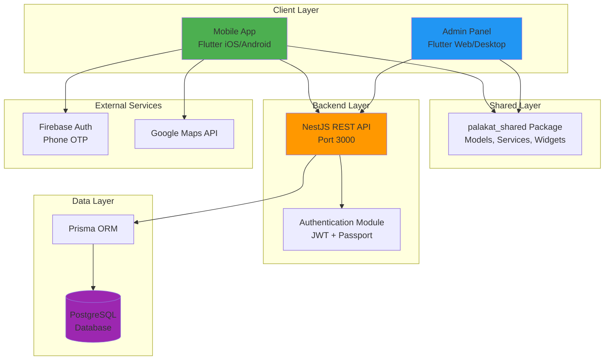
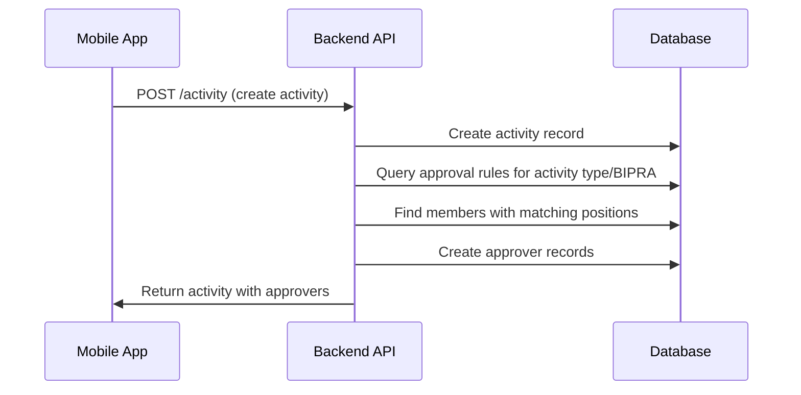

# Design Document

## Overview

The Palakat system is architected as a three-tier application with clear separation of concerns:

1. **Mobile Application Layer** - Flutter-based mobile app for church members (iOS/Android)
2. **Admin Application Layer** - Flutter-based web/desktop app for church administrators
3. **Backend API Layer** - NestJS REST API with PostgreSQL database

The system follows a monorepo structure managed by Melos (Flutter) and pnpm (Node.js), enabling code sharing through the `palakat_shared` package while maintaining independent deployment of each application.

### Design Principles

- **Separation of Concerns**: Clear boundaries between presentation, business logic, and data layers
- **Code Reusability**: Shared package for common models, services, and widgets
- **Scalability**: Multi-tenant architecture supporting multiple churches
- **Security**: JWT-based authentication with refresh token rotation
- **Performance**: Database indexing, pagination, and efficient queries

## Architecture

### System Architecture Diagram



### Mobile App Architecture

The mobile app follows a feature-based layered architecture:

```
Feature Module
├── Data Layer (Repositories)
│   └── Handles API communication and data transformation
├── Presentation Layer
│   ├── Controllers (Business Logic + State Management)
│   ├── States (Immutable State Classes)
│   ├── Screens (UI Components)
│   └── Widgets (Feature-specific UI)
└── Domain Layer (via palakat_shared)
    └── Models, Services, Constants
```

**State Management**: Riverpod with code generation
- Controllers use `@riverpod` annotation for automatic provider generation
- States use `@freezed` for immutable data classes
- Repositories use `@riverpod` for dependency injection

**Navigation**: go_router with declarative routing
- Routes defined in `AppRoute` constants
- Data passed via `extra` parameter with `RouteParam` wrapper

**Local Storage**: Hive for key-value storage
- Authentication tokens (secure storage)
- User preferences

### Backend API Architecture

The backend follows NestJS modular architecture:

```
Module Structure
├── Controller Layer
│   └── HTTP endpoints, request validation, response formatting
├── Service Layer
│   └── Business logic, data transformation, orchestration
├── Repository Layer (Prisma)
│   └── Database queries, transactions, data persistence
└── Common Layer
    ├── Guards (Authentication, Authorization)
    ├── Interceptors (Logging, Pagination)
    ├── Filters (Exception handling)
    └── Utilities (Helpers, Validators)
```

## Components and Interfaces

### 1. Authentication System

**Components**:
- `AuthController` - Handles sign-in, sign-out, token refresh, validation
- `AuthService` - Implements authentication logic, token generation
- `JwtStrategy` - Validates JWT tokens for protected routes
- `ClientStrategy` - Validates API client credentials

**Interfaces**:
```typescript
interface SignInDto {
  phone: string;
  password: string;
}

interface AuthResponse {
  accessToken: string;
  refreshToken: string;
  user: Account;
}

interface ValidateDto {
  phone: string;
}
```

**Security Features**:
- Password hashing with bcryptjs (10 rounds)
- Failed login attempt tracking with account lockout (5 attempts, 30 min lockout)
- Refresh token rotation (one-time use)
- JWT expiration (15 minutes for access, 7 days for refresh)

### 2. Activity Management System

**Components**:
- `ActivityController` - CRUD endpoints for activities
- `ActivityService` - Business logic for activity operations
- `ApproverService` - Approver status management

**Data Flow**:


**Approval States**:
- `UNCONFIRMED` - Initial state, awaiting review
- `APPROVED` - Approver has approved the activity
- `REJECTED` - Approver has rejected the activity

### 3. Member Management System

**Components**:
- `MembershipController` - Member CRUD operations
- `MembershipService` - Member business logic
- `AccountController` - Account management
- `AccountService` - Account operations

**Relationships**:
- One Account → One Membership (1:1)
- One Membership → Many MembershipPositions (1:N)
- One Membership → One Column (N:1)
- One Membership → One Church (N:1)

### 4. Financial Management System

**Components**:
- `RevenueController` - Revenue CRUD operations
- `ExpenseController` - Expense CRUD operations
- `RevenueService` / `ExpenseService` - Business logic

**Financial Record Structure**:
```typescript
interface FinancialRecord {
  id: number;
  accountNumber: string;
  amount: number;
  paymentMethod: 'CASH' | 'CASHLESS';
  churchId: number;
  activityId?: number;
  createdAt: Date;
  updatedAt: Date;
}
```

### 5. Digital Song Book System

**Components**:
- `SongController` - Song CRUD operations
- `SongPartController` - Song part management
- `SongService` - Song business logic

**Song Structure**:
```typescript
interface Song {
  id: number;
  title: string;
  index: number; // Unique song number
  book: 'NKB' | 'NNBT' | 'KJ' | 'DSL';
  link: string;
  parts: SongPart[];
}

interface SongPart {
  id: number;
  index: number;
  name: string; // e.g., "Verse 1", "Chorus"
  content: string;
  songId: number;
}
```

### 6. Church Request System

**Components**:
- `ChurchRequestController` - Church request CRUD operations
- `ChurchRequestService` - Request management business logic

**Data Model**:
```typescript
interface ChurchRequest {
  id: number;
  churchName: string;
  churchAddress: string;
  contactPerson: string;
  contactPhone: string;
  status: 'TODO' | 'DOING' | 'DONE';
  requesterId: number;
  requester: Account;
  createdAt: Date;
  updatedAt: Date;
}
```

## Data Models

### Core Entities

#### Account
```dart
@freezed
class Account with _$Account {
  const factory Account({
    required int id,
    required String name,
    required String phone,
    String? email,
    required Gender gender,
    required MaritalStatus maritalStatus,
    required DateTime dob,
    required bool isActive,
    required bool claimed,
    Membership? membership,
  }) = _Account;
}
```

#### Activity
```dart
@freezed
class Activity with _$Activity {
  const factory Activity({
    required int id,
    required int supervisorId,
    required Bipra bipra,
    required String title,
    String? description,
    int? locationId,
    DateTime? date,
    String? note,
    required ActivityType activityType,
    required DateTime createdAt,
    required DateTime updatedAt,
    Membership? supervisor,
    List<Approver>? approvers,
    Location? location,
  }) = _Activity;
}
```

### Enumerations

```dart
enum Gender { MALE, FEMALE }
enum MaritalStatus { MARRIED, SINGLE }
enum Bipra { PKB, WKI, PMD, RMJ, ASM }
enum ActivityType { SERVICE, EVENT, ANNOUNCEMENT }
enum ApprovalStatus { UNCONFIRMED, APPROVED, REJECTED }
enum Book { NKB, NNBT, KJ, DSL }
enum PaymentMethod { CASH, CASHLESS }
enum RequestStatus { TODO, DOING, DONE }
enum GeneratedBy { MANUAL, SYSTEM }
```

### Database Schema Key Relationships

**One-to-One**:
- Account ↔ Membership
- Account ↔ ChurchRequest
- Church ↔ Location
- Activity ↔ Revenue
- Activity ↔ Expense

**One-to-Many**:
- Church → Columns, Memberships, Revenues, Expenses, Documents, Reports, ApprovalRules
- Membership → MembershipPositions, Activities (as supervisor), Approvers
- Activity → Approvers
- Song → SongParts

**Indexes**:
- Activity: date, supervisorId, activityType, bipra
- Approver: activityId, membershipId, status
- Account: phone (unique), email (unique)
- Song: index (unique)
- ChurchRequest: requesterId (unique), createdAt, status

## Correctness Properties

*A property is a characteristic or behavior that should hold true across all valid executions of a system-essentially, a formal statement about what the system should do. Properties serve as the bridge between human-readable specifications and machine-verifiable correctness guarantees.*

Based on the prework analysis, the following correctness properties have been identified:

### Property 1: Authentication Token Generation
*For any* valid user credentials (phone and password), authenticating should return a JWT access token and refresh token with valid structure and expiration times.
**Validates: Requirements 1.1**

### Property 2: Invalid Credentials Rejection
*For any* invalid credential combination (wrong phone or wrong password), authentication should be rejected with an appropriate error response.
**Validates: Requirements 1.2**

### Property 3: Account Lockout Enforcement
*For any* account with 5 or more consecutive failed login attempts, subsequent authentication attempts (even with valid credentials) should be rejected until the 30-minute lockout period expires.
**Validates: Requirements 1.3**

### Property 4: Refresh Token Rotation
*For any* valid refresh token, using it to obtain a new access token should invalidate the old refresh token and return a new one (one-time use).
**Validates: Requirements 1.4, 1.5**

### Property 5: Account Uniqueness Constraints
*For any* account creation or update, the system should reject duplicate phone numbers across all accounts, and reject duplicate email addresses where email is provided.
**Validates: Requirements 3.6, 3.7**

### Property 6: Member Data Persistence
*For any* member creation with name, phone, email, gender, marital status, and date of birth, all fields should be correctly stored and retrievable.
**Validates: Requirements 3.1, 3.8**

### Property 7: Member Update Timestamps
*For any* member information update, the updatedAt timestamp should be greater than the previous value.
**Validates: Requirements 3.4, 14.2**

### Property 8: Activity Creation with Required Fields
*For any* activity creation with title, description, date, location, activity type, and BIPRA, all fields should be correctly stored and the activity should be retrievable.
**Validates: Requirements 4.1**

### Property 9: Automatic Approver Assignment
*For any* activity creation, the system should automatically assign approvers based on active approval rules matching the activity type and BIPRA, by finding members with the associated membership positions.
**Validates: Requirements 4.2, 5.4**

### Property 10: Activity Enum Validation
*For any* activity, the activityType must be one of SERVICE, EVENT, or ANNOUNCEMENT, and bipra must be one of PKB, WKI, PMD, RMJ, or ASM.
**Validates: Requirements 4.8, 4.9**

### Property 11: Activity Cascade Delete
*For any* activity deletion, all associated approver records should also be deleted.
**Validates: Requirements 4.7**

### Property 12: Approval Status Update
*For any* approver reviewing an activity, updating the status to APPROVED or REJECTED should persist correctly and be retrievable.
**Validates: Requirements 4.4**

### Property 13: Activity Filtering
*For any* activity query with date, type, status, or BIPRA filters, only activities matching all specified criteria should be returned.
**Validates: Requirements 4.6**

### Property 14: Approval Rule Position Assignment
*For any* approval rule, multiple membership positions can be assigned, and all assignments should be correctly stored and retrievable.
**Validates: Requirements 5.1, 5.2**

### Property 15: Approval Rule Active State
*For any* approval rule, toggling the active state should persist correctly, and only active rules should be applied during activity creation.
**Validates: Requirements 5.3**

### Property 16: Financial Record Creation
*For any* revenue or expense creation with account number, amount, and payment method (CASH or CASHLESS), all fields should be correctly stored and the record should be associated with the correct church.
**Validates: Requirements 6.1, 6.2, 6.3, 6.6**

### Property 17: Financial Record Activity Association
*For any* financial record associated with an activity, the relationship should be one-to-one (only one revenue and one expense per activity).
**Validates: Requirements 6.5**

### Property 18: Financial Aggregation
*For any* date range query, the total revenue and expense amounts should equal the sum of individual records within that range.
**Validates: Requirements 6.7**

### Property 19: Song Index Uniqueness
*For any* song creation, the index number must be unique across all songs in the system.
**Validates: Requirements 7.6**

### Property 20: Song Parts Ordering
*For any* song with multiple parts, retrieving the song should return parts in sequential order by part index.
**Validates: Requirements 7.7**

### Property 21: Song Search
*For any* search query by title or index number, all returned songs should match the search criteria.
**Validates: Requirements 7.3**

### Property 22: Column Name Uniqueness
*For any* column creation within a church, the column name must be unique within that church (but can be duplicated across different churches).
**Validates: Requirements 8.4**

### Property 23: Church Location Association
*For any* church, exactly one location (with name, latitude, longitude) must be associated.
**Validates: Requirements 8.2**

### Property 24: Church Request Uniqueness
*For any* user account, only one church registration request can exist at a time.
**Validates: Requirements 9.3, 9.10**

### Property 25: Church Request Status Messages
*For any* church request, the displayed status message should correspond to the current status: TODO shows "waiting to be reviewed", DOING shows "processing", DONE shows "registered".
**Validates: Requirements 9.7**

### Property 26: Multi-Church Data Isolation
*For any* authenticated user, all queries should return only data belonging to the user's church, and data from other churches should never be accessible.
**Validates: Requirements 11.1, 11.2, 11.4, 11.5, 11.6**

### Property 27: Pagination Correctness
*For any* paginated list endpoint, the returned page should contain at most the requested page size (max 100), and pagination metadata (total count, current page, total pages) should be mathematically consistent.
**Validates: Requirements 12.1, 12.2, 12.5**

### Property 28: Validation Error Response
*For any* request with invalid data, the Backend_API should return a 400 Bad Request response with detailed error messages.
**Validates: Requirements 13.2**

### Property 29: Timestamp Management
*For any* record creation, createdAt should be automatically set to the current UTC time. For any record update, updatedAt should be automatically updated to the current UTC time.
**Validates: Requirements 14.1, 14.2, 14.4**

## Error Handling

### Backend Error Handling

**Global Exception Filter**:
- Catches all unhandled exceptions
- Transforms Prisma errors to HTTP errors
- Returns standardized error response format

**Error Response Format**:
```typescript
interface ErrorResponse {
  statusCode: number;
  message: string | string[];
  error: string;
  timestamp: string;
  path: string;
}
```

**Common Error Scenarios**:
- 400 Bad Request - Validation failures
- 401 Unauthorized - Invalid/missing token
- 403 Forbidden - Insufficient permissions
- 404 Not Found - Resource doesn't exist
- 409 Conflict - Unique constraint violation
- 500 Internal Server Error - Unexpected errors

### Frontend Error Handling

**Error Mapper Utility**:
- Transforms API errors to user-friendly messages
- Handles network errors
- Handles timeout errors

**Error Display**:
- Toast messages for transient errors
- Dialog boxes for critical errors
- Inline validation messages for form errors

## Testing Strategy

### Dual Testing Approach

The system uses both unit testing and property-based testing:

- **Unit tests** verify specific examples, edge cases, and error conditions
- **Property tests** verify universal properties that should hold across all inputs
- Together they provide comprehensive coverage

### Backend Testing

**Framework**: Jest for unit tests, Supertest for E2E tests

**Unit Tests**:
- Service layer business logic
- Utility functions
- Data transformations
- Validation logic

**Property-Based Tests**:
- Use `fast-check` library for property-based testing
- Minimum 100 iterations per property test
- Each property test tagged with format: `**Feature: palakat-system-overview, Property {number}: {property_text}**`

**Test Coverage Goals**:
- Service layer: 80%+ coverage
- Controllers: 70%+ coverage
- Critical paths: 100% coverage

### Frontend Testing

**Framework**: Flutter test framework with Mockito

**Unit Tests**:
- Utility functions
- Extensions
- Validators
- Data transformations

**Widget Tests**:
- Reusable widgets in palakat_shared
- Form validation
- State management logic

**Property-Based Tests**:
- Use `glados` or `quickcheck` Dart package
- Focus on data model serialization/deserialization
- Form validation logic

### Property-Based Test Requirements

Each correctness property from this design document must be implemented as a property-based test with:
1. A comment referencing the property number and requirements
2. Minimum 100 test iterations
3. Smart generators that constrain to valid input space
4. Clear assertion of the property being tested

Example format:
```typescript
// **Feature: palakat-system-overview, Property 5: Account Uniqueness Constraints**
// **Validates: Requirements 3.6, 3.7**
describe('Account uniqueness', () => {
  it('should reject duplicate phone numbers', () => {
    fc.assert(
      fc.property(fc.string(), fc.string(), (phone, name) => {
        // Create first account
        // Attempt to create second account with same phone
        // Assert rejection
      }),
      { numRuns: 100 }
    );
  });
});
```

## Performance Considerations

### Database Optimization

**Indexing Strategy**:
- Composite indexes on frequently joined columns
- Indexes on foreign keys
- Indexes on date fields for range queries
- Unique indexes on natural keys (phone, email, song index)

**Query Optimization**:
- Use Prisma's `select` to fetch only needed fields
- Use `include` judiciously to avoid N+1 queries
- Implement cursor-based pagination for large datasets

### API Performance

**Pagination**:
- Default page size: 20 records
- Maximum page size: 100 records
- Return total count for UI pagination controls

### Mobile App Performance

**Lazy Loading**:
- Infinite scroll for activity lists
- On-demand image loading with caching
- Deferred loading of non-critical data

## Security Considerations

### Authentication Security

- Passwords hashed with bcryptjs (10 rounds)
- JWT tokens signed with HS256 algorithm
- Refresh tokens stored hashed in database
- Account lockout after 5 failed login attempts
- Refresh token rotation (one-time use)

### Authorization Security

- Role-based access control via JWT claims
- Church-level data isolation
- Protected routes require valid JWT
- Admin endpoints require admin role

### Data Security

- Input validation on all endpoints
- SQL injection prevention via Prisma parameterized queries
- CORS configuration for allowed origins
- HTTPS enforcement in production
