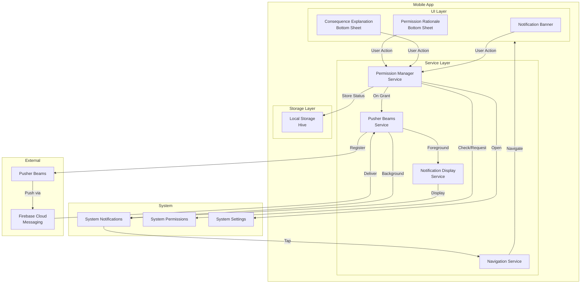

# Design Document: Push Notification UX Improvements

## Overview

This design document outlines enhancements to the existing push notification system to improve user experience through proper notification display and graceful permission handling. The improvements build upon the existing Pusher Beams implementation specified in `.kiro/specs/push-notification/`.

The key improvements are:

1. **System Notification Display**: Show native system notifications for both foreground and background push notifications, allowing users to tap notifications to navigate rather than forcing immediate navigation
2. **Permission Flow**: Implement educational permission rationale UI before requesting system permissions, with graceful handling of denial scenarios
3. **Android Notification Channels**: Organize notifications into channels (Activity Updates, Approval Requests, General Announcements) with appropriate importance levels
4. **iOS Badge Management**: Track and display unread notification counts on the app icon
5. **Permission State Persistence**: Track permission status locally to provide appropriate UI and avoid repeated permission requests

## Architecture



### Notification Flow

#### Foreground Notification Flow
1. Push notification received while app is in foreground
2. Pusher Beams SDK delivers to app via callback
3. Notification Display Service creates system notification
4. User taps notification → Navigation Service routes to appropriate screen
5. User dismisses notification → No action taken

#### Background Notification Flow
1. Push notification received while app is backgrounded/closed
2. Operating system displays system notification automatically
3. User taps notification → App launches/resumes → Navigation Service routes
4. User dismisses notification → No action taken

#### Permission Request Flow
1. App attempts to register push notifications (first time or after denial period)
2. Permission Manager checks stored permission status
3. If not previously granted:
   - Show Permission Rationale bottom sheet
   - User taps "Allow" → Request system permissions
   - User taps "Not Now" → Dismiss, store denial timestamp
4. If user denies system permission:
   - Show Consequence Explanation bottom sheet
   - User taps "Enable in Settings" → Open system settings
   - User taps "Continue" → Dismiss, store denial status
5. Store permission status in local storage

## Components and Interfaces

### 1. Permission Manager Service

Manages notification permission state and UI flows.

```dart
// apps/palakat/lib/core/services/permission_manager_service.dart

enum PermissionStatus {
  notDetermined,  // Never asked
  granted,        // User granted
  denied,         // User denied (can ask again)
  permanentlyDenied, // User selected "Don't ask again" (Android)
}

class PermissionState {
  final PermissionStatus status;
  final DateTime? deniedAt;
  final int denialCount;
  
  const PermissionState({
    required this.status,
    this.deniedAt,
    this.denialCount = 0,
  });
}

abstract class PermissionManagerService {
  /// Get current permission state (from storage and system)
  Future<PermissionState> getPermissionState();
  
  /// Check if we should show permission rationale
  Future<bool> shouldShowRationale();
  
  /// Request permissions with rationale flow
  Future<PermissionStatus> requestPermissionsWithRationale(
    BuildContext context,
  );
  
  /// Open system settings for app
  Future<void> openAppSettings();
  
  /// Store permission status
  Future<void> storePermissionStatus(PermissionStatus status);
  
  /// Check if enough time has passed since denial (7 days)
  bool shouldRetryAfterDenial(DateTime? deniedAt);
  
  /// Sync stored status with system status
  Future<void> syncPermissionStatus();
}
```

### 2. Notification Display Service

Handles displaying system notifications for foreground push notifications.

```dart
// apps/palakat/lib/core/services/notification_display_service.dart

class NotificationPayload {
  final String title;
  final String body;
  final String? icon;
  final Map<String, dynamic>? data;
  
  const NotificationPayload({
    required this.title,
    required this.body,
    this.icon,
    this.data,
  });
}

abstract class NotificationDisplayService {
  /// Initialize notification channels (Android)
  Future<void> initializeChannels();
  
  /// Display a system notification
  Future<void> displayNotification({
    required NotificationPayload payload,
    required String channelId,
    int? id,
  });
  
  /// Handle notification tap
  void setNotificationTapHandler(
    void Function(Map<String, dynamic> data) handler,
  );
  
  /// Clear all notifications
  Future<void> clearAllNotifications();
  
  /// Update badge count (iOS)
  Future<void> updateBadgeCount(int count);
}
```

### 3. Notification Channel Configuration (Android)

```dart
// apps/palakat/lib/core/constants/notification_channels.dart

class NotificationChannel {
  final String id;
  final String name;
  final String description;
  final Importance importance;
  final bool enableVibration;
  final bool playSound;
  
  const NotificationChannel({
    required this.id,
    required this.name,
    required this.description,
    required this.importance,
    this.enableVibration = false,
    this.playSound = true,
  });
}

class NotificationChannels {
  static const activityUpdates = NotificationChannel(
    id: 'activity_updates',
    name: 'Activity Updates',
    description: 'Notifications about church activities and events',
    importance: Importance.defaultImportance,
    enableVibration: false,
    playSound: true,
  );
  
  static const approvalRequests = NotificationChannel(
    id: 'approval_requests',
    name: 'Approval Requests',
    description: 'Notifications requiring your approval',
    importance: Importance.high,
    enableVibration: true,
    playSound: true,
  );
  
  static const generalAnnouncements = NotificationChannel(
    id: 'general_announcements',
    name: 'General Announcements',
    description: 'General church announcements',
    importance: Importance.low,
    enableVibration: false,
    playSound: false,
  );
  
  static List<NotificationChannel> get all => [
    activityUpdates,
    approvalRequests,
    generalAnnouncements,
  ];
  
  static String getChannelForType(String notificationType) {
    switch (notificationType) {
      case 'APPROVAL_REQUIRED':
        return approvalRequests.id;
      case 'ACTIVITY_CREATED':
      case 'APPROVAL_CONFIRMED':
      case 'APPROVAL_REJECTED':
        return activityUpdates.id;
      default:
        return generalAnnouncements.id;
    }
  }
}
```

### 4. Navigation Handler

```dart
// apps/palakat/lib/core/services/notification_navigation_service.dart

class NotificationNavigationService {
  final GoRouter router;
  
  NotificationNavigationService(this.router);
  
  /// Navigate based on notification data
  void handleNotificationTap(Map<String, dynamic> data) {
    final type = data['type'] as String?;
    final activityId = data['activityId'] as String?;
    
    if (activityId == null) {
      // Navigate to notification inbox or home
      router.go('/notifications');
      return;
    }
    
    switch (type) {
      case 'ACTIVITY_CREATED':
      case 'APPROVAL_CONFIRMED':
      case 'APPROVAL_REJECTED':
        router.go('/activities/$activityId');
        break;
      case 'APPROVAL_REQUIRED':
        router.go('/approvals/$activityId');
        break;
      default:
        router.go('/notifications');
    }
  }
}
```

### 5. Permission Rationale Bottom Sheet

```dart
// apps/palakat/lib/features/notification/presentation/widgets/permission_rationale_bottom_sheet.dart

class PermissionRationaleBottomSheet extends StatelessWidget {
  final VoidCallback onAllow;
  final VoidCallback onNotNow;
  
  const PermissionRationaleBottomSheet({
    required this.onAllow,
    required this.onNotNow,
  });
  
  @override
  Widget build(BuildContext context) {
    return BottomSheet(
      // UI showing:
      // - Icon/illustration
      // - Title: "Stay Updated"
      // - Benefits list:
      //   * Get notified about new activities
      //   * Receive approval requests
      //   * Don't miss important announcements
      // - "Allow Notifications" button (primary)
      // - "Not Now" button (text)
    );
  }
}
```

### 6. Consequence Explanation Bottom Sheet

```dart
// apps/palakat/lib/features/notification/presentation/widgets/consequence_explanation_bottom_sheet.dart

class ConsequenceExplanationBottomSheet extends StatelessWidget {
  final VoidCallback onEnableInSettings;
  final VoidCallback onContinueWithout;
  
  const ConsequenceExplanationBottomSheet({
    required this.onEnableInSettings,
    required this.onContinueWithout,
  });
  
  @override
  Widget build(BuildContext context) {
    return BottomSheet(
      // UI showing:
      // - Icon (warning/info)
      // - Title: "You'll Miss Out On"
      // - Consequences list:
      //   * Activity notifications
      //   * Approval requests
      //   * Important updates
      // - "Enable in Settings" button (primary)
      // - "Continue Without Notifications" button (text)
    );
  }
}
```

### 7. Notification Permission Banner

```dart
// apps/palakat/lib/features/notification/presentation/widgets/notification_permission_banner.dart

class NotificationPermissionBanner extends ConsumerWidget {
  @override
  Widget build(BuildContext context, WidgetRef ref) {
    final permissionState = ref.watch(permissionStateProvider);
    
    if (permissionState.status == PermissionStatus.granted) {
      return const SizedBox.shrink();
    }
    
    return Banner(
      // UI showing:
      // - Icon
      // - Text: "Enable notifications to stay updated"
      // - "Enable Notifications" button
      // - Dismiss button
    );
  }
}
```

### 8. Enhanced Pusher Beams Service

Update existing service to integrate with new components:

```dart
// apps/palakat/lib/core/services/pusher_beams_mobile_service.dart

class PusherBeamsMobileService {
  final PermissionManagerService permissionManager;
  final NotificationDisplayService notificationDisplay;
  
  // ... existing methods ...
  
  /// Initialize with permission flow
  Future<void> initializeWithPermissions(BuildContext context) async {
    final permissionState = await permissionManager.getPermissionState();
    
    if (permissionState.status == PermissionStatus.granted) {
      await initialize();
      return;
    }
    
    if (await permissionManager.shouldShowRationale()) {
      final status = await permissionManager.requestPermissionsWithRationale(
        context,
      );
      
      if (status == PermissionStatus.granted) {
        await initialize();
      }
    }
  }
  
  /// Set up foreground notification handler
  void setupForegroundNotificationHandler() {
    setOnMessageReceivedInTheForeground((notification) {
      final payload = NotificationPayload(
        title: notification['title'] as String,
        body: notification['body'] as String,
        icon: notification['icon'] as String?,
        data: notification['data'] as Map<String, dynamic>?,
      );
      
      final type = notification['data']?['type'] as String?;
      final channelId = NotificationChannels.getChannelForType(type ?? '');
      
      notificationDisplay.displayNotification(
        payload: payload,
        channelId: channelId,
      );
    });
  }
}
```

## Data Models

### Permission State Model

```dart
// packages/palakat_shared/lib/core/models/permission_state.dart

@freezed
class PermissionStateModel with _$PermissionStateModel {
  const factory PermissionStateModel({
    required PermissionStatus status,
    DateTime? deniedAt,
    @Default(0) int denialCount,
    DateTime? lastCheckedAt,
  }) = _PermissionStateModel;
  
  factory PermissionStateModel.fromJson(Map<String, dynamic> json) =>
      _$PermissionStateModelFromJson(json);
}
```

### Notification Settings Model

```dart
// packages/palakat_shared/lib/core/models/notification_settings.dart

@freezed
class NotificationSettingsModel with _$NotificationSettingsModel {
  const factory NotificationSettingsModel({
    @Default(true) bool activityUpdatesEnabled,
    @Default(true) bool approvalRequestsEnabled,
    @Default(true) bool generalAnnouncementsEnabled,
    @Default(true) bool soundEnabled,
    @Default(true) bool vibrationEnabled,
  }) = _NotificationSettingsModel;
  
  factory NotificationSettingsModel.fromJson(Map<String, dynamic> json) =>
      _$NotificationSettingsModelFromJson(json);
}
```

### Local Storage Schema (Hive)

```dart
// Permission state box
const String permissionStateBox = 'permission_state';

// Keys
const String permissionStatusKey = 'status';
const String deniedAtKey = 'denied_at';
const String denialCountKey = 'denial_count';
const String lastCheckedAtKey = 'last_checked_at';

// Notification settings box
const String notificationSettingsBox = 'notification_settings';
```

## Correctness Properties

*A property is a characteristic or behavior that should hold true across all valid executions of a system-essentially, a formal statement about what the system should do. Properties serve as the bridge between human-readable specifications and machine-verifiable correctness guarantees.*

### Property Reflection

After analyzing all acceptance criteria, the following redundancies were identified:
- Properties 1.2 and 2.2 both test that notifications contain payload fields - consolidated into Property 1
- Properties 9.1, 9.2, 9.3 all test notification configuration by type - consolidated into Property 7

### Property 1: Notification Payload Completeness
*For any* notification payload with non-empty title and body, when displayed as a system notification (foreground or background), the displayed notification should contain the title, body, and icon (if provided) from the payload.
**Validates: Requirements 1.2, 2.2**

### Property 2: Notification Navigation Routing
*For any* notification with valid deep link data (type and activityId), when tapped, the app should navigate to the screen corresponding to the notification type and activityId.
**Validates: Requirements 1.3, 2.3**

### Property 3: Multiple Notification Display
*For any* sequence of N foreground notifications (N > 0), the system notification tray should contain N separate notifications, each with distinct content.
**Validates: Requirements 1.5**

### Property 4: Permission State Persistence
*For any* permission status (granted, denied, permanently_denied), when stored to local storage and then retrieved, the retrieved status should match the stored status.
**Validates: Requirements 7.1, 7.2, 7.3**

### Property 5: Permission Denial Retry Timing
*For any* denial timestamp, if the current time is at least 7 days after the denial timestamp, shouldRetryAfterDenial should return true; otherwise false.
**Validates: Requirements 6.1**

### Property 6: Permission Status Synchronization
*For any* stored permission status and system permission status, when syncPermissionStatus is called, the stored status should be updated to match the system status if they differ.
**Validates: Requirements 7.4, 7.5**

### Property 7: Notification Channel Assignment
*For any* notification type (ACTIVITY_CREATED, APPROVAL_REQUIRED, APPROVAL_CONFIRMED, APPROVAL_REJECTED, or other), the notification should be assigned to the correct channel with appropriate sound and vibration settings.
**Validates: Requirements 8.2, 9.1, 9.2, 9.3**

### Property 8: Badge Count Increment
*For any* initial badge count N and M received notifications, the badge count should be N + M after all notifications are received.
**Validates: Requirements 10.1**

### Property 9: Badge Count Decrement
*For any* initial badge count N and K notifications marked as read (where K ≤ N), the badge count should be N - K after marking.
**Validates: Requirements 10.3**

### Property 10: Badge Count Update Propagation
*For any* badge count update operation, the new badge count should be reflected in the system within a reasonable time (< 1 second).
**Validates: Requirements 10.5**

## Error Handling

### Permission Request Errors

1. **System Permission Dialog Dismissed:**
   - Treat as denial
   - Show consequence explanation bottom sheet
   - Store denial status with timestamp

2. **Permanent Denial (Android "Don't ask again"):**
   - Detect via permission_handler package
   - Store as permanently_denied
   - Only show "Enable in Settings" option in future

3. **Settings App Not Available:**
   - Log error
   - Show error message to user
   - Provide manual instructions

### Notification Display Errors

1. **Notification Channel Creation Failure (Android):**
   - Log error with channel details
   - Fall back to default channel
   - Continue app operation

2. **Notification Display Failure:**
   - Log error with payload details
   - Continue app operation (non-blocking)
   - User may miss notification but app remains functional

3. **Badge Count Update Failure (iOS):**
   - Log error
   - Continue app operation
   - Badge may be inaccurate but app remains functional

### Navigation Errors

1. **Invalid Deep Link Data:**
   - Log warning with data details
   - Navigate to notification inbox as fallback
   - Don't crash app

2. **Navigation Route Not Found:**
   - Log error with route details
   - Navigate to home screen as fallback
   - Show error message to user

### Storage Errors

1. **Permission State Read Failure:**
   - Log error
   - Assume notDetermined status
   - Continue with permission flow

2. **Permission State Write Failure:**
   - Log error
   - Continue app operation
   - May result in repeated permission requests

## Testing Strategy

### Dual Testing Approach

The testing strategy employs both unit tests and property-based tests:
- **Unit tests** verify specific examples, edge cases, and UI interactions
- **Property-based tests** verify universal properties across all valid inputs

### Property-Based Testing

**Library:** kiri_check (Dart property-based testing library)

**Configuration:** Each property test runs minimum 100 iterations.

**Test Tagging:** Each property-based test must include a comment with the format:
```dart
// **Feature: push-notification-ux-improvements, Property 1: Notification Payload Completeness**
```

**Test Files:**
- `apps/palakat/test/core/services/permission_manager_service_property_test.dart`
- `apps/palakat/test/core/services/notification_display_service_property_test.dart`
- `apps/palakat/test/core/services/notification_navigation_service_property_test.dart`

**Property Test Coverage:**
- Property 1: Generate random notification payloads, verify displayed notifications contain all fields
- Property 2: Generate random notification types and activityIds, verify correct navigation
- Property 3: Generate N random notifications, verify N separate system notifications
- Property 4: Generate random permission statuses, verify storage round-trip
- Property 5: Generate random timestamps, verify 7-day retry logic
- Property 6: Generate random permission state combinations, verify sync logic
- Property 7: Generate random notification types, verify channel assignment and settings
- Property 8: Generate random badge counts and notification counts, verify increment
- Property 9: Generate random badge counts and read counts, verify decrement
- Property 10: Generate random badge updates, verify propagation timing

### Unit Testing

**Test Files:**
- `apps/palakat/test/core/services/permission_manager_service_test.dart`
- `apps/palakat/test/core/services/notification_display_service_test.dart`
- `apps/palakat/test/features/notification/presentation/widgets/permission_rationale_bottom_sheet_test.dart`
- `apps/palakat/test/features/notification/presentation/widgets/consequence_explanation_bottom_sheet_test.dart`

**Key Unit Test Cases:**

1. **Permission Flow:**
   - First-time permission request shows rationale
   - "Allow" button triggers system permission request
   - "Not Now" button dismisses without requesting
   - Denial shows consequence explanation
   - "Enable in Settings" opens system settings
   - "Continue Without" dismisses and stores denial

2. **Notification Display:**
   - Foreground notification creates system notification
   - Background notification handled by OS
   - Notification tap triggers navigation
   - Notification dismissal doesn't trigger navigation
   - Multiple notifications don't collapse

3. **Navigation Routing:**
   - ACTIVITY_CREATED navigates to activity detail
   - APPROVAL_REQUIRED navigates to approval detail
   - APPROVAL_CONFIRMED navigates to activity detail
   - APPROVAL_REJECTED navigates to activity detail
   - Missing activityId navigates to notification inbox

4. **Android Channels:**
   - All channels created on initialization
   - Approval notifications use high importance channel
   - Activity notifications use default importance channel
   - General notifications use low importance channel

5. **iOS Badge:**
   - Badge increments on notification received
   - Badge clears on app open
   - Badge decrements on mark as read
   - Badge hidden when count is zero

### Widget Testing

**Test Files:**
- `apps/palakat/test/features/notification/presentation/permission_flow_widget_test.dart`

**Widget Test Cases:**
- Permission rationale bottom sheet displays correctly
- Consequence explanation bottom sheet displays correctly
- Notification permission banner displays when denied
- Banner hidden when permission granted

### Integration Testing

**Test Files:**
- `apps/palakat/test/integration/notification_permission_flow_test.dart`
- `apps/palakat/test/integration/notification_display_flow_test.dart`

**Integration Test Scenarios:**
- Complete permission request flow (rationale → system → consequence)
- Foreground notification display and tap
- Background notification launch and navigation
- Permission re-request after 7 days
- Settings return and auto-registration

## Dependencies

### New Dependencies

```yaml
# pubspec.yaml (apps/palakat)
dependencies:
  flutter_local_notifications: ^17.0.0  # System notification display
  permission_handler: ^11.0.0           # Permission status checking
  app_settings: ^5.0.0                  # Open system settings
  
dev_dependencies:
  kiri_check: ^0.3.0                    # Property-based testing
```

### Existing Dependencies (Already in Project)

- pusher_beams: ^1.3.0 (Push notification delivery)
- firebase_messaging: ^14.7.0 (FCM for Android)
- hive: ^2.2.3 (Local storage)
- freezed: ^2.4.5 (Immutable models)
- riverpod: ^2.4.9 (State management)
- go_router: ^13.0.0 (Navigation)

## Platform-Specific Considerations

### Android

1. **Notification Channels:**
   - Required for Android 8.0+ (API 26+)
   - Created on app initialization
   - User can customize per-channel settings
   - Cannot be deleted once created (only renamed/updated)

2. **Permission Handling:**
   - Runtime permission required for Android 13+ (API 33+)
   - Can detect "Don't ask again" via permission_handler
   - Settings deep link: `android.settings.APP_NOTIFICATION_SETTINGS`

3. **Foreground Service:**
   - Not required for displaying notifications
   - Only needed if app needs to run in background

### iOS

1. **Permission Handling:**
   - Always requires explicit user permission
   - Cannot detect permanent denial (always can re-request)
   - Settings deep link: `app-settings:`

2. **Badge Count:**
   - Managed via flutter_local_notifications
   - Automatically hidden when count is 0
   - Requires notification permission to update

3. **Notification Categories:**
   - iOS equivalent of Android channels
   - Less user-configurable than Android channels
   - Defined in app, not modifiable by user

## Migration Strategy

### Phase 1: Core Infrastructure
1. Add new dependencies
2. Implement PermissionManagerService
3. Implement NotificationDisplayService
4. Create notification channel configuration
5. Update local storage schema

### Phase 2: UI Components
1. Create permission rationale bottom sheet
2. Create consequence explanation bottom sheet
3. Create notification permission banner
4. Update notification settings screen

### Phase 3: Integration
1. Update PusherBeamsMobileService to use new services
2. Implement foreground notification handler
3. Implement background notification handler
4. Implement notification tap handler
5. Add navigation routing logic

### Phase 4: Permission Flow
1. Integrate permission flow into app initialization
2. Add permission re-request logic (7-day timer)
3. Add settings return detection
4. Add permission banner to relevant screens

### Phase 5: Testing & Polish
1. Write property-based tests
2. Write unit tests
3. Write widget tests
4. Write integration tests
5. Test on physical devices (Android & iOS)
6. Polish UI/UX based on testing feedback

## Future Enhancements

1. **Rich Notifications:**
   - Action buttons (Approve/Reject directly from notification)
   - Images/thumbnails in notifications
   - Expandable notification content

2. **Notification Grouping:**
   - Group multiple notifications by type
   - Summary notifications for many updates

3. **Notification Scheduling:**
   - Quiet hours (don't disturb during certain times)
   - Notification batching (group updates)

4. **Advanced Analytics:**
   - Track notification open rates
   - Track permission grant/denial rates
   - A/B test permission rationale messaging
