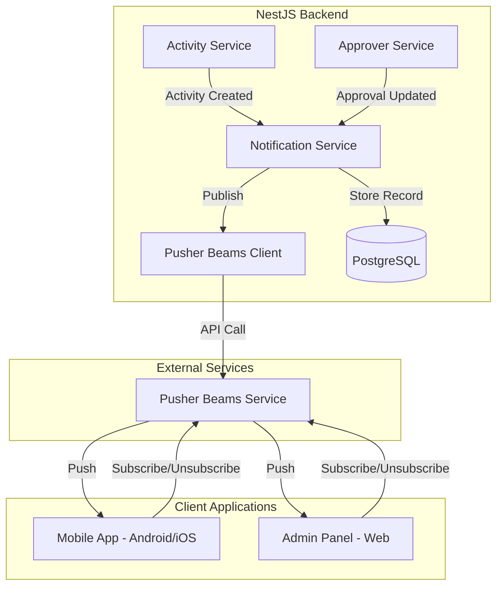

# Design Document: Push Notification with Pusher Beams

## Overview

This design document outlines the implementation of push notifications using Pusher Beams for the Palakat church management platform. The system enables real-time notifications across the mobile app (Android/iOS) and admin panel (web) for activity creation and approval workflow events.

The architecture follows a centralized notification service pattern where the backend handles all notification logic, persists records to the database, and publishes to Pusher Beams. Client applications subscribe to device interests based on user context (church, BIPRA, column, membership).

## Architecture



### Notification Flow

1. **Activity Creation Flow:**
   - Activity Service creates activity with approvers
   - Calls NotificationService.notifyActivityCreated()
   - NotificationService sends BIPRA group notification
   - NotificationService sends individual approver notifications
   - All notifications persisted to database

2. **Approval Status Change Flow:**
   - Approver Service updates approval status
   - Calls NotificationService.notifyApprovalStatusChanged()
   - NotificationService identifies recipients (supervisor + other unconfirmed approvers)
   - Deduplicates if supervisor is also an approver
   - Sends notifications and persists records

## Components and Interfaces

### Backend Components

#### 1. NotificationModule
```typescript
// src/notification/notification.module.ts
@Module({
  imports: [PrismaModule],
  controllers: [NotificationController],
  providers: [NotificationService, PusherBeamsService],
  exports: [NotificationService],
})
export class NotificationModule {}
```

#### 2. PusherBeamsService
```typescript
// src/notification/pusher-beams.service.ts
interface PushPayload {
  title: string;
  body: string;
  deepLink?: string;
  data?: Record<string, any>;
}

@Injectable()
export class PusherBeamsService {
  private beamsClient: PushNotifications;
  
  constructor(private configService: ConfigService) {
    this.beamsClient = new PushNotifications({
      instanceId: configService.get('PUSHER_BEAMS_INSTANCE_ID'),
      secretKey: configService.get('PUSHER_BEAMS_SECRET_KEY'),
    });
  }
  
  async publishToInterests(interests: string[], payload: PushPayload): Promise<void>;
  
  // Interest name formatters
  formatBipraInterest(churchId: number, bipra: string): string;
  formatMembershipInterest(membershipId: number): string;
  formatChurchInterest(churchId: number): string;
  formatColumnInterest(churchId: number, columnId: number): string;
  formatColumnBipraInterest(churchId: number, columnId: number, bipra: string): string;
}
```

#### 3. NotificationService
```typescript
// src/notification/notification.service.ts
@Injectable()
export class NotificationService {
  constructor(
    private prisma: PrismaService,
    private pusherBeams: PusherBeamsService,
  ) {}
  
  // Activity creation notifications
  async notifyActivityCreated(activity: ActivityWithRelations): Promise<void>;
  
  // Approval status change notifications
  async notifyApprovalStatusChanged(
    approver: ApproverWithRelations,
    newStatus: ApprovalStatus,
  ): Promise<void>;
  
  // CRUD operations
  async findAll(query: NotificationListQueryDto): Promise<PaginatedResponse<Notification>>;
  async findOne(id: number, membershipId: number): Promise<Notification>;
  async markAsRead(id: number, membershipId: number): Promise<Notification>;
  async remove(id: number, membershipId: number): Promise<void>;
  async getUnreadCount(membershipId: number): Promise<number>;
}
```

#### 4. NotificationController
```typescript
// src/notification/notification.controller.ts
@Controller('notifications')
@UseGuards(JwtAuthGuard)
export class NotificationController {
  @Get()
  findAll(@Query() query: NotificationListQueryDto, @Req() req): Promise<PaginatedResponse>;
  
  @Get(':id')
  findOne(@Param('id') id: number, @Req() req): Promise<Notification>;
  
  @Patch(':id/read')
  markAsRead(@Param('id') id: number, @Req() req): Promise<Notification>;
  
  @Delete(':id')
  remove(@Param('id') id: number, @Req() req): Promise<void>;
}
```

### Flutter Components (Shared)

#### 1. PusherBeamsService (palakat_shared)
```dart
// packages/palakat_shared/lib/core/services/pusher_beams_service.dart
abstract class PusherBeamsService {
  Future<void> initialize(String instanceId);
  Future<void> subscribeToInterests(List<String> interests);
  Future<void> unsubscribeFromAllInterests();
  Future<void> clearAllState();
  Stream<PushNotification> get onNotificationReceived;
}
```

#### 2. InterestBuilder (palakat_shared)
```dart
// packages/palakat_shared/lib/core/utils/interest_builder.dart
class InterestBuilder {
  static const String globalInterest = 'palakat';
  
  static String church(int churchId) => 'church.$churchId';
  static String churchBipra(int churchId, String bipra) => 
    'church.${churchId}_bipra.${bipra.toUpperCase()}';
  static String churchColumn(int churchId, int columnId) => 
    'church.${churchId}_column.$columnId';
  static String churchColumnBipra(int churchId, int columnId, String bipra) => 
    'church.${churchId}_column.${columnId}_bipra.${bipra.toUpperCase()}';
  static String membership(int membershipId) => 'membership.$membershipId';
  
  static List<String> buildUserInterests({
    required int membershipId,
    required int churchId,
    required String bipra,
    int? columnId,
  }) {
    final interests = [
      globalInterest,
      church(churchId),
      churchBipra(churchId, bipra),
      membership(membershipId),
    ];
    if (columnId != null) {
      interests.add(churchColumn(churchId, columnId));
      interests.add(churchColumnBipra(churchId, columnId, bipra));
    }
    return interests;
  }
}
```

### Mobile App Components

#### 1. PusherBeamsController (Riverpod)
```dart
// apps/palakat/lib/features/notification/data/pusher_beams_controller.dart
@riverpod
class PusherBeamsController extends _$PusherBeamsController {
  Future<void> registerInterests(Membership membership) async;
  Future<void> unregisterAllInterests() async;
}
```

### Admin Panel Components

#### 1. PusherBeamsWebService
```dart
// apps/palakat_admin/lib/core/services/pusher_beams_web_service.dart
class PusherBeamsWebService implements PusherBeamsService {
  // Web-specific implementation using pusher_beams_web package
}
```

## Data Models

### Prisma Schema Addition

```prisma
enum NotificationType {
  ACTIVITY_CREATED
  APPROVAL_REQUIRED
  APPROVAL_CONFIRMED
  APPROVAL_REJECTED
}

model Notification {
  id         Int              @id @default(autoincrement())
  title      String
  body       String
  type       NotificationType
  recipient  String           // Device interest name (e.g., "membership.123")
  activityId Int?
  activity   Activity?        @relation(fields: [activityId], references: [id], onDelete: SetNull)
  isRead     Boolean          @default(false)
  createdAt  DateTime         @default(now())
  updatedAt  DateTime         @updatedAt

  @@index([recipient])
  @@index([isRead])
  @@index([type])
  @@index([activityId])
  @@index([createdAt])
}
```

### DTOs

```typescript
// create-notification.dto.ts
export class CreateNotificationDto {
  @IsString()
  title: string;

  @IsString()
  body: string;

  @IsEnum(NotificationType)
  type: NotificationType;

  @IsString()
  recipient: string;

  @IsOptional()
  @IsInt()
  activityId?: number;
}

// notification-list.dto.ts
export class NotificationListQueryDto extends PaginationDto {
  @IsOptional()
  @IsString()
  recipient?: string;

  @IsOptional()
  @IsBoolean()
  @Transform(({ value }) => value === 'true')
  isRead?: boolean;

  @IsOptional()
  @IsEnum(NotificationType)
  type?: NotificationType;
}
```

### Flutter Models

```dart
// packages/palakat_shared/lib/core/models/notification.dart
@freezed
class NotificationModel with _$NotificationModel {
  const factory NotificationModel({
    required int id,
    required String title,
    required String body,
    required NotificationType type,
    required String recipient,
    int? activityId,
    required bool isRead,
    required DateTime createdAt,
    required DateTime updatedAt,
  }) = _NotificationModel;

  factory NotificationModel.fromJson(Map<String, dynamic> json) =>
      _$NotificationModelFromJson(json);
}

enum NotificationType {
  @JsonValue('ACTIVITY_CREATED')
  activityCreated,
  @JsonValue('APPROVAL_REQUIRED')
  approvalRequired,
  @JsonValue('APPROVAL_CONFIRMED')
  approvalConfirmed,
  @JsonValue('APPROVAL_REJECTED')
  approvalRejected,
}
```

## Correctness Properties

*A property is a characteristic or behavior that should hold true across all valid executions of a system-essentially, a formal statement about what the system should do. Properties serve as the bridge between human-readable specifications and machine-verifiable correctness guarantees.*

Based on the prework analysis, the following properties have been identified. Redundant properties have been consolidated.

### Property 1: Notification Persistence Round-Trip
*For any* valid notification data (title, body, type, recipient, activityId), creating a notification and then querying it by ID should return a notification with matching fields.
**Validates: Requirements 1.2, 1.3**

### Property 2: Read Status State Transition
*For any* unread notification, marking it as read should result in isRead being true, and the change should persist across queries.
**Validates: Requirements 1.4, 7.3**

### Property 3: Notification Filtering Correctness
*For any* set of notifications with varying recipients, isRead statuses, and types, filtering by any combination of these fields should return only notifications matching all specified criteria.
**Validates: Requirements 1.5, 7.1**

### Property 4: Interest Name Formatting - BIPRA
*For any* churchId (positive integer) and bipra (valid BIPRA enum value), the formatted BIPRA interest should match the pattern `church.{churchId}_bipra.{BIPRA}` with BIPRA in uppercase.
**Validates: Requirements 2.2, 5.1**

### Property 5: Interest Name Formatting - Membership
*For any* membershipId (positive integer), the formatted membership interest should match the pattern `membership.{membershipId}`.
**Validates: Requirements 2.3, 6.1**

### Property 6: Notification Payload Structure
*For any* notification payload constructed by the service, the payload should contain non-empty title, non-empty body, and valid deep link data.
**Validates: Requirements 2.5, 5.4, 5.5, 6.4**

### Property 7: Activity Creation Notification Count
*For any* activity created with N approvers, the system should create exactly N+1 notification records (1 BIPRA group + N individual approvers).
**Validates: Requirements 5.2, 5.3**

### Property 8: Approval Notification Deduplication
*For any* approval status change where the supervisor is also an approver, the system should send exactly one notification to the supervisor (not two).
**Validates: Requirements 6.3**

### Property 9: Approval Notification Recipients
*For any* approval status change on an activity with M total approvers where K have already confirmed, the system should notify exactly (M - K - 1) other unconfirmed approvers plus the supervisor (deduplicated per Property 8).
**Validates: Requirements 6.2, 6.5**

### Property 10: Notification Authorization
*For any* notification query or update operation, the operation should succeed only if the requesting user's membership interest matches the notification's recipient field.
**Validates: Requirements 7.2**

### Property 11: Notification Deletion
*For any* notification that is deleted, subsequent queries for that notification should return not found or empty result.
**Validates: Requirements 7.4**

### Property 12: Unread Count Accuracy
*For any* user with N total notifications where K are unread, the unread count returned in list metadata should equal K.
**Validates: Requirements 7.5**

## Error Handling

### Backend Error Handling

1. **Pusher Beams API Failures:**
   - Log error with full context (interest, payload, error message)
   - Continue with database persistence (notification record still created)
   - Do not throw exception to caller (non-blocking)

2. **Database Failures:**
   - Log error and throw appropriate NestJS exception
   - Transaction rollback for multi-record operations

3. **Invalid Interest Names:**
   - Validate interest format before publishing
   - Log warning for malformed interests

### Client Error Handling

1. **SDK Initialization Failures:**
   - Log error and continue app operation
   - Retry initialization on next app foreground

2. **Subscription Failures:**
   - Log error with interest name
   - Retry subscription with exponential backoff

3. **Notification Display Failures:**
   - Log error and fail silently
   - Store notification for later display if possible

## Testing Strategy

### Dual Testing Approach

The testing strategy employs both unit tests and property-based tests:
- **Unit tests** verify specific examples, edge cases, and integration points
- **Property-based tests** verify universal properties across all valid inputs

### Property-Based Testing

**Library:** fast-check (already in project dependencies)

**Configuration:** Each property test runs minimum 100 iterations.

**Test Files:**
- `src/notification/notification.service.property.spec.ts`
- `src/notification/pusher-beams.service.property.spec.ts`
- `src/notification/interest-builder.property.spec.ts`

### Unit Testing

**Test Files:**
- `src/notification/notification.service.spec.ts`
- `src/notification/notification.controller.spec.ts`
- `src/notification/pusher-beams.service.spec.ts`

**Key Unit Test Cases:**
1. NotificationService.notifyActivityCreated() creates correct records
2. NotificationService.notifyApprovalStatusChanged() handles supervisor-as-approver case
3. NotificationController authorization checks
4. PusherBeamsService error handling on API failure

### Flutter Testing

**Test Files:**
- `packages/palakat_shared/test/interest_builder_test.dart`
- `apps/palakat/test/features/notification/pusher_beams_controller_test.dart`

**Property-Based Testing Library:** kiri_check (already in project dependencies)
