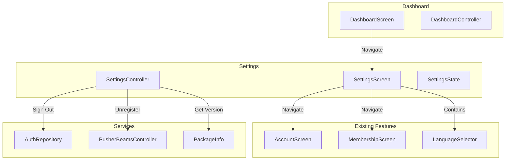
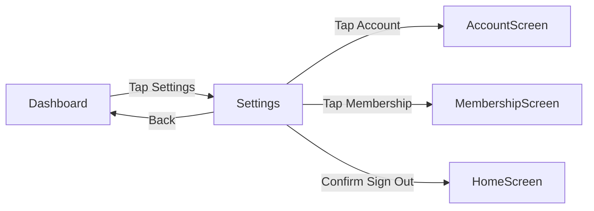

# Design Document: Settings Screen

## Overview

This feature introduces a dedicated Settings Screen to the Palakat mobile app, replacing the sign-out button on the dashboard with a settings button. The settings screen consolidates user preferences and configuration options in a single, accessible location.

The implementation follows the existing feature-based architecture pattern used throughout the app, with a new `settings` feature containing presentation layer components (screen, controller, state).

## Architecture



### Navigation Flow



## Components and Interfaces

### New Components

#### 1. SettingsScreen (`settings_screen.dart`)
- Stateless ConsumerWidget displaying settings options
- Uses ScaffoldWidget with back navigation
- Contains menu items for Account, Membership, Language, and Sign Out
- Displays app version at bottom

#### 2. SettingsController (`settings_controller.dart`)
- Riverpod AsyncNotifier managing settings state
- Handles sign-out flow with push notification cleanup
- Retrieves app version information
- Provides account and membership data for navigation

#### 3. SettingsState (`settings_state.dart`)
- Freezed immutable state class
- Contains: account, membership, appVersion, buildNumber, isSigningOut

### Modified Components

#### 1. DashboardScreen
- Replace sign-out IconButton with settings IconButton
- Change icon from `AppIcons.logout` to `AppIcons.settings` (gear/cog)
- Navigate to settings screen on tap

#### 2. AccountScreen
- Remove Language Settings section (lines ~270-300)
- Language selector moved to SettingsScreen

#### 3. Routing
- Add new `settings` route to `AppRoute` class
- Add `settingsRouting` GoRoute configuration
- Update `dashboardRouting` or create separate settings routing file

### Interfaces

```dart
// SettingsState
@freezed
class SettingsState with _$SettingsState {
  const factory SettingsState({
    Account? account,
    Membership? membership,
    @Default('') String appVersion,
    @Default('') String buildNumber,
    @Default(false) bool isSigningOut,
    String? errorMessage,
  }) = _SettingsState;
}

// SettingsController
@riverpod
class SettingsController extends _$SettingsController {
  Future<void> loadSettings();
  Future<void> signOut();
  bool get hasMembership;
}
```

## Data Models

### Existing Models Used
- `Account` - User account data from `palakat_shared`
- `Membership` - Church membership data from `palakat_shared`

### New Data
- App version info retrieved via `package_info_plus` package

## Correctness Properties

*A property is a characteristic or behavior that should hold true across all valid executions of a system-essentially, a formal statement about what the system should do. Properties serve as the bridge between human-readable specifications and machine-verifiable correctness guarantees.*

Based on the prework analysis, the following correctness properties have been identified:

### Property 1: Settings navigation from dashboard
*For any* dashboard state where account is not null, tapping the settings button should trigger navigation to the settings route.
**Validates: Requirements 1.1**

### Property 2: Settings button visibility
*For any* dashboard state, the settings button should be visible if and only if the account is not null (user is signed in).
**Validates: Requirements 1.2**

### Property 3: Account navigation with ID
*For any* settings screen state with a non-null account, tapping account settings should navigate to AccountScreen with the account's ID as a parameter.
**Validates: Requirements 2.2**

### Property 4: Membership navigation with ID
*For any* settings screen state with a non-null membership, tapping membership settings should navigate to MembershipScreen with the membership's ID as a parameter.
**Validates: Requirements 3.2**

### Property 5: Sign out confirmation display
*For any* settings screen state, tapping the sign out button should display a confirmation dialog before executing sign out.
**Validates: Requirements 5.2**

### Property 6: Sign out cleanup execution
*For any* confirmed sign out action, the system should unregister push notification interests and clear the session before navigation.
**Validates: Requirements 5.3**

### Property 7: Sign out navigation
*For any* successful sign out, the system should navigate to the home screen.
**Validates: Requirements 5.4**

### Property 8: Version format display
*For any* version string V and build number B, the displayed version should match the format "Version V (Build B)".
**Validates: Requirements 6.2**

## Error Handling

### Sign Out Errors
- If push notification unregistration fails, continue with sign out (non-blocking)
- If session clear fails, show error message and remain on settings screen
- Log all errors for debugging

### Data Loading Errors
- If account/membership data fails to load, show error state with retry option
- If package info fails to load, display "Version unknown"

### Navigation Errors
- If account ID is null when navigating to account, show error toast
- If membership ID is null when navigating to membership, disable the option or show appropriate message

## Testing Strategy

### Property-Based Testing
The project uses `kiri_check` for property-based testing in Flutter. Each correctness property will be implemented as a property-based test with a minimum of 100 iterations.

Property tests will focus on:
- Navigation behavior with various account/membership states
- Sign out flow execution order
- Version string formatting

### Unit Tests
Unit tests will cover:
- SettingsController state management
- Sign out flow with mocked dependencies
- Version info retrieval

### Widget Tests
Widget tests will verify:
- Settings screen renders all required menu items
- Settings button appears on dashboard when signed in
- Language selector is present in settings and absent from account screen
- Sign out confirmation dialog appears on tap

### Test File Structure
```
test/
└── features/
    └── settings/
        ├── settings_controller_test.dart
        ├── settings_screen_test.dart
        └── settings_property_test.dart
```
