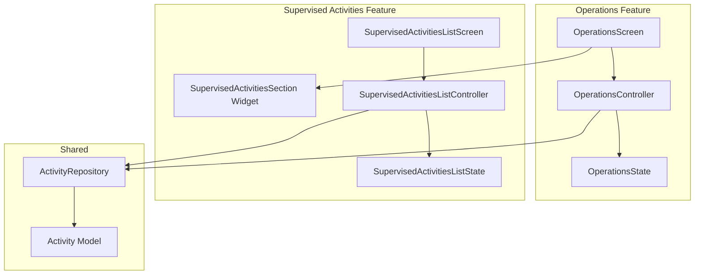

# Design Document: Supervised Activities

## Overview

This feature extends the Operations screen in the Palakat mobile app to display supervised activities. It adds a new section showing the 3 most recent activities supervised by the current user, with navigation to a dedicated list screen that supports filtering by activity type and date range.

### Reusable Components

The implementation maximizes reuse of existing code:

- **ActivityRepository**: Already supports filtering by `membershipId` (maps to `supervisorId` on backend)
- **GetFetchActivitiesRequest**: Already has `membershipId`, `activityType`, `startDate`, `endDate` filters
- **Activity Model**: Existing model with all required fields
- **PaginationRequestWrapper**: Existing pagination support
- **LoadingWrapper**: Existing widget for loading/error states
- **Gap, BaseColor, BaseTypography**: Existing UI constants
- **AppRoute**: Existing routing infrastructure

## Architecture



## Components and Interfaces

### 1. OperationsState Extension

Extend the existing `OperationsState` to include supervised activities:

```dart
@freezed
abstract class OperationsState with _$OperationsState {
  const factory OperationsState({
    // ... existing fields ...
    
    /// List of recent supervised activities (max 3)
    @Default([]) List<Activity> supervisedActivities,
    
    /// Loading state for supervised activities section
    @Default(false) bool loadingSupervisedActivities,
    
    /// Error message for supervised activities fetch
    String? supervisedActivitiesError,
  }) = _OperationsState;
}
```

### 2. OperationsController Extension

Add method to fetch supervised activities:

```dart
Future<void> fetchSupervisedActivities() async {
  state = state.copyWith(loadingSupervisedActivities: true);
  
  final membership = state.membership;
  if (membership?.id == null) {
    state = state.copyWith(loadingSupervisedActivities: false);
    return;
  }
  
  final request = PaginationRequestWrapper(
    page: 1,
    limit: 3,
    sortBy: 'date',
    sortOrder: 'desc',
    data: GetFetchActivitiesRequest(membershipId: membership!.id),
  );
  
  final result = await _activityRepository.fetchActivities(
    paginationRequest: request,
  );
  
  result.when(
    onSuccess: (response) {
      state = state.copyWith(
        supervisedActivities: response.data,
        loadingSupervisedActivities: false,
        supervisedActivitiesError: null,
      );
    },
    onFailure: (failure) {
      state = state.copyWith(
        loadingSupervisedActivities: false,
        supervisedActivitiesError: failure.message,
      );
    },
  );
}
```

### 3. SupervisedActivitiesSection Widget

New widget for the Operations screen:

```dart
class SupervisedActivitiesSection extends ConsumerWidget {
  const SupervisedActivitiesSection({
    required this.activities,
    required this.isLoading,
    required this.error,
    required this.onSeeAllTap,
    required this.onActivityTap,
    required this.onRetry,
    super.key,
  });

  final List<Activity> activities;
  final bool isLoading;
  final String? error;
  final VoidCallback onSeeAllTap;
  final ValueChanged<Activity> onActivityTap;
  final VoidCallback onRetry;
}
```

### 4. SupervisedActivitiesListState

```dart
@freezed
abstract class SupervisedActivitiesListState with _$SupervisedActivitiesListState {
  const factory SupervisedActivitiesListState({
    @Default([]) List<Activity> activities,
    @Default(true) bool isLoading,
    String? errorMessage,
    
    // Pagination
    @Default(1) int currentPage,
    @Default(false) bool hasMorePages,
    @Default(false) bool isLoadingMore,
    
    // Filters
    ActivityType? filterActivityType,
    DateTime? filterStartDate,
    DateTime? filterEndDate,
    
    /// Indicates if any filter is currently active
    @Default(false) bool hasActiveFilters,
  }) = _SupervisedActivitiesListState;
}
```

### 5. SupervisedActivitiesListController

```dart
@riverpod
class SupervisedActivitiesListController extends _$SupervisedActivitiesListController {
  
  Future<void> fetchActivities({bool refresh = false}) async;
  Future<void> loadMoreActivities() async;
  void setActivityTypeFilter(ActivityType? type);
  void setDateRangeFilter(DateTime? start, DateTime? end);
  void clearFilters();
  bool get hasActiveFilters;
}
```

### 6. SupervisedActivitiesListScreen

```dart
class SupervisedActivitiesListScreen extends ConsumerWidget {
  // Displays:
  // - Filter bar with activity type dropdown and date range picker
  // - Active filter indicator
  // - Paginated list of activities
  // - Empty state when no activities match filters
  // - Loading and error states
}
```

## Data Models

The feature uses existing models from `palakat_shared`:

### Activity Model (existing)
```dart
@freezed
abstract class Activity with _$Activity {
  const factory Activity({
    int? id,
    int? supervisorId,
    Bipra? bipra,
    required String title,
    String? description,
    int? locationId,
    required DateTime date,
    String? note,
    String? fileUrl,
    @Default(ActivityType.service) ActivityType activityType,
    Reminder? reminder,
    required DateTime createdAt,
    DateTime? updatedAt,
    required Membership supervisor,
    @Default([]) List<Approver> approvers,
    Location? location,
  }) = _Activity;
}
```

### GetFetchActivitiesRequest (existing)
```dart
@freezed
abstract class GetFetchActivitiesRequest with _$GetFetchActivitiesRequest {
  const factory GetFetchActivitiesRequest({
    int? churchId,
    int? membershipId,  // Used to filter by supervisorId
    int? columnId,
    DateTime? startDate,
    DateTime? endDate,
    ActivityType? activityType,
    String? search,
  }) = _GetFetchActivitiesRequest;
}
```

## Correctness Properties

*A property is a characteristic or behavior that should hold true across all valid executions of a system-essentially, a formal statement about what the system should do. Properties serve as the bridge between human-readable specifications and machine-verifiable correctness guarantees.*

### Property 1: Recent activities limit
*For any* list of supervised activities returned from the API, the Operations screen SHALL display at most 3 activities, specifically the most recent ones by date.
**Validates: Requirements 1.1**

### Property 2: Activity item display completeness
*For any* Activity displayed in the supervised activities section, the rendered widget SHALL contain the activity's title, formatted date, and activity type.
**Validates: Requirements 1.3**

### Property 3: Navigation callback correctness
*For any* Activity item tap in the supervised activities section, the navigation callback SHALL be invoked with the correct activity ID.
**Validates: Requirements 1.4**

### Property 4: List item display completeness
*For any* Activity displayed in the Supervised Activities List screen, the rendered item SHALL contain the activity's title, formatted date, activity type, and approval status.
**Validates: Requirements 2.4**

### Property 5: Filter application correctness
*For any* filter criteria (activity type and/or date range) applied to the activities list, all displayed activities SHALL match the specified filter criteria.
**Validates: Requirements 3.3**

### Property 6: Filter clear restores full list
*For any* filtered state, clearing all filters SHALL result in displaying the same activities as an unfiltered fetch.
**Validates: Requirements 3.4**

### Property 7: Active filter indicator consistency
*For any* state where filterActivityType is non-null OR filterStartDate is non-null OR filterEndDate is non-null, the hasActiveFilters flag SHALL be true.
**Validates: Requirements 3.5**

## Error Handling

| Scenario | Handling |
|----------|----------|
| Network failure on fetch | Display error message with retry button |
| Empty supervised activities | Hide section on Operations screen |
| Empty filtered results | Display "No activities match your filters" message |
| Pagination failure | Show error toast, keep existing data |
| Invalid date range | Prevent filter application, show validation error |

## Testing Strategy

### Unit Tests
- Test `OperationsController.fetchSupervisedActivities()` correctly builds request with membershipId
- Test `SupervisedActivitiesListController` filter state management
- Test `hasActiveFilters` computed property logic
- Test date range validation

### Property-Based Tests

The project uses **fast-check** for property-based testing (as specified in tech.md for the backend). For Flutter, we'll use the **glados** package which provides similar PBT capabilities for Dart.

Each property-based test MUST:
- Run a minimum of 100 iterations
- Be tagged with a comment referencing the correctness property: `// **Feature: supervised-activities, Property {number}: {property_text}**`

Property tests to implement:
1. **Property 1**: Generate random lists of activities (0-10 items), verify displayed count is `min(3, list.length)`
2. **Property 2**: Generate random Activity objects, verify rendered widget contains title, date string, and activity type
3. **Property 3**: Generate random Activity objects, simulate tap, verify callback receives correct activity ID
4. **Property 4**: Generate random Activity objects with approvers, verify list item contains all required fields
5. **Property 5**: Generate random activities and filter criteria, verify all displayed activities match filters
6. **Property 6**: Generate random filter state, apply then clear, verify result matches unfiltered state
7. **Property 7**: Generate random filter combinations, verify hasActiveFilters matches expected boolean

### Widget Tests
- Test SupervisedActivitiesSection renders correctly with activities
- Test SupervisedActivitiesSection hides when activities list is empty
- Test filter UI interactions on list screen
- Test loading and error states
