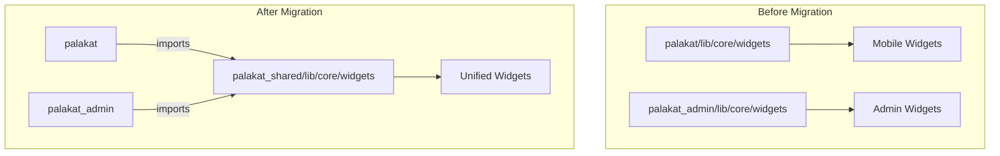
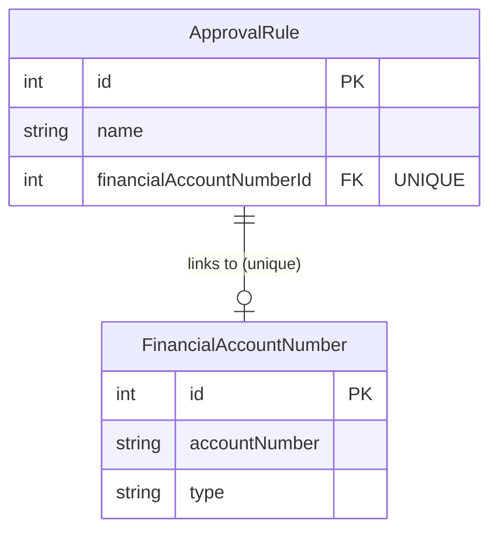

# Design Document: Widget Consolidation & Financial Account Constraint

## Overview

This feature addresses two main concerns:

1. **Widget Consolidation**: Migrate custom UI widgets from `palakat` (mobile) and `palakat_admin` (web) apps into the `palakat_shared` package for consistency and centralized maintenance.

2. **Financial Account Unique Constraint**: Enforce a 1:1 relationship between `FinancialAccountNumber` and `ApprovalRule`, ensuring each financial account can only be linked to one approval rule.

## Architecture

### Widget Migration Architecture



### Financial Account Constraint Architecture



## Components and Interfaces

### Widget Categories to Migrate

| Category | Source (palakat) | Existing in Shared | Action |
|----------|------------------|-------------------|--------|
| Button | `button/button_widget.dart` | No | Migrate |
| Card | `card/*.dart` | `surface_card.dart` | Migrate additional cards |
| Dialog | `dialog/*.dart` | No | Migrate |
| Input | `input/*.dart` | `input/input.dart` | Merge/extend |
| Loading | `loading/*.dart` | `loading_widget.dart`, `loading_shimmer.dart` | Merge |
| Error | `error/*.dart` | `error_widget.dart` | Merge |
| AppBar | `appbar/appbar_widget.dart` | No | Migrate (mobile-specific) |
| Bottom Navbar | `bottom_navbar/*.dart` | No | Migrate (mobile-specific) |
| Scaffold | `scaffold/scaffold_widget.dart` | No | Migrate (mobile-specific) |
| Chips | `chips/chips_widget.dart` | Various chip widgets | Merge |
| Output | `output/output_widget.dart` | No | Migrate |
| Screen Title | `screen_title/*.dart` | No | Migrate |
| Segment Title | `segment_title/*.dart` | No | Migrate |
| Info Box | `info_box_widget.dart`, `info_box_with_action_widget.dart` | `info_section.dart` | Merge |
| Image Network | `image_network/*.dart` | No | Migrate |
| Account Number Picker | `account_number_picker/*.dart` | `financial_account_picker.dart` | Merge |

### Backend Service Changes

#### ApprovalRuleService Updates

```typescript
// New validation method for uniqueness
async validateFinancialAccountUniqueness(
  financialAccountNumberId: number,
  excludeRuleId?: number
): Promise<void>

// New validation method for financial type requiring account
async validateFinancialTypeRequiresAccount(
  financialType: FinanceType | null,
  financialAccountNumberId: number | null
): Promise<void>

// Updated create method with validation
async create(dto: CreateApprovalRuleDto): Promise<ApprovalRule>

// Updated update method with validation  
async update(id: number, dto: UpdateApprovalRuleDto): Promise<ApprovalRule>
```

#### FinancialAccountNumberService Updates

```typescript
// New method to get available accounts (not linked to any rule)
async getAvailableAccounts(
  churchId: number,
  financeType?: FinanceType,
  currentRuleId?: number
): Promise<FinancialAccountNumber[]>

// Updated findAll to include linked approval rule information
async findAll(
  churchId: number,
  options?: {
    type?: FinanceType,
    search?: string,
    includeApprovalRule?: boolean
  }
): Promise<FinancialAccountNumber[]>
```

### Frontend Widget Updates

#### FinancialAccountPicker Enhancements

```dart
/// Enhanced picker with search functionality
class FinancialAccountPicker extends StatelessWidget {
  // Existing properties...
  
  /// Enable search functionality
  final bool searchable;
  
  /// Search by description first, fallback to account number
  List<FinancialAccountNumber> _filterAccounts(String query) {
    // 1. Filter by description match
    // 2. If no results, filter by account number match
  }
}
```

#### PositionSelector Enhancements

```dart
/// Enhanced selector with search functionality
class PositionSelector extends StatelessWidget {
  // Existing properties...
  
  /// Enable search functionality
  final bool searchable;
  
  /// Filter positions by name
  List<MemberPosition> _filterPositions(String query);
}
```

### Database Schema Changes

```prisma
model ApprovalRule {
  // ... existing fields
  financialAccountNumberId Int? @unique  // Add unique constraint
  financialAccountNumber   FinancialAccountNumber? @relation(fields: [financialAccountNumberId], references: [id], onDelete: SetNull)
}
```

## Data Models

### No new models required

Existing models are sufficient. The change is adding a unique constraint to the existing `financialAccountNumberId` field in `ApprovalRule`.

### DTO Updates

```typescript
// Response DTO for available accounts endpoint
interface AvailableAccountsResponse {
  data: FinancialAccountNumber[];
  total: number;
}

// Extended FinancialAccountNumber response with approval rule info
interface FinancialAccountNumberWithRule {
  id: number;
  accountNumber: string;
  type: FinanceType;
  description?: string;
  approvalRule?: {
    id: number;
    name: string;
  };
}
```

## Correctness Properties

*A property is a characteristic or behavior that should hold true across all valid executions of a system-essentially, a formal statement about what the system should do. Properties serve as the bridge between human-readable specifications and machine-verifiable correctness guarantees.*

### Property 1: Financial Account Uniqueness Constraint

*For any* church with multiple approval rules and financial accounts, if a financial account is linked to one approval rule, attempting to link the same account to a different approval rule SHALL result in a rejection error.

**Validates: Requirements 3.1, 3.2, 3.3, 3.4**

### Property 2: Seed Data Financial Account Uniqueness

*For any* seeded database state, the count of approval rules with non-null `financialAccountNumberId` SHALL equal the count of distinct `financialAccountNumberId` values across all approval rules.

**Validates: Requirements 4.1, 4.2, 4.3**

### Property 3: Available Accounts Filtering

*For any* set of financial accounts where some are linked to approval rules, the available accounts list for a new approval rule SHALL contain only accounts that are not linked to any existing rule.

**Validates: Requirements 5.1**

### Property 4: Financial Type Requires Account Number

*For any* approval rule creation or update request that includes a financial type, if no financial account number is provided, the request SHALL be rejected with a validation error.

**Validates: Requirements 6.1, 6.2**

### Property 5: Financial Account Search by Description

*For any* list of financial accounts and any search query, filtering by description SHALL return all accounts where the description contains the query string (case-insensitive).

**Validates: Requirements 7.2**

### Property 6: Financial Account Search Fallback to Account Number

*For any* list of financial accounts and any search query where no accounts match by description, filtering SHALL fallback to return accounts where the account number contains the query string.

**Validates: Requirements 7.3**

### Property 7: Position Search by Name

*For any* list of membership positions and any search query, filtering by name SHALL return all positions where the position name contains the query string (case-insensitive).

**Validates: Requirements 8.2**

### Property 8: Linked Approval Rule Display

*For any* financial account that is linked to an approval rule, the financial accounts table SHALL display the approval rule name in the linked rule column.

**Validates: Requirements 9.4**

## Error Handling

### Backend Errors

| Error Code | Message | Condition |
|------------|---------|-----------|
| `FINANCIAL_ACCOUNT_ALREADY_LINKED` | "Financial account {accountNumber} is already linked to approval rule {ruleName}" | Attempting to link an account already assigned to another rule |
| `FINANCIAL_ACCOUNT_REQUIRED` | "Financial account number is required when financial type is set" | Creating/updating rule with financial type but no account |
| `APPROVAL_RULE_NOT_FOUND` | "Approval rule with id {id} not found" | Rule doesn't exist |
| `FINANCIAL_ACCOUNT_NOT_FOUND` | "Financial account with id {id} not found" | Account doesn't exist |

### Frontend Handling

- Display error toast when duplicate link is attempted
- Disable submit button when no available accounts exist
- Show informative message when all accounts are assigned
- Show validation error when financial type is selected but no account is chosen
- Mark financial account field as required when financial type is selected

## Testing Strategy

### Dual Testing Approach

This feature requires both unit tests and property-based tests:

- **Unit tests**: Verify specific examples, edge cases, and error conditions
- **Property-based tests**: Verify universal properties hold across all inputs

### Property-Based Testing

**Library**: `fast-check` (already configured in the backend)

**Configuration**: Minimum 100 iterations per property test

**Test File Location**: `apps/palakat_backend/test/property/`

### Property Test Specifications

#### Test 1: Financial Account Uniqueness
```typescript
// **Feature: widget-consolidation-financial-constraint, Property 1: Financial Account Uniqueness Constraint**
// Generate: random church, multiple approval rules, multiple financial accounts
// Action: Link account to rule A, then attempt to link same account to rule B
// Assert: Second link attempt throws error
```

#### Test 2: Seed Data Uniqueness Verification
```typescript
// **Feature: widget-consolidation-financial-constraint, Property 2: Seed Data Financial Account Uniqueness**
// After seeding: Query all approval rules with financialAccountNumberId
// Assert: No duplicate financialAccountNumberId values exist
```

#### Test 3: Available Accounts Filtering
```typescript
// **Feature: widget-consolidation-financial-constraint, Property 3: Available Accounts Filtering**
// Generate: random accounts, some linked to rules
// Action: Call getAvailableAccounts
// Assert: Result contains only unlinked accounts
```

#### Test 4: Financial Type Requires Account Number
```typescript
// **Feature: widget-consolidation-financial-constraint, Property 4: Financial Type Requires Account Number**
// Generate: random approval rule data with financial type but no account
// Action: Attempt to create/update rule
// Assert: Request is rejected with FINANCIAL_ACCOUNT_REQUIRED error
```

#### Test 5: Financial Account Search by Description
```typescript
// **Feature: widget-consolidation-financial-constraint, Property 5: Financial Account Search by Description**
// Generate: random accounts with descriptions, random search query
// Action: Filter accounts by query
// Assert: All results have description containing query (case-insensitive)
```

#### Test 6: Financial Account Search Fallback
```typescript
// **Feature: widget-consolidation-financial-constraint, Property 6: Financial Account Search Fallback to Account Number**
// Generate: accounts where description doesn't match but account number does
// Action: Filter accounts by query
// Assert: Results include accounts matching by account number
```

#### Test 7: Position Search by Name
```typescript
// **Feature: widget-consolidation-financial-constraint, Property 7: Position Search by Name**
// Generate: random positions, random search query
// Action: Filter positions by query
// Assert: All results have name containing query (case-insensitive)
```

### Unit Tests

- Test error message content for duplicate link attempts
- Test error message for financial type without account
- Test edge case: editing rule keeps its own account in available list
- Test edge case: all accounts assigned shows empty list
- Test widget rendering with various account states
- Test search with empty query returns all items
- Test search with no matches returns empty list

### Integration Tests

- Test full flow: create rule with account, try to create another with same account
- Test update flow: update rule to use already-linked account
- Test create rule with financial type but no account fails
- Test financial account list includes linked approval rule names
